# 机器文摘 第 184 期

### Kami：给 AI 文档设计的"排版系统"

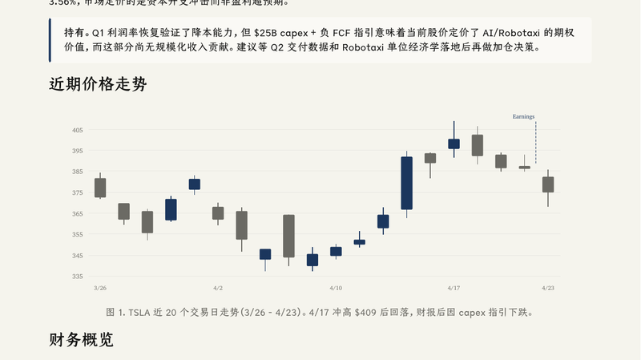

[Kami](https://github.com/tw93/Kami)，10.9k Star，MIT。作者 tw93 平时喜欢投资美股，经常让 AI 帮他写研究报告，可每次出来的文档都一个毛病：灰扑扑的、版式每次都乱，看着就没耐心读下去。于是他干脆自己动手，一点一点调字体、调配色、调留白，最终抽象成一个可以交给任何 Agent 的设计系统。

它不是传统排版软件，而是"文档设计系统/排版约束系统"：8 种模板（一页纸、长文档、信件、作品集、简历、股票研究报告、幻灯片、Changelog）+ 落地页系统。HTML→PDF、Mermaid 图表、PPTX/Marp 幻灯片、代码高亮、内容 schema 校验 + 视觉走查。设计风格是暖羊皮纸底 + 墨蓝强调色 + 衬线字体，中文用仓耳今楷02。零依赖 MCP Server，分发为 Claude Code / Codex / 通用 Agent 插件。

核心价值：AI 生成内容容易，但"AI 生成好看的文档"很难。Kami 把排版规范做成可复用的约束，让 Agent 每次输出都稳定好看。主推场景之一就是股票研究报告（官方示例是 Tesla Q1 2026 财报点评）。

### wechat-article-pipeline：公众号排版的自动化流水线

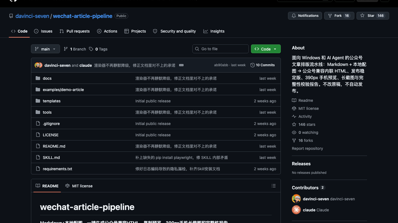

[wechat-article-pipeline](https://github.com/davinci-seven/wechat-article-pipeline)，146 Star，MIT。为 Windows 用户和 AI Agent 提供一套完整的公众号文章处理方案：Markdown 原稿与本地配图一键转化为兼容公众号的内联 HTML，同步生成 390px 手机预览、长截图及完整性校验报告。

技术实现：自研 918 行 Markdown 子集渲染器（行级正则分块），双版本输出（clean 相对路径 + stable data-URI 内嵌图），用 HTMLParser 游标法做正文顺序完整性校验，6 套主题参数化。8 步流程：渲染→组件库校验→HTML 校验×2→复制按钮预览→390px 长截图（Playwright）→原稿 SHA256 复核→隐私清理（7 类 token 正则）。

几条铁律值得注意：不覆盖原稿、不自动发布、不二次渲染、不公开本机路径；缺图或不支持语法即停。它不重造引擎，而是把 gzh-design（渲染/校验）、xiaowan（手机端 QA）、md2wechat（发布）三个上游项目编排成一条流水线——"编排型"思路，模块各司其职。

### watermarks-remover：移除 AI 文本水印的开源项目

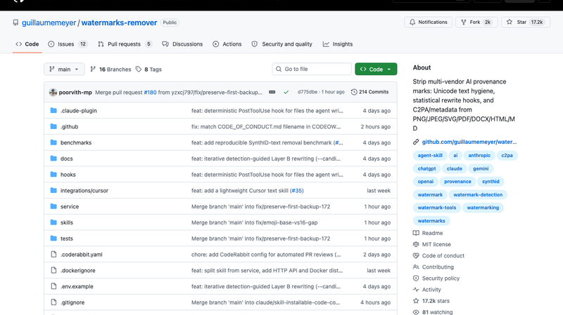

[watermarks-remover](https://github.com/guillaumemeyer/watermarks-remover)，17.2k Star，Python + MIT。2026-08-11 创建一周爆火，定位是剥离多厂商 AI 溯源水印（文本水印 + 文件元数据），架构为 Agent Skill + 纯标准库 HTTP 服务 + Claude Code 钩子。

技术原理分两层：Layer A（Unicode 清洗，确定性可验证）——AI 厂商在文本里藏隐形 Unicode 码点作水印载体，按码点黑名单剔除 ZWSP/ZWJ、双向控制符、tag 字符等；亮点是上下文感知保留（蒙古文 FVS、emoji 粘合符等合法场景不误删）。Layer B（统计水印改写，best-effort）——Kirchenbauer green-list、Aaronson keyed-Gumbel 这类信号藏在 token 采样偏置里，只能靠 LLM 重写攻击（paraphrase/backtranslate 等 5 种强度），迭代+检测驱动循环。

项目很诚实：明确说"统计水印移除=逐句重写、必然降质、可能被重打标"。有意思的是 Google 2026-08 已退役 SynthID 文本检测 API——文本水印这条路本身也在被厂商重新评估。

### 用 Excel 展示着色器的工作原理

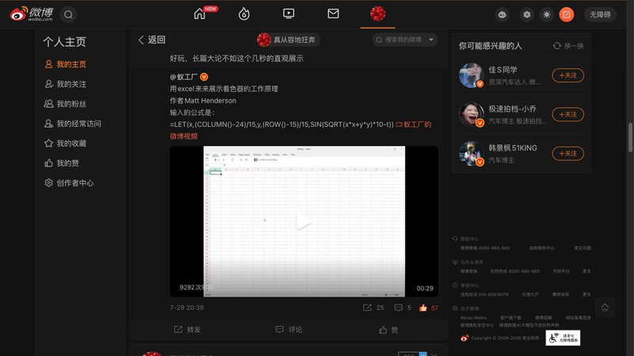

Matt Henderson（数学可视化作者）用 Excel 演示了着色器的工作原理。输入的公式很简单：`=LET(x,(COLUMN()-24)/15,y,(ROW()-15)/15,SIN(SQRT(x*x+y*y)*10-t))`——一个单元格一个像素，整个工作表就是一个屏幕，SIN(SQRT(x²+y²)) 是经典的圆环波纹，t 是时间变量让它动起来。

这个演示的妙处在于：着色器（shader）的核心思想是"对每个像素并行计算颜色"，Excel 的动态数组公式恰好完美映射了这个模型——每个单元格独立计算自己的颜色，几百上千个单元格同时更新，就是一场实时动画。你不需要理解 GPU 管线，打开 Excel 就能直观看到"对每个像素求值"是什么感觉。

蚁工厂的微博配了视频（29 秒），评论区用户感慨"长篇大论不如这个几秒的直观展示"。

### typ.ing：好玩的打字练习网站

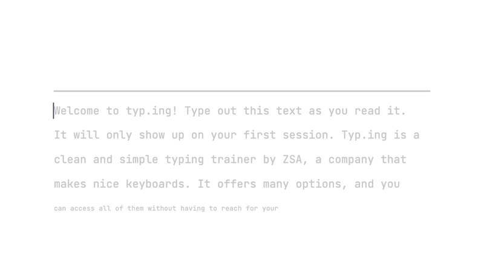

[typ.ing](https://typ.ing)，HN 263 分。一个打字练习网站——但和传统打字测试（机械重复打字）不同，它更像一个"打字游戏"。

特色功能：每日挑战、多种文本模式（代码、键盘瑜伽、长文等）、实时打字可视化、目标设定。界面简洁现代。在打字测试这个已经有很多老牌选手（monkeytype、typing.com）的领域，typ.ing 靠设计感和玩法差异化突围——不是给你一个枯燥的速度测试，而是让你愿意每天回来练一会儿。

### Hister：属于你自己的搜索引擎

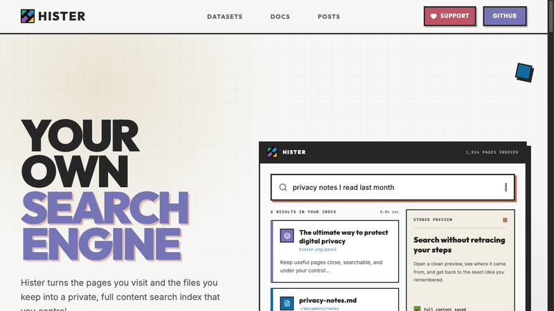

[Hister](https://hister.org/)，HN 341 分，免费软件。Hister 把你访问过的网页和你保存的文件变成一个私有的全文搜索索引——完全由你控制。

核心思路：网络搜索的历史是你的"第二大脑"——你昨天看过的那篇有用的文章，今天想找回来，搜索引擎往往搜不到（因为你记得的是内容不是 URL）。Hister 在你本地索引你访问过的每个页面，之后用全文搜索秒回。隐私是卖点：索引存在本地，不经过任何第三方服务器。

"把已经找到过的东西重新变有用"——这个定位很准。搜索引擎擅长找新内容，但找回旧内容往往很难，Hister 填补了这个空白。

### MartyPC：用 Rust 写的早期 PC 模拟器

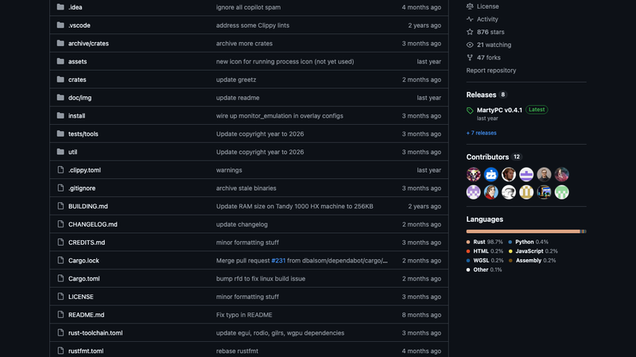

[MartyPC](https://github.com/dbalsom/martypc)，876 Star，用 Rust 写的 IBM PC/XT 周期精确模拟器，HN 107 分。

模拟硬件：8088 CPU（99.9997% 周期精确，经 Arduino + 真机逐周期对拍验证）、NEC V20；机型 IBM 5150/5160/XT 兼容机 + 初步 PCjr/Tandy 1000；视频覆盖 CGA/MDA/Hercules/EGA/TGA/VGA（含 overscan 模拟，MC6845 CRTC 级仿真）；8253/8255/8259/8237/8250 芯片组、Adlib(OPL2)/SN76489/PC Speaker、µPD765 FDC 等。

亮点：首个跑通全部 Area 5150 特效的 PC 模拟器、支持 8088 MPH demo；通过 8088 V2 测试套件。Rust workspace（marty_core + egui 前端 + wgpu/glow 后端），支持 WASM 多线程 Web 版（martypc.net）。对 retro-computing 爱好者来说，这是"在浏览器里完美重现 40 年前的 PC"的极致追求。

### Wi-Fi 8：第一个不追速度的无线升级

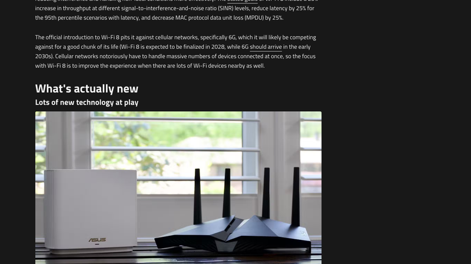

[Wi-Fi 8 (802.11bn)](https://www.xda-developers.com/wifi-8-80211bn-ultra-high-reliability/)，XDA 文章，HN 83 分。IEEE 官方定名"Ultra High Reliability（超高可靠性）"，纸面规格与 Wi-Fi 7 几乎相同——因为 Wi-Fi 7 单频段 23 Gbit/s 早已远超家庭宽带需求，速度不再是瓶颈。

量化目标（对比 Wi-Fi 7）：有效吞吐 +25%、时延 -25%（P95）、MPDU 丢包率 -25%。关键技术：DRU 分布式音调资源单元（弱天线设备受益）、干扰缓解导频、非均衡调制+新 MCS、P-EDCA 低时延信道接入、非主信道传输、无缝漫游与多 AP 协作。

对标蜂窝（尤其 6G），解决"大量设备同连"的真实痛点。标准预计 2028 年 5 月定稿，同年首批设备。HN 高赞评论印证痛点：仓库场景要的是"真实世界 ~20Mbit/s 可靠连接 + 能用的漫游"，而非理论 Gbit/s。

### 恶意 Rust crate：Arrayref 在构建时执行 payload

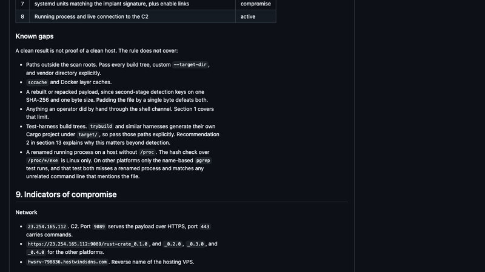

[Malicious Rust crate Arrayref](https://rustsec.org/advisories/)，HN 496 分。一个被广泛使用的 Rust crate "Arrayref" 被劫持，恶意版本会在构建时执行 payload——供应链攻击的经典案例。

细节：攻击者接管了 crate 发布权限（或盗取账号），发布包含恶意 build.rs 的版本。任何依赖它的项目在构建时都会执行恶意代码——而 Rust 生态的信任模型是"crates.io 上的包可信"，一旦上游被攻破，所有下游都中招。这正是 xz 后门事件之后的又一次供应链警示。

对开发者的教训：锁定依赖版本、审计 build.rs、使用锁文件、关注 crate 维护者的安全公告。供应链安全没有银弹，只有层层防御。

### The August 17 outage：GitHub 的 8 小时大故障

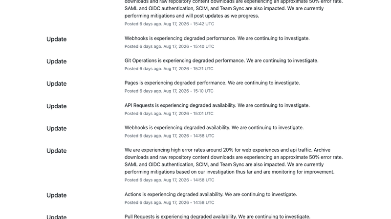

2026年8月17日，GitHub.com 发生持续 7 小时 47 分钟的大规模故障（UTC 13:28–21:15），波及 Issues、Pull Requests、APIs、Actions、Copilot、Pages、Webhooks、Git Operations 等核心服务。高峰期 Web/API 错误率约 20%，archive 与 raw 仓库内容下载错误率约 50%。HN 热帖 561+ 分、945 条评论。

官方复盘（The Register 报道）：直接原因是美国中部数据中心负载均衡器网络饱和；初始触发点是 Istio sidecar pod 达到并发上限但自动扩缩容策略失效——策略监控的是宿主服务而非 sidecar 的并发限制，形成监控盲区，导致级联失败。放大因素：乐观重试逻辑过载内部负载均衡器；VS Code 潜伏重试 bug 将流量放大约 10 倍；故障期间 codeload 端点还遭遇爬虫抓取攻击。

信任危机：HN 评论普遍批评 GitHub 自被微软收购后可靠性长期下滑。CloudBees CEO 表示 Cursor、OpenAI 及多家初创已在构建竞品，"GitHub 不会再是默认选项"。

### CIA 资助让 NeXT 在 80 年代存活

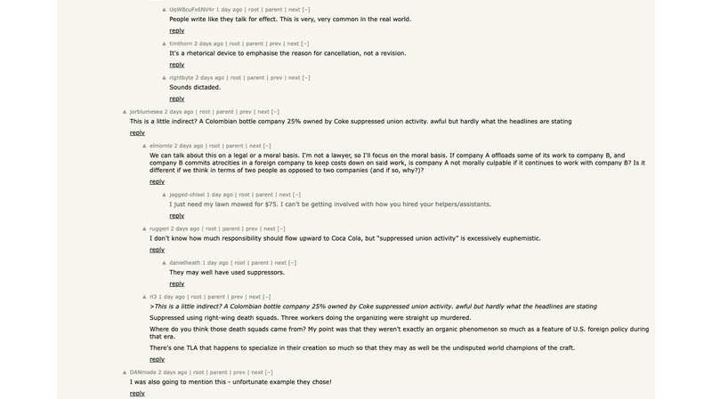

[The Hidden Debt That Apple Owes to the CIA](https://www.wsj.com/)，WSJ 深度报道，HN 450 分。核心叙事：CIA 在 80 年代以客户/采购形式资助 NeXT，帮其在存活期续命，间接为乔布斯回归苹果和 iPhone 底层代码铺路。

故事细节：1986 年冷战高峰，CIA 人员"不约而至" NeXT 总部——来自 CIA 机密计划"Program B"（卫星侦察）的 Joe Romello 和 Jeff Harris 要求面见乔布斯谈"国防相关、具体指情报"。乔布斯 1985 年被逐出苹果后创办 NeXT。CIA 购买 NeXT 电脑把原始情报送到战场指挥官手中。

HN 高赞评论点破真相："看到'CIA 资助'我以为是有后门，实际是 CIA 买了 NeXT 电脑来用"——资助=采购订单而非股权投资。文章配图说明：CIA 与 NeXT 的合同使其获得高级图形处理能力，可用于分析（现已解密的）莫斯科机场情报照片。

### 日本想为世界构建操作系统，美国出手了

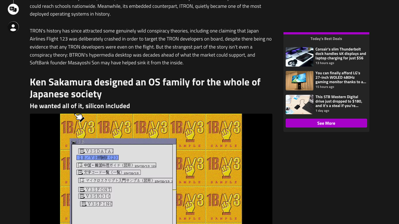

[Japan tried to build an operating system for the world, the US intervened](https://www.xda-developers.com/)，HN 379 分。讲的是 TRON 项目（东京大学坂村健，1984 年发起）——日本想构建自己的操作系统家族，最终被美国干预的故事。

TRON 家族包括 BTRON（桌面超媒体 OS）、CTRON（通信）、ITRON（嵌入式实时），还有自研 TRON VLSI CPU（日立 Gmicro）、150 万字符编码，日立/东芝/NEC/富士通全部入会，MITI 国家战略背书，开放免版税。1989 年 USTR 国家贸易评估报告点名 TRON，指文部省全国中小学电脑标准 + NTT 网络用 CTRON 把两大市场导向国产标准；ADAPSO 称 TRON"民族主义色彩强烈"；美国威胁制裁 → 日本放弃学校计划、日企集体退出 → BTRON 死于声誉杀伤而非禁令。

反转结局：没人注意的 ITRON 悄悄成为部署量最大的 OS 之一——任天堂 Switch Joy-Con 跑 µITRON 4.0、Nikon 相机、汽车电子、JBlend 8 亿+ 设备。技术没有输，输的是"成为世界标准"的野心。

## 订阅
这里会不定期分享我看到的有趣的内容（不一定是最新的，但是有意思），因为大部分都与机器有关，所以先叫它"机器文摘"吧。

Github 仓库地址：https://github.com/sbabybird/MachineDigest

喜欢的朋友可以订阅关注：

- 通过微信公众号"从容地狂奔"订阅。

