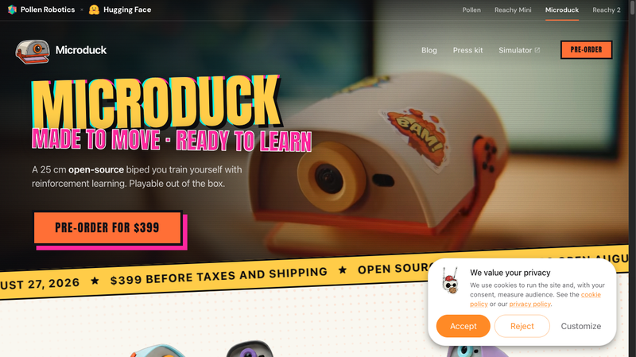
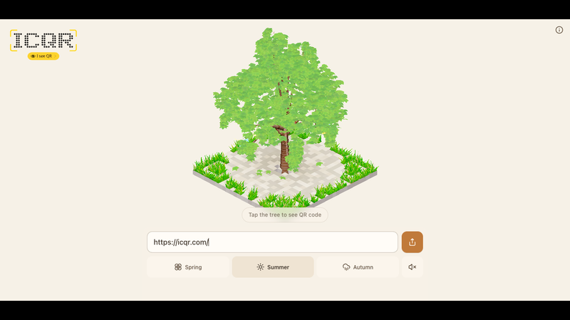
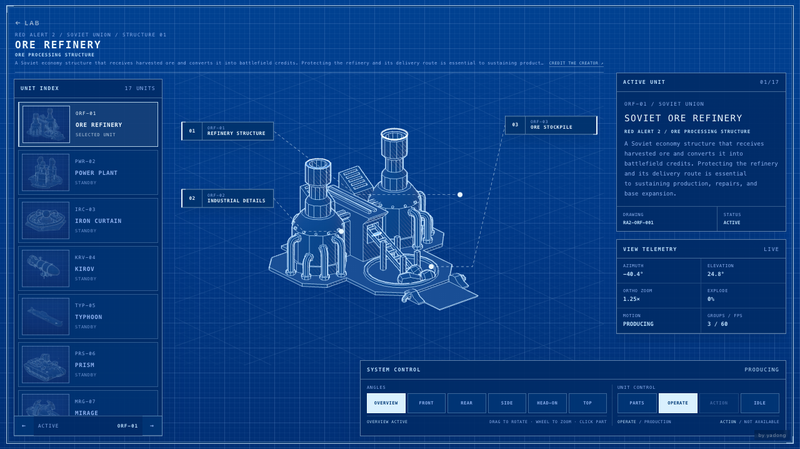
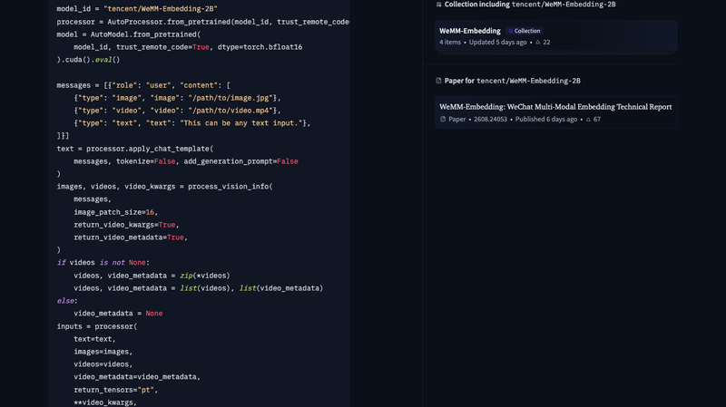
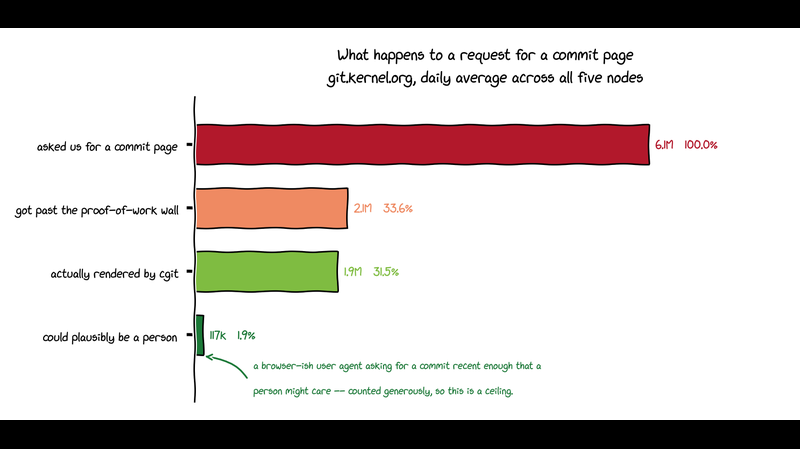
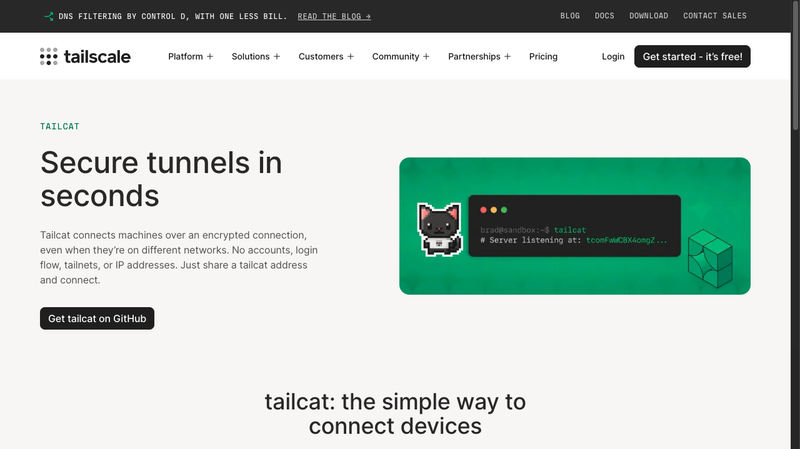
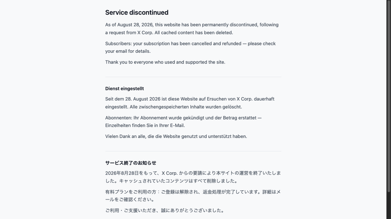
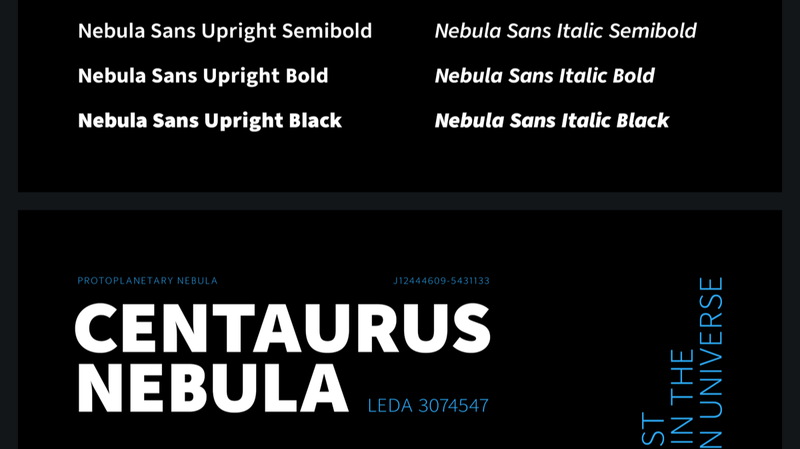
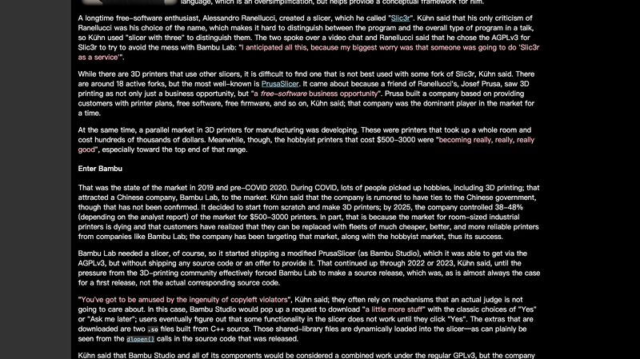
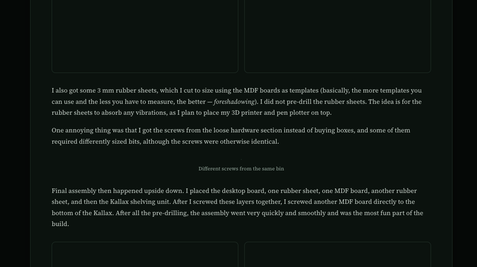

# 机器文摘 第 185 期

### Microduck：399 美元的可爱开源机器人

[Microduck](https://pollen-robotics.com/microduck/)，Hugging Face 和 Pollen Robotics 联合推出的开源双足机器人，HN 774 分，2026-08-27 开启预购，399 美元。

身高 25 厘米，配备 15 个执行器、一枚摄像头、激光雷达以及许多其他传感器。它能行走、坐下、捡拾物体，在摔倒后重新站起来，甚至还会穿轮滑鞋滑行。但最有趣的是，你还可以利用强化学习亲自训练它——"Made to move · Ready to learn"。

Microduck 是继 LeRobot 之后 Hugging Face 在机器人方向的新动作：开源硬件 + 开源软件 + 强化学习训练闭环。399 美元的价格让"自己训练一个机器人"第一次变得触手可及——不用几万美元的机械臂，一个桌面大小的鸭子机器人就能让你上手 RL 训练。

### Dactyl：网页生成原生 App，无需 Mac 和 Xcode

[Dactyl](https://dactyl.dev)，Deno 公司（Node.js 创始人 Ryan Dahl 创办）的新产品。在浏览器里用一句话描述需求，生成真正的原生 iPhone/iPad/Android app。口号："NO MAC. NO XCODE. NO ANDROID STUDIO."

技术实现很有意思：用 Swift 重新实现了 SwiftUI 及常见框架（Charts、SpriteKit、SceneKit、ARKit、MapKit、StoreKit、Metal、Vision 等），App 编译为 Wasm，链接 Dactyl 自家的 SwiftUI 而非 Apple 的。渲染管线：引擎把绘制命令以二进制流写入线性内存，JS host 读取并在 Canvas2D 上绘制；布局先完整解析再发命令。所以浏览器里跑的是一个"SwiftUI 的 WASM 移植"——相当于浏览器里的 iOS 模拟器。

定价：ChatGPT $20 + Dactyl $20 = $40/月，对比别家 $200/月。支持导出原生 Xcode 工程（源码属于你），发布时需要 $99/年的 Apple Developer 账号。HN 评论吐槽主页像在"速通律师函"（大量 Apple 框架商标）。

### tree.icqr.com：二维码藏进一棵树的底座

[tree.icqr.com](https://tree.icqr.com)，ICQR 旗下的"魔法树"——把任意 URL 变成一个可扫描的 3D 二维码树。树的形状/结构由 URL 内容确定性生成：每个 URL 都长出一棵不同的树；点击树即翻转揭示真正的二维码，扫码即达原链接。

技术栈：Vite + React SPA，Canvas + WebGPU 渲染（比较前沿的选型），前端本地生成 QR（data:image/png 内联），无后端请求。三季切换：Spring（稀疏粉花）/ Summer（浓绿，默认）/ Autumn（橙红落叶），一键换肤改变配色与树叶形态。还有分享菜单、Credits 面板（致谢灵感来源）。

实测验证：QR 解码正确，URL 变化树形随之变化（像素差异 10.8% > 同 URL 动画噪声 4.3%），树有持续动画（微风摆动）。把"二维码生成器"做成有情感的设计作品——这种"惊喜翻转"的交互（点击揭示）是低成本高感知度的设计差异化。

### 红警坦克：纯 Web 技术还原红警载具

[Red Alert Armory](https://www.yadongxie.com/lab/tanks)，用纯 web 技术制作了红警 2 游戏里的部分坦克和载具，具有动画和交互能力。微博网友评价"光棱坦克做的很还原啊"。

包含 17 个单位（UNIT INDEX），从苏联的矿石精炼厂（Ore Refinery）到各种坦克载具。每个单位都有详细的文字说明（比如矿石精炼厂："接收采集的矿石并将其转化为战场资金，保护精炼厂及其运输路线对维持生产、维修和基地扩张至关重要"）。页面是 3D 交互展示，可以旋转查看。

和之前"重写整个红警 2"的项目不同，这个项目专注在"载具本身"——把游戏里的单位做成可以 360 度欣赏的 3D 模型，带动画和交互，是一份很有诚意的粉丝作品。

### 微信开源嵌入模型：2B 超过别人 8B

[WeMM-Embedding](https://github.com/Tencent/WeMM-Embedding)，腾讯微信视觉团队开源的多模态嵌入模型，Apache 2.0，935 Star。基座 Qwen3.5（2B/4B/9B），输出 L2 归一化 2048/2560/4096 维，支持文本/图像/视频/视觉文档/交错多模态。

"2B 超 8B"验证成立：MMEB-v2（78 数据集）AVG 77.9，超过 Qwen3-VL-Embedding-8B（77.8）、GME-8B（59.2）、VLM2Vec-8B（53.2）；9B 版 80.6 全榜第一。支持 Matryoshka 截断（256 维保留 98.7% 性能）——意味着可以大幅压缩存储和检索成本。

微博原文评价："可能跟微信掌握大量的文本数据资源有关吧。"嵌入模型是 RAG 和检索的核心组件，微信在真实世界数据（聊天、公众号、视频号）上的积累确实可能是优势来源。

### Creepy Crawlies：AI 爬虫压垮 kernel.org 的真实记录

[Creepy Crawlies](https://news.ycombinator.com/item?id=49491791)，Linux 内核基础设施维护者 Konstantin Ryabitsev 的技术博客，HN 892 分 / 409 评论。讲的是 AI 爬虫压垮 git.kernel.org 的真实记录。

硬数据：git.kernel.org 每天约 600 万次"看随机 commit"的爬虫请求，合法流量仅约 2%；90 个 CPU 核中 14-16 核常年只为爬虫渲染 HTML（占 20% 容量）。爬虫不 git clone（明明一条命令就能拿到全部历史），却选择逐 commit 渲染 HTML 解析——linux.git 148 万 commit × 922 个 fork = 数十亿有效 URL。

封禁演进：改 UA 伪装 → 换 IP → 扩散到住宅/移动 IP（"proxy SDK 变现"，智能电视都参与）→ 蝗虫式攻击。部署 Anubis PoW 门禁初期有效，但 bots 逐步解出难度 4→5，目前 33% 已穿透；作者悲观收尾。评论区爆发 PoW 军备竞赛大辩论：tptacek 引用 Tavis Ormandy 的预言——PoW 对爬虫无效（每个请求对它都有产出）。

### Tailcat：netcat，但走 Tailscale 数据平面

[Tailcat](https://tailscale.com/tailcat)，Tailscale 出的工具，HN 577 分。Like netcat, but over Tailscale's data plane——像 netcat 一样，但流量走 Tailscale 的数据平面。

netcat 是"网络界的瑞士军刀"（端口扫描、文件传输、反弹 shell 都能干），但传统 netcat 需要双方网络可达（公网 IP、端口转发、防火墙放行）。Tailcat 利用 Tailscale 的 WireGuard 网络，让任意两台设备（哪怕都在 NAT 后面）都能直接建立连接——不需要公网 IP，不需要开放端口。

对运维和开发者来说，这意味着"在任何两台设备之间开一条数据通道"变得极其简单：只要两台机器都装了 Tailscale，就能像 netcat 一样直接通信。

### Twitter Viewer：免账号看推，然后被 X 干掉了

[Twitter Viewer](https://twitterwebviewer.com/)，HN 451 分。一个免登录查看 Twitter 内容的工具——不需要账号就能看推文、图片、视频。

但故事有个戏剧性结局：**2026-08-28 该服务被永久关闭**，原因是收到 X Corp（马斯克的 X 公司）的要求。官方公告："As of August 28, 2026, this website has been permanently discontinued, following a request from X Corp. All cached content has been deleted. Subscribers: your subscription has been cancelled and refunded."

Nitter 之后，又一个第三方 Twitter 前端倒下。X 对"免账号看推"工具的打击一直在持续——这既是平台控制权的争夺，也是"开放互联网 vs 封闭平台"的又一次冲突。

### Nebula Sans：星云字体

[Nebula Sans](https://nebulasans.com/)，HN 420 分。一个字体项目——以星云（Nebula）为主题的字体设计。

字体设计在 HN 上拿 420 分不算常见，说明它在美学或技术上确实有独到之处。开源字体项目（如 Inter、JetBrains Mono）在 HN 上一直有忠实受众，Nebula Sans 大概是继承了这种"开源 + 高质量设计"的传统，用星云般的曲线和空间感做出了一套有辨识度的 sans-serif 字体。

### 3D 打印机厂商的 AGPL 违规

[An ongoing 3D-printer AGPL violation](https://lwn.net/)，HN 489 分，LWN 文章。讲的是拓竹（Bambu Lab）的 AGPL 违规——2025 年占 3D 打印机市场约 38-48% 份额的厂商。

具体违规：其切片软件 Bambu Studio 是 PrusaSlicer（AGPLv3，源自 Slic3r）的修改版，长期不发源码；2022-23 年被迫放出但非"对应源码"。部分机型固件基于 Buildroot Linux，300MB 固件镜像无源码/要约。更戏剧性的是：Bambu 用 dlopen() 动态加载两个闭源 .so，通过网络调用自家服务器功能，用固定 User-Agent 字符串当"key"解锁，并声称这是 DMCA 反规避机制——SFC（软件自由保护协会）指出这正是 AGPLv3 设计来阻止的行为。波兰用户 Paweł Jarczak 逆向该机制后反遭 Bambu DMCA 下架。

SFC 已募资超 25 万美元、聘全职诉讼律师。开源许可证不是装饰品，大公司违反 AGPL 的后果正在显现。

### Mechanical Turk 关闭：一个人工智能时代的落幕

亚马逊宣布 2026-09-30 永久关闭 Mechanical Turk——运营 21 年的众包平台，巅峰期 50 万工人。HN 534 分。Bezos 当年称它是"人工人工智能"（artificial artificial intelligence）——用人类来完成 AI 做不了的小任务。

关闭原因：AI 取代（2023 年研究显示高达 46% 的工人用 AI 完成任务）、平台空心化（主管 AMT 的 AWS 员工约 2-3 年前转岗 Bedrock/SageMaker，项目近零团队维护）、竞争（Scale AI / Mercor / Prolific 等新贵崛起）。

一个黑色幽默的循环：MTurk 诞生于"AI 不够强，需要人类补位"的时代，死于"AI 足够强，不再需要人类"的时代。它的生与死，恰好框住了过去 20 年 AI 发展的完整弧线。

### Hacking IKEA Furniture

[Hacking IKEA Furniture](https://news.ycombinator.com/item?id=49394170)，HN 255 分。改造宜家家具的话题——把宜家的标准家具改造成更个性化、更智能、更好用的东西。

宜家家具以"便宜 + 标准化 + 可拆卸"著称，这恰恰是黑客最喜欢的特性：标准化的板材意味着可以互换、可以钻孔、可以加装；模块化设计意味着可以组合出宜家没想到的用法。从加装智能家居传感器、改造显示器支架、到把 Billy 书柜改成服务器机架——宜家是 maker 社区最爱的"乐高积木"。

HN 上这个话题能拿 255 分，说明改造宜家家具是很多人共同的爱好。

## 订阅
这里会不定期分享我看到的有趣的内容（不一定是最新的，但是有意思），因为大部分都与机器有关，所以先叫它"机器文摘"吧。

Github 仓库地址：https://github.com/sbabybird/MachineDigest

喜欢的朋友可以订阅关注：

- 通过微信公众号"从容地狂奔"订阅。

