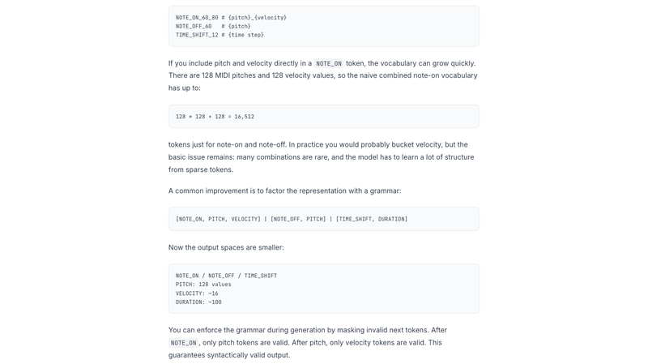
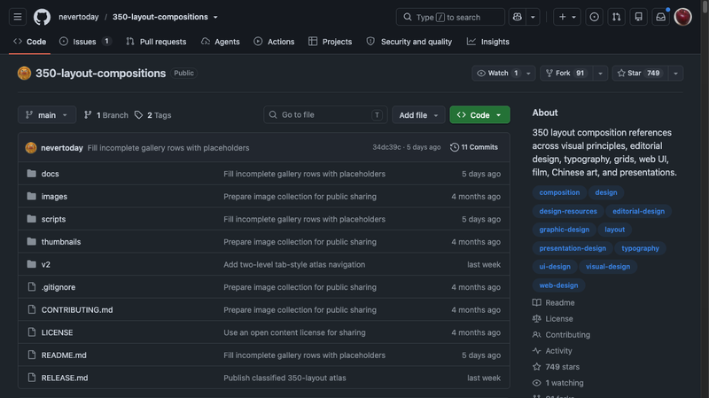
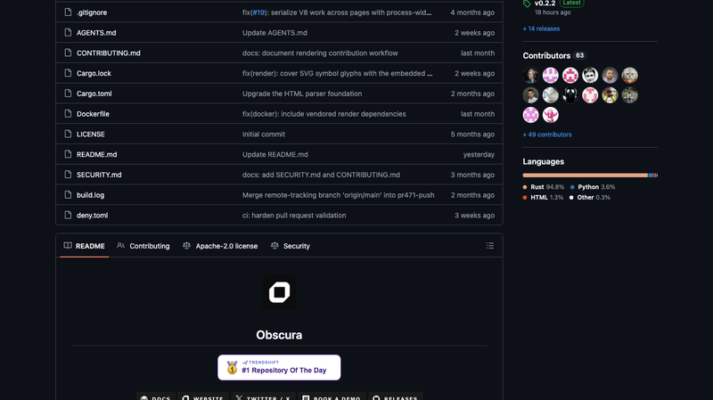
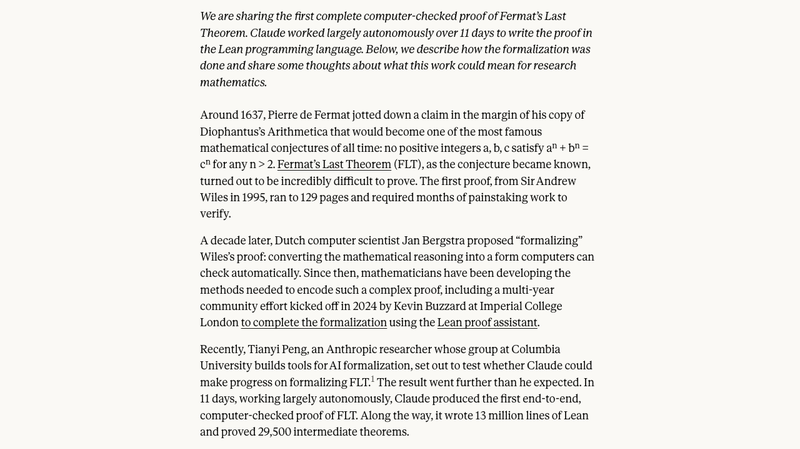
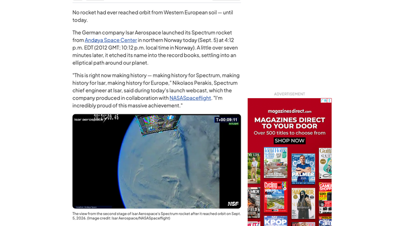
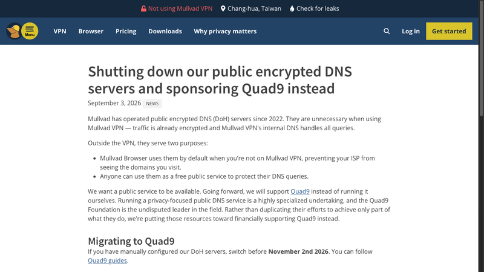
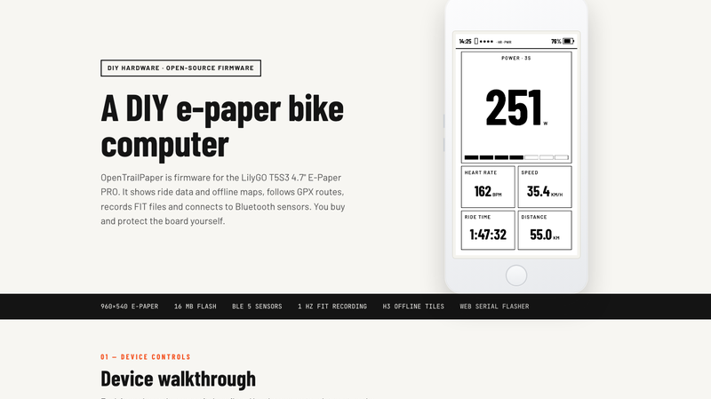
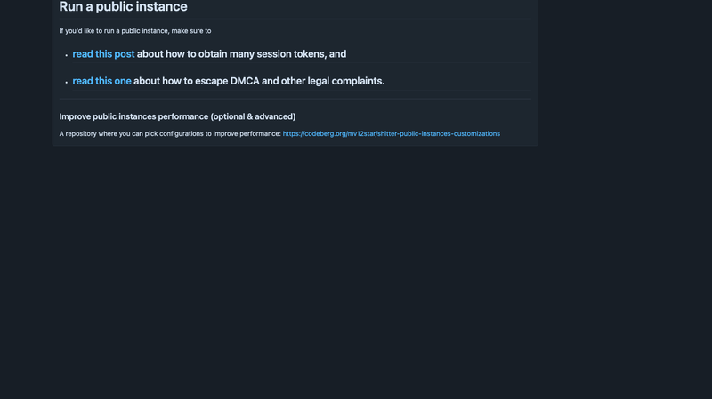
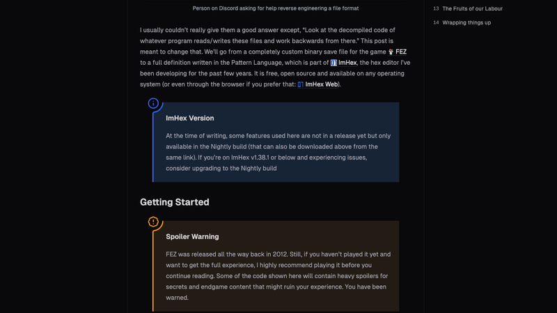
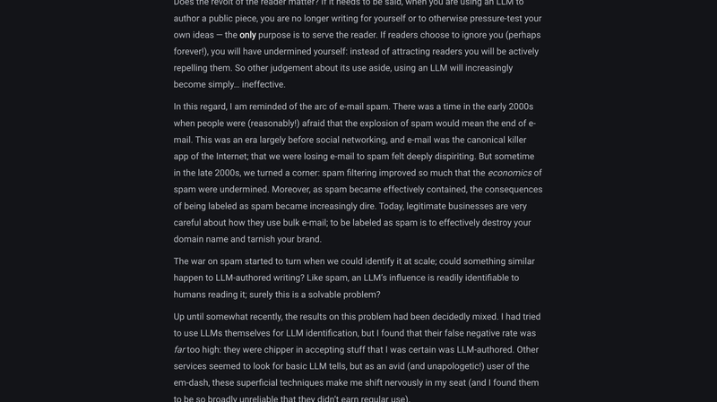

# 机器文摘 第 186 期

### RollTab：125M 模型在 iPhone 上跟你合奏钢琴

[RollTab](https://simedw.com/2026/08/20/midi-autocomplete/)，Simon Edwardsson（V7 Labs 联合创始人）开发的免费 iPhone/iPad App，把 MIDI 键盘接到手机，弹几句后由 125M 参数 decoder-only Transformer 端上实时续奏——"GitHub Copilot, but for piano"（钢琴版 Copilot）。HN Show HN 598 分。

最关键的工程决策是音符表示：不用 NOTE_ON/OFF + TIME_SHIFT 平铺流（小模型会漂移/挂音），而是「一个音符 = 一个复合 token」NOTE(pitch, delta_onset, duration, velocity)，5 个字段各有词表、各自 embedding 求和、多头输出——主干每音符只跑一次，iPhone 15 上约 108 音符/秒。标准 decoder-only：RMSNorm + RoPE + SwiGLU；PyTorch → Core ML + INT8 量化。数据几十万 MIDI ≈ 3 亿音符事件，重度清洗去重。训练里 DPO 是最大功臣：仅约 700 对 Gemini 成对偏好样本（12 分钟单卡），胜率 69% vs 基线 24.6%。

作者做了十四轮实验才写成这篇博客，完整记录了一个小模型落地到端上的全过程——从数据清洗到量化到偏好对齐，每一步都有数据支撑。未开源，但博客本身是很好的学习材料。

### 350 种排版分类图鉴

[350-layout-compositions](https://github.com/nevertoday/350-layout-compositions)，749 Star。从经典构图、视觉原则，到出版广告、字体网格、网页 UI、影视、中国传统构图和演示文稿：350 种排版，按 8 个一级分类与 33 个二级主题组织成可浏览、可检索、可下载的知识图鉴。

8 大分类：构图逻辑（86 种）、视觉原则（45）、出版广告（36）、字体网格（54）、网页 UI（79）、影视画面（14）、中国传统构图（20）、演示文稿（16）。每种都有高清 PNG（1086×1448），支持目录浏览、缩略图画廊、CSV 检索、整包下载。

作者陈小东做过排版相关的 AI prompt 工具，这个图鉴既是设计参考手册，也可以当作给 AI 生成图像/PPT 时的"构图词典"——想要什么构图风格，直接引用编号和名称。这是原「100 种排版」项目的新版扩展。

### Obscura：Rust 写的自动化浏览器

[Obscura](https://github.com/h4ckf0r0day/obscura)，25.8k Star，Apache-2.0，Rust。无头浏览器引擎，专为 AI 代理/网页抓取设计，做 headless Chrome 的 drop-in 替代。slogan："Give every agent its own browser"。30MB 内存、85ms 页面加载、屏蔽 3,520 个跟踪域。

技术实现是完全独立引擎：JS 用 V8（经 deno_core 嵌入）；HTML/CSS 解析借 Servo 生态的 html5ever/selectors/cssparser；布局用 taffy、光栅用 tiny-skia——全纯 Rust CPU 渲染，零 Chromium/WebKit/Gecko。内置 stealth 反检测（指纹随机化 + TLS 指纹伪装 + 跟踪器拦截），自研 CDP 服务器 + MCP 服务器。

与 Playwright 非竞品而是互补：Obscura 可被 chromium.connectOverCDP 直接驱动，即"Playwright/Puppeteer 客户端 + 轻量反检测引擎"。差异在 30MB vs 200+MB、内置反检测 vs 无。一位开发者做到了谷歌多年没做（或不想做）的事情——给 Agent 们一个不背 Chromium 包袱的浏览器。

### DHH 的 Omacom 基金会：资助"可塑计算机"

Ruby on Rails 创始人、37signals 联合创始人 DHH（David Heinemeier Hansson）宣布成立非营利组织 Omacom 基金会，获得 800 万美元启动资金（后续报道为 1,495 万美元，赞助人含 Jack Dorsey），资助 Omarchy 相关基础设施与开源开发，推动"未来可塑计算机"（The Malleable Computer）愿景落地。

Omarchy 的定位是"malleable OS for the age of agents"——为 Agent 时代设计的可塑操作系统。DHH 一直主张软件应该可以被用户自由改造（而不是锁定在厂商的围墙花园里），Omacom 基金会就是把这种理念变成可持续的基础设施投资。

有意思的是 DHH 最近的动作：从 Rails 到 37signals 的"小团队 + 大软件"哲学，再到现在投入操作系统层面——他一直试图回答"软件应该为谁服务"这个问题，答案是：为使用者，而不是为平台。

### 费马大定理被 Claude 用 Lean 形式化证明了

[Anthropic 官方宣布](https://www.anthropic.com/)，Claude 用 Lean 4 在 11 天内端到端形式化证明了费马大定理（FLT）——这是迄今最大的 Lean 证明，也是 Freek Wiedijk「100 定理清单」中最后一个被形式化的定理。HN 747 分。

规模惊人：约 1,300 万行 Lean（5× mathlib）、29,500 个中间定理、60,475 个模块。工具链：Lean 4.33.1 + Mathlib v4.33.0；Claude Code 多 agent harness + Prove2Me 协作平台（定理 DAG 任务编排）；约 60 亿 output tokens。三重独立验证：从零 lake build 内核检查、comparator 比对 mathlib 陈述、独立 Rust 内核 nanoda 复检 105 万条声明零错误。

Kevin Buzzard（帝国理工，长期推动数学形式化的教授）亲自编译复核通过，评价"数学上无新信息，意义在 autoformalization 能力"——让 AI 把自然语言数学变成机器可验证的证明，这才是突破点。

### Isar Aerospace：西欧本土首次火箭入轨

2026-09-05，德国 Isar Aerospace 的 Spectrum 火箭从挪威 Andøya 航天中心成功入轨（任务名 "Onward and Upward"），这是西欧本土历史上首次有火箭进入轨道。HN 365+ 分。

Isar Aerospace（慕尼黑，2018 年创立）的 Spectrum 是两级火箭，高约 28 米，近地轨道运力约 1 吨，瞄准小中型卫星市场。本次是第二次飞行——首飞（2025 年 3 月）升空不到 1 分钟即坠毁，之后又因增压阀、天气、气瓶泄漏等多次推迟，这次成功堪称"从挫折中反弹"。入轨后成功部署 5 颗立方星 + 1 个科学实验载荷。

此前欧洲轨道发射全靠政府主导体系（ESA/Ariane 从法属圭亚那发射，法属圭亚那是欧洲领土而非欧洲本土）。这次发射被视为欧洲在美欧关系紧张背景下寻求"战略自主"的信号——欧洲终于有了自己的私营入轨能力，加入了 SpaceX、Rocket Lab 所在的行列。

### Mullvad 关闭公共加密 DNS，转投 Quad9

[Mullvad 宣布](https://mullvad.net/en/blog/shutting-down-our-public-encrypted-dns-servers-and-sponsoring-quad9-instead)关闭运营了 4 年的公共加密 DNS（DoH）服务，改为赞助 Quad9。HN 444 分。

原因：Mullvad 自 2022 年起运营公共 DoH 服务器，但"使用 Mullvad VPN 时它们是多余的——流量已经加密，VPN 内部 DNS 处理所有查询"。这些服务器对 VPN 外的用户有两个用途：Mullvad Browser 默认使用（防止 ISP 窥探），以及任何想用加密 DNS 的人。但维护公共基础设施有成本，且与 VPN 业务重叠有限。

于是 Mullvad 做了一个务实的决定：关掉自己的公共 DNS，转而赞助在隐私领域口碑同样好的 Quad9——让专业的人做专业的事。这种"关停并转"在隐私社区很罕见，也引发了 HN 上的讨论：公共基础设施的可持续性到底该靠什么？

### Statichost.eu：100% 欧洲的静态网站托管

[Statichost.eu](https://statichost.eu)，HN 290 分。"100% 欧洲静态网站托管"，对标 Netlify/Cloudflare Pages，但主打欧洲数据主权。

卖点：不只是服务器在欧盟，而是欧洲公司 + 欧洲基础设施 + 欧洲价值观。Git 部署到 CDN 全链路无 AWS、无 Cloudflare；访客零追踪、不存任何访客个人信息；提供 DPA 等合规文档。创始人 Eric Selin（瑞典），自述受够"欧洲托管跑在美国云上"，独立打造替代方案。

功能完整：Git 部署（GitHub/GitLab/Bitbucket/Forgejo/SourceHut）、任意 SSG（Hugo/Astro/Next.js/Zola）、自定义域名+自动免费 SSL、即时回滚。定价：Hobby 免费（1 站/10GB）、Starter €9/月。背书客户：FreeSewing、JUnit。"欧洲数据主权"正在从口号变成真实的基础设施选项。

### OpenTrailPaper：开源墨水屏自行车码表

[OpenTrailPaper](https://github.com/stingrae/OpenTrailPaper)，Show HN 389 分。面向 LilyGO T5S3 4.7" E-Paper PRO 的开源墨水屏自行车 GPS 码表，Apache-2.0。

硬件：ESP32-S3（16MB flash/8MB PSRAM）、4.7" 960×540 墨水屏+触摸+前光、u-blox GPS、microSD、RTC、SX1262 LoRa、BLE5；配套 iOS/Android 伴侣 App。功能：1Hz FIT 骑行记录（崩溃自修复）、Uber H3 六边形离线地图瓦片、无气压计高程方案（DEM 烘焙进瓦片）、GPX 导航、BLE 心率/功率传感器、Meshtastic LoRa 组网、训练文件支持。

价格：软件全免费无订阅；硬件自购 LilyGO 板约 $84。墨水屏码表的魅力：超长续航 + 阳光下清晰可读 + 开源可折腾——对骑行爱好者来说，这是 Garmin 之外的另一种选择。

### Nitter 被封杀后，实例反而更多了

[Nitter has more working instances than before the takedowns](https://codeberg.org/mv12star/shitter/wiki/Instances)，HN 625 分。X 在 2026-08-24 向 XCancel 发 C&D 后，9 天内社区重建出更多实例——现 9 个 clearnet + 3 个 Tor 可用实例。

复兴的催化剂是"三件套"：社区维护分支 shitter（托管在 Codeberg）+ 会话令牌方案（Nitter 现在需要真实 X 账号 auth_token）+ 抗 DMCA 托管手册。wiki 甚至公开了批量购号教程和欧盟 2001/29/EC 抗辩模板。

HN 争论焦点：pessimizer 痛批公开实例列表"= 给 Musk 送坐标"；实例主反驳"列表上所有实例均事先同意公开"。XCancel 的 RSS feeds 至今仍工作——去中心化社区的生命力在于：你关掉一个，社区会冒出三个。

### 用 ImHex 逆向未知文件格式

[Reverse Engineering Unknown File Formats with ImHex](https://werwolv.net/posts/file_format_reverse_engineering/)，ImHex 作者 WerWolv 的文章，HN 255 分。一套四步方法论：

1. **判断是否已知格式** — ImHex magic 检测/binwalk，已知则找解析器或规范；
2. **找到读写该文件的代码** — 有源码直接用，否则按语言反编译（.NET→Rider、原生→Ghidra/IDA、JVM→Recaf）；
3. **分析代码识别"积木"** — 格式本质是整数/布尔/字符串/列表/枚举的序列化，逐个识别；
4. **写 ImHex Pattern 文件记录+验证** — 边逆向边建模，用 assert、逐字节高亮验证正确性。

实战案例：FEZ 游戏存档（无 magic、定长 0xA000、0 填充）→ 完整 Pattern Language 定义。HN 热评补充：约半数"未知格式"其实是 zip 包/sqlite，Kaitai Struct 可以互补，LLM 辅助逆向效果也不错。

### The revolt of the reader：读者反抗 AI 代写

[The revolt of the reader](https://bcantrill.dtrace.org/2026/09/05/the-revolt-of-the-reader/)，Oxide CTO Bryan Cantrill 的文章，HN 99 分。主题是"读者反抗"——对 LLM 代写文章的拒读与拉黑作者。

关键数据（668 名开发者调查）：78% 识别出 LLM 后立刻停止阅读；71% 从此避开该作者；98% 偏好作者亲写（不完美但真实）的作品。核心论点：LLM 代写 = 撕毁作者-读者社会契约。Cantrill 已强制 Oxide 公开发文须通过 Pangram 检测为"人类撰写"，并点名 Rust Foundation。

HN 评论多数共鸣（有人提议做 Pangram 检测浏览器插件），少数质疑（AI 检测可靠性、垃圾邮件类比是否成立）。这可能是 2026 年内容生态最值得注意的暗流：当 AI 内容泛滥，读者开始用脚投票——真实的声音反而成了稀缺品。

## 订阅
这里会不定期分享我看到的有趣的内容（不一定是最新的，但是有意思），因为大部分都与机器有关，所以先叫它"机器文摘"吧。

Github 仓库地址：https://github.com/sbabybird/MachineDigest

喜欢的朋友可以订阅关注：

- 通过微信公众号"从容地狂奔"订阅。

