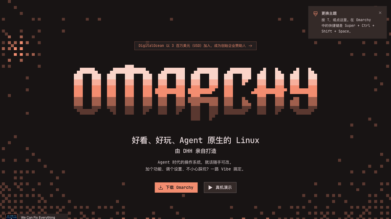
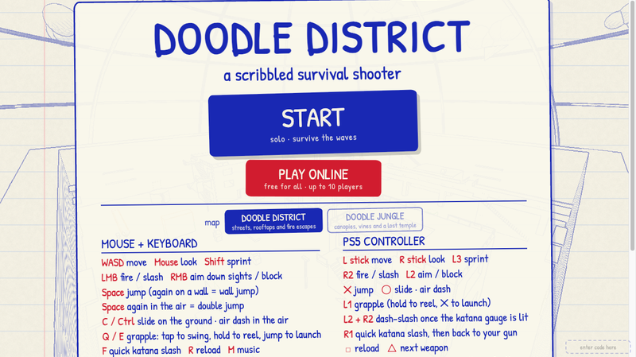
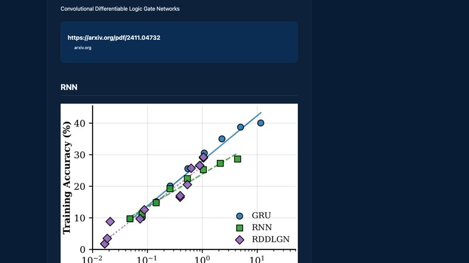
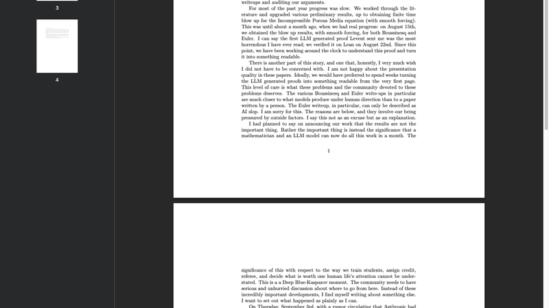
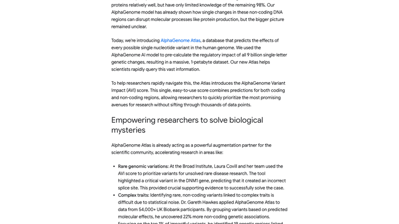
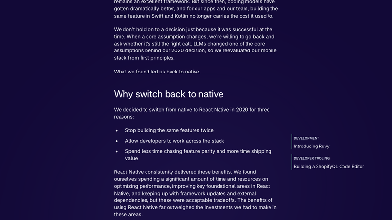
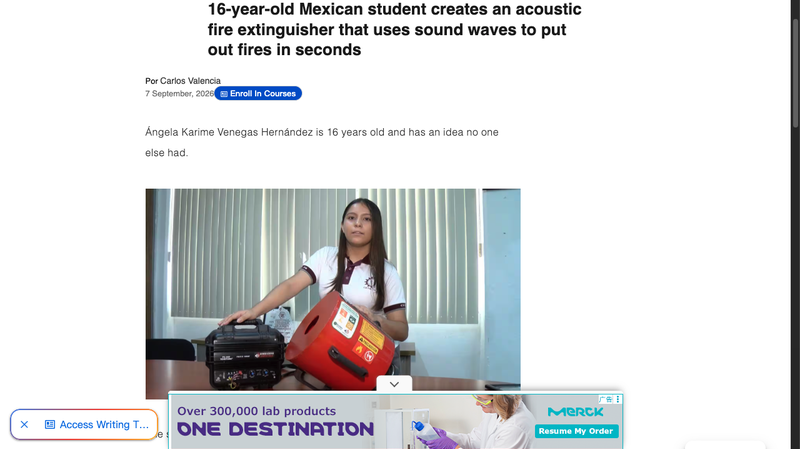
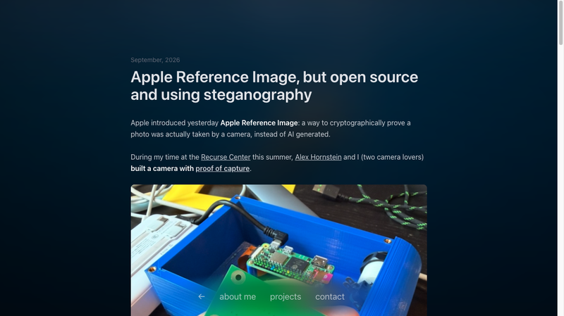
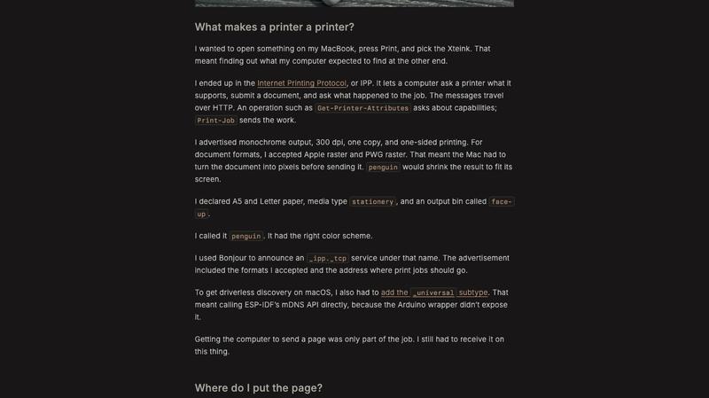
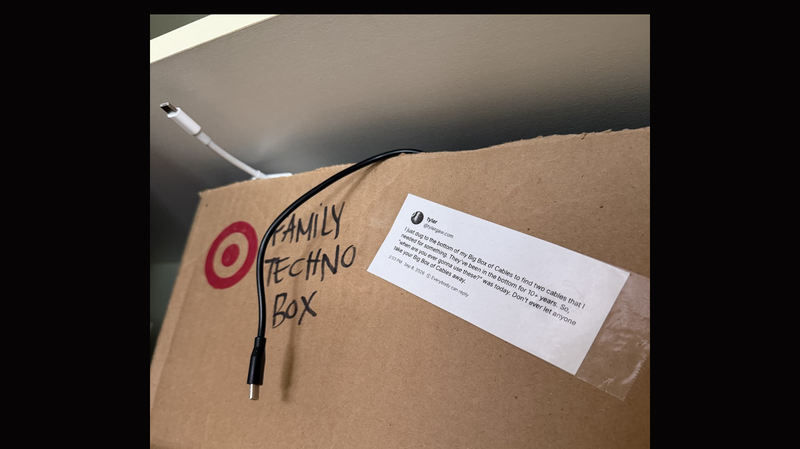

# 机器文摘 第 187 期

### Navop：Rust 写的全能运维工作台

[Navop](https://github.com/feigeCode/navop)，1,336 Star，Rust + Apache-2.0。数据库、SSH、SFTP、终端、远程桌面、监控与 AI 一体化的原生桌面工作台。支持 MySQL、PostgreSQL、Redis、MongoDB、Oracle 等主流数据库，还有 ClickHouse、DuckDB、IoTDB、KingBase、达梦、OpenGauss 这些国产/时序库。

技术路线是最大的差异点：UI 用 **GPUI + Rust**（Zed 编辑器同款 Rust GPU 加速 UI 框架），**无 WebView、无 Electron、无 Chromium**——纯原生渲染，启动快、内存占用低。而 Navicat、DBeaver、TablePlus 这类工具大多基于 Electron 或 Qt。项目 2 个月前创建，已有 2,526 次提交、83 个 tag、最新 v0.17.0，作者 feigeCode 一人贡献 2,481 次提交——典型的个人主导高效率项目。

功能覆盖很全：数据库管理（含 ER 图）、SSH/SFTP/端口转发/X11 转发/ZMODEM 文件传输、终端、远程桌面（Windows 走 RDP ActiveX 宿主）、IoT/MQTT、笔记、Markdown 编辑器。扩展系统用 WASM，还有 AI Agent 运行时和 MCP 支持。运维工具这个领域终于有了"原生 + 现代"的选项。

### Omarchy 中文官网上线

[zh.omarchy.org](https://zh.omarchy.org)，DHH（Ruby on Rails 作者、37signals 联合创始人）打造的 Omarchy 上线了中文官网。定位是"**好看、好玩、Agent 原生的 Linux**"。

命名含义很妙：**Oma 即 omakase（主厨之选）**——官方替你挑选工具、调校细节，装好即可开工；但系统完全属于你，可随意修改（slogan：malleable OS，可塑操作系统）。技术底座是 Arch Linux + Hyprland 平铺窗口管理器 + Quickshell + 键盘优先工作流。有人评价得很准："本质上就是 Arch，只是有人替你把所有硬核又无尽的决策都做完了。"

Agent 原生是核心卖点：Agent 是电脑上的一等公民——初次开机引导设置默认 Agent，应用崩溃时点弹窗派 Agent 读日志诊断根因，还能让 Agent 直接手搓应用、插件、主题。支持的 Agent 环境包括 Claude Code、Codex、Copilot、Crush、Grok、Hermes、OpenClaw 等。安装速度：顶配机器约 35 秒，大多数电脑不到 2 分钟。当前版本 Omarchy 4.0.3（Quattro）。

数据也很能说明势头：官网自述承诺捐赠约 1,850 万美元、首年 ISO 下载 **1,102,980** 次、GitHub **40,507 星**、516 位贡献者，DigitalOcean 以 300 万美元成为创始企业赞助人。中文官网是本次官网改版的 29 种语言之一——一款"个人主导 + 社区共建"的 Linux 发行版做到这个规模，在开源圈并不多见。

### doodleshooter：线框图里打反恐精英

[doodleshooter.vercel.app](https://doodleshooter.vercel.app)（Doodle District），基于线框图（wireframe/doodle）风格渲染的反恐精英式在线小游戏。微博网友评价："擦，这个好叼，打击感爆棚。"

游戏用最简的线条勾勒场景和敌人，但保留了完整的射击手感：多种武器（步枪、霰弹枪、狙击枪、武士刀，各有弹药和伤害数值）、波次制敌人（WAVE 计数）、血量系统、得分统计。视觉极简但机制完整——证明了"游戏的爽感来自反馈和节奏，而不是贴图精度"。

浏览器里直接玩，零安装。这类"极简渲染 + 完整游戏性"的作品一直很有魅力：用最少的视觉成本，做出最有打击感的体验。

### 32 个逻辑门通关马里奥

[手羽先（@Tebasaki_lab）](https://x.com/Tebasaki_lab)在未踏 IT 项目中开发"逻辑门型 AI 库"，做出了一个令人惊奇的成果：**仅用 29 个逻辑门就让马里奥动起来，32 个逻辑门通关了超级马里奥 1-1**（[技术解读](https://note.com/_furoku_/n/nad1ba4bce213)）。

"逻辑门神经网络"（Differentiable Logic Gate Networks）不是普通神经网络的浮点乘加，而是 AND/OR/XOR 这类门电路的组合。每个神经元就是一个布尔门（双输入共 16 种可能），连线随机固定，只学"每个位置放哪种门"。训练方法是"可微分化"：学习时把门软化成 16 种门上的概率分布（比如 AND 用 a×b 表示，允许 0.8×0.5=0.4 这类中间值），让梯度可以流动；训练完再离散化取最大概率的门。这个方向 2022 年就有代表性研究（Deep Differentiable Logic Gate Networks），作者也主动修正过"世界首创"的说法。

需要注意"32 个"指的是决策回路的门数，不包括感知、二值化和游戏本体。作者的野心不止游戏：他还用 136 个门做了人体关节动作推断、37 个门让 MuJoCo 里的水生物游起来、以及机器人控制。这类研究的价值在于——**在"输入明确、判断重复、需要离线低功耗"的场景里，一个小回路可以替代庞大的模型**。

### 纳维-斯托克斯方程获重大进展，但故事比数学更复杂

[Tristan Buckmaster（NYU）与 Levent Alpöge 的公开声明](https://cims.nyu.edu/~tristanb/statement.pdf)，HN 2044 分、828 条评论——本期最热的话题。他们公开了三个结果：**不可压缩多孔介质、Boussinesq 方程和三维不可压缩欧拉方程在光滑外力作用下的有限时间爆破**（finite-time blowup）。这是通向千禧年难题——纳维-斯托克斯方程组——的一条关键路径，Clay 研究所的百万美元悬赏正悬在那里。

声明里有几个数字很有冲击力：整个推进用了大量 LLM 辅助（Claude、Codex、GPT-5.6 Sol、Astra），**"第一个 LLM 生成的证明是我这辈子读过最糟糕的东西"**，8 月 22 日在 Lean 里验证通过后，他们日夜工作才把它变成人能读的论文。Buckmaster 罕见地坦承论文质量问题——"欧拉方程那份文档，只能被描述为 AI slop"。

**真正的争议在后半部分。** 9 月 3 日，在"Anthropic 解决了一个重大开放问题"的传言扩散时，Buckmaster 给 OpenAI 的一位知名数学家写信澄清。随后 Sebastien Bubeck 加入通话，告知他：OpenAI 内部模型产出了 forced Navier-Stokes 的有限时间爆破证明（约 100 页）。但很快真相浮现——**不是"模型拿到问题陈述就解决了"，而是一整个团队在做，prompt 本身也是用 Codex 写的，用了大量算力，而且是在获知 Buckmaster 团队进展之后才启动的**。

OpenAI 提出了两个"方案"：他们先发欧拉结果，OpenAI 次日发纳维-斯托克斯；或者由 Buckmaster 单独署名发表，承认是 OpenAI 内部模型解决的。Bubeck 两次要求把 Alpöge 从作者名单中移除（因为他在 Anthropic 工作）。Buckmaster 都拒绝了。当他表示如果 OpenAI 那样发布他会公开内情，得到的回复是：**"为什么要毁掉你的职业生涯？"**以及"如果你不想让我友善，我也没必要友善"。

Buckmaster 的措辞很克制：他没有见过 OpenAI 的证明，不指控任何人，只是陈述"我被告知了什么、何时被告知、以及对方提出了什么"。他强调"如果 OpenAI 模型确实补上了纳维-斯托克斯的缺口，那是了不起的事，应该由他们大声宣布，并且保持历史的完整"。

最后他说：这是**"Deep Blue 对 Kasparov 的时刻"**——一个数学家和 LLM 现在能在一个月内完成这些工作，这件事对"如何培养学生、如何分配功劳、如何评审、如何决定什么值得一个人一生的注意力"的意义，怎么强调都不过分。数学界需要认真而不慌不忙地讨论接下来往哪走。

### AlphaGenome Atlas：为基因组画一张"A 到 Z"的效应地图

[AlphaGenome Atlas](https://alphagenome.google/atlas)，Google DeepMind 2026-09-08 发布的人类基因组高分辨率资源，HN 562 分。它用 AlphaGenome 模型（2025 年发布的 sequence-to-function 模型）**预计算了人类基因组中约 90 亿个单核苷酸变异（SNV）的分子层面影响**，打包成 1 PB 的开放数据集 + 免费网页门户。定位类似基因组版的"AlphaFold 数据库"。

规模惊人：**1 PB 数据集，比 AlphaFold 数据库大 30 多倍**。输入最长 1 Mb DNA 上下文，输出做到碱基对级分辨率；每个变异给出数千条分子效应预测，覆盖数百种人类和小鼠细胞类型/组织（转录因子结合、染色质可及性、组蛋白修饰、RNA 剪接、基因表达等）。核心的 AVI 分数（AlphaGenome Variant Impact）把变异影响浓缩成一个数字，并附带特征归因解释——告诉你这个分数是被剪接、表达还是染色质驱动的。

重点解决的是**非编码区变异**这个老大难：基因组 98% 是非编码区，此前最难解读。实测案例很有说服力：Broad Institute 用它找到此前被忽略的 DNM1 基因变异（与癫痫性脑病强相关，预测显示该变异制造了错误剪接位点，实验验证成功）；University of Exeter 用它分析 UK Biobank 5.4 万+ 全基因组，**多发现 22% 的非编码关联**。

### Shopify 从 React Native 迁回原生

[Shopify 官方博客](https://shopify.engineering/back-to-native)，HN 1260 分、943 条评论。标题就很有意思："Native is now the future of mobile at Shopify"。副标题更直接：**"Coding agents changed what it costs to build mobile apps twice."**

关键点在于：**不是因为性能**。文章明确写着 "React Native apps can be fast. Ours are."（RN 可以很快，我们的就是），也强调 RN "依然是个优秀的框架"。真正的原因是编码智能体改变了成本结构：

2020 年选 RN 的三条理由（不用写两遍、跨技术栈协作、减少两端对齐成本）中，第三条已被 LLM 大幅削弱——Shopify 自 2021 年就开始用 LLM 写代码，到 2025 年底模型能力足够强，他们开始质疑"做两遍是否还等于两倍工作量"。实测用 LLM 把大 App 核心部分用 Swift/Kotlin 重建，效果"好得出乎意料"：智能体能以 iOS 实现为参照在 Android 上实现同一功能，也能帮开发者快速上手非主栈技术。

有意思的反转：RN 的热更新救不了智能体的迭代速度——因为智能体靠 accessibility tree 和截图理解状态，改代码只要几秒、跑测试却要几分钟。原生开发的"编译-测试"循环反而更适合 Agent 时代的开发节奏。

### 16 岁学生做出声波灭火器

[墨西哥 16 岁学生 Ángela Karime Venegas Hernández](https://www.upsocl.com/en/16-year-old-mexican-student-creates-an-acoustic-fire-extinguisher-that-uses-sound-waves-to-put-out-fires-in-seconds/) 做了一个用声波灭火的装置，HN 384 分。她在 Tamaulipas 的 CETIS 78 读书，某天决定"不用吹、不用水、什么都不用，只用声音"灭掉一根蜡烛。

装置极简：12 伏电池 + 频率发生器 + 扬声器，每秒发出 30 次脉冲。原理是声波振动把氧气推离火焰，火在 5-8 秒内熄灭。她反复测试了 100 多次，确认对木头、易燃液体、食用油和电子设备都有效——**对电子设备灭火这点尤其有价值**，因为传统灭火剂会直接毁掉设备。

这不是新概念（声波灭火在实验室里被研究过多年），但一个 16 岁学生用几百美元的材料做出可工作的装置，并系统测试了多种火源，这份完成度值得称赞。消防领域的创新往往被忽视，但它与每个人的安全相关。

### Proof of Capture：证明照片是"真的拍的"

[Proof of Capture](https://merybenavente.me/blog/proof-of-capture)，HN 135 分。作者 María Benavente 和 Alex Hornstein 在 Recurse Center 期间造了一台能"证明拍摄"的相机——应对 AI 生成图像泛滥的问题。

设计理念很有意思：**与其事后检测假货，不如在拍摄时证明真实**。作者 2019 年部署过 ML 事实核查工具，当时的结论是"检测必输"——检测器每改进一次，都是在给下一个生成器提供训练信号。所以她的思路转向了：不去检测假，而是证明真。

硬件方案：树莓派 Zero + 显示板 + ATECC608 加密芯片 + 快门按钮 + 3D 打印外壳。拍摄时用硬件加密芯片对图像签名，形成不可伪造的"拍摄证明"。巧的是苹果前一天刚发布 Apple Reference Image（同样是加密证明照片来自真实相机而非 AI），而这个项目是**开源版 + 用隐写术嵌入证明**。

"证明真实"vs"检测虚假"——这个思路转换可能是对抗 AI 生成内容更可持续的路径。

### How to build a printer：把墨水屏伪装成网络打印机

[How to build a printer](https://github.com/NishantJoshi00/crosspoint-reader)，HN 447 分。标题是个幌子——这不是硬件组装指南，而是作者 Nishant Joshi 让一块廉价的 ESP32-C3 墨水屏阅读器（Xteink X3）**伪装成一台北欧标准的网络打印机**：在 macOS 上按 Cmd+P，选"penguin"，页面就出现在墨水屏上。

技术实现：用 **IPP 协议 + Bonjour/mDNS 广播 `_ipp._tcp`**，声明支持单色/300dpi、接受 Apple Raster 和 PWG Raster 格式。有个坑：macOS 的无驱发现需要 `_universal` 子类型，而 Arduino 封装没暴露这个 API，只能直接调 ESP-IDF 的 mDNS 接口。

最精彩的是内存技巧：**一页印出来是 8.4MB，而设备只有 400KB RAM**（连上 Wi-Fi 后只剩 6.8KB 堆）。`mmap` 也救不了（C3 的 flash 映射不支持 SD 卡）。他的解法是**把显示屏当存储用**：逐行解码 → 缩放 → 抖动 → 写进屏幕缓冲区，工作区反复复用，缓冲区从约 113KB 压到 62KB。

HN 讨论里，打印机固件开发者 ValdikSS 建议用 1-bit 模式（数据量少 8 倍）加精确的屏幕尺寸媒体定义；还有反复出现的"为什么不做 PDF"讨论——答案是 RAM 和 ROM 根本装不下。

### 别让别人拿走你的线缆大箱子

[Don't let anyone take away your big box of cables](https://blog.jim-nielsen.com/2026/hands-off-my-cables/)，HN 770 分。一篇关于"要不要留一箱旧线缆"的温情随笔，引发了互联网的集体共鸣。

故事很短：作者 Jim Nielsen 刷到 Tyler Gaw 的一条帖子——"我今天为了找两根线，翻到了线缆大箱子最底层，它们已经躺在那儿 10 年以上。所以'你这辈子到底什么时候会用到它们'的答案是——就是今天。永远别让别人拿走你的线缆大箱子。"Nielsen 被这条帖子"又哭又笑"，于是把它打印出来剪下，贴到自己那个被妻子标注为 **"FAMILY TECHNO BOX"** 的箱子上——既是提醒自己为什么留着，也是对家里想偷偷扔掉它的人的"警告"。

HN 评论区热闹得像线缆囤积者互助会，几条实质结论：**专有/冷门线要留**（打印机线、RS232、PS/2、FireWire、老笔电充电线，需要时贵且难找），标准线（HDMI、以太网、USB）可以扔；"一扔就用到"是普遍经验，所以"线缆后悔值的最优解 > 0"；最实用的警告是**模组电源线绝不能混用**——接口看着通用但引脚定义不同，插错会烧硬盘。环保两难也真实：舍不得进填埋场 vs 老线存量早就超过可用设备。有人把箱子比作祖父的车间——手边有料，能修一切。

## 订阅
这里会不定期分享我看到的有趣的内容（不一定是最新的，但是有意思），因为大部分都与机器有关，所以先叫它"机器文摘"吧。

Github 仓库地址：https://github.com/sbabybird/MachineDigest

喜欢的朋友可以订阅关注：

- 通过微信公众号"从容地狂奔"订阅。

