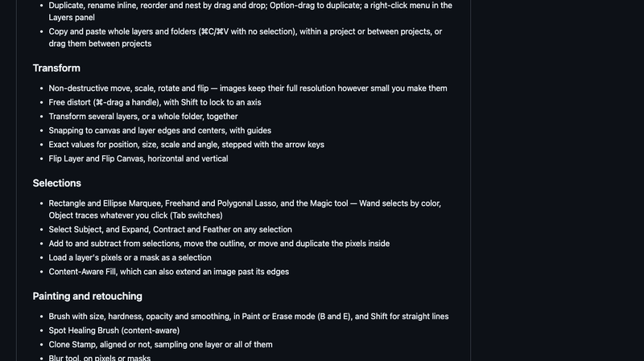
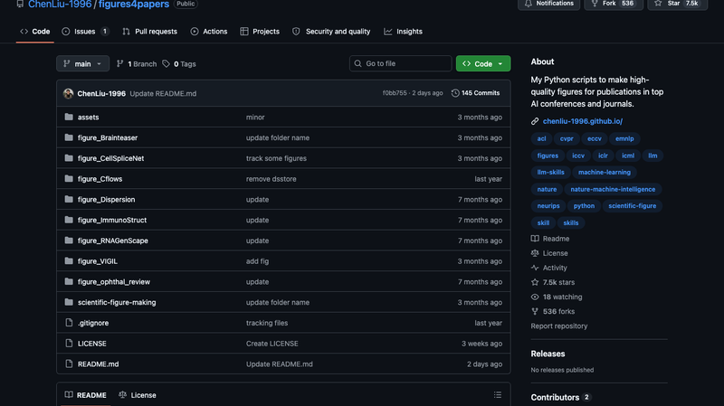
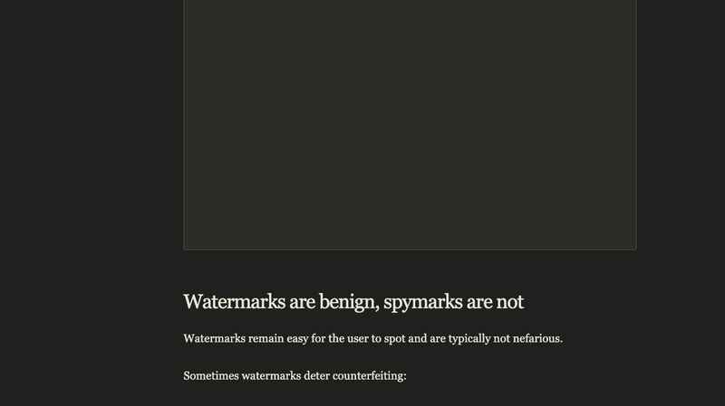
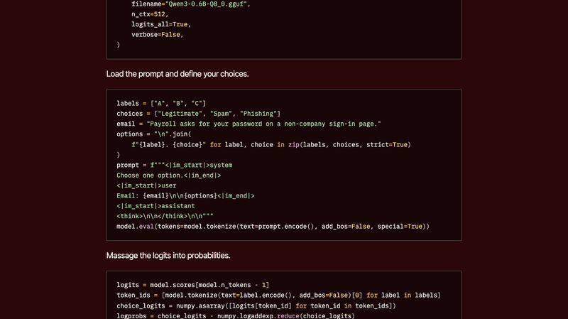
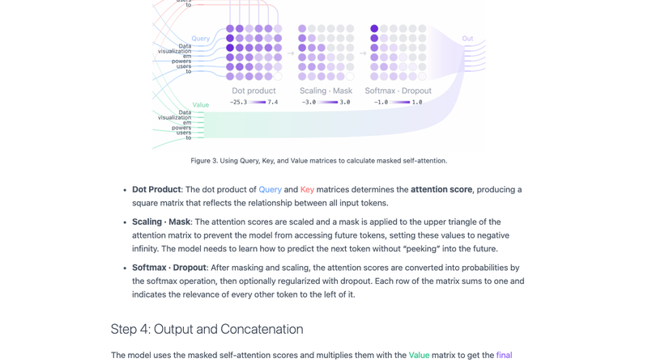
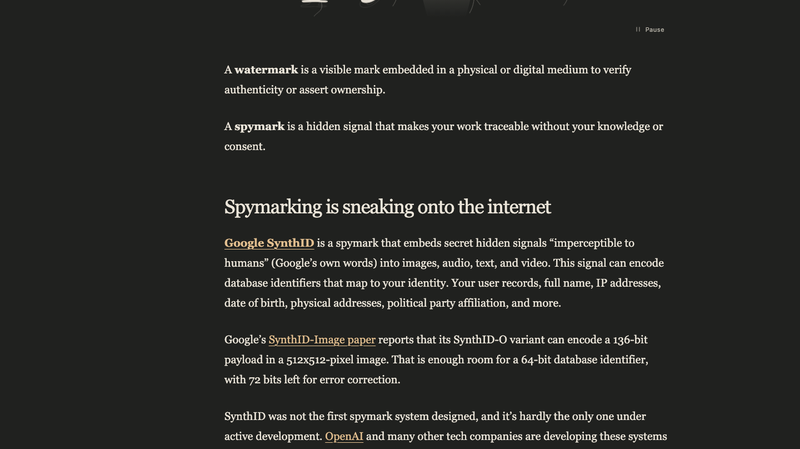
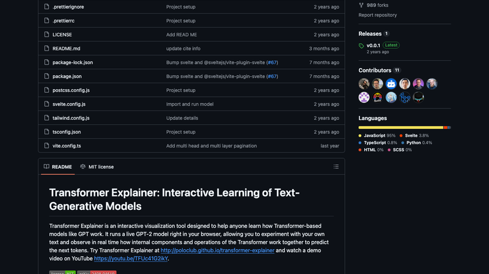
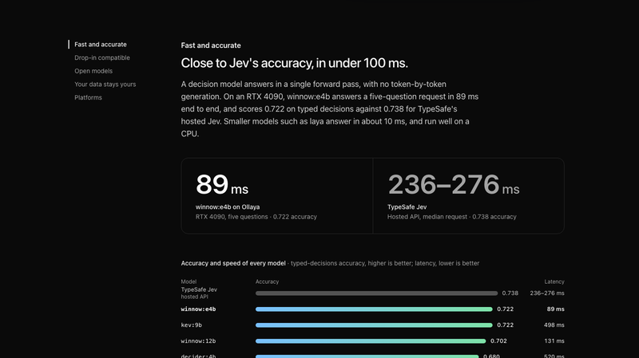
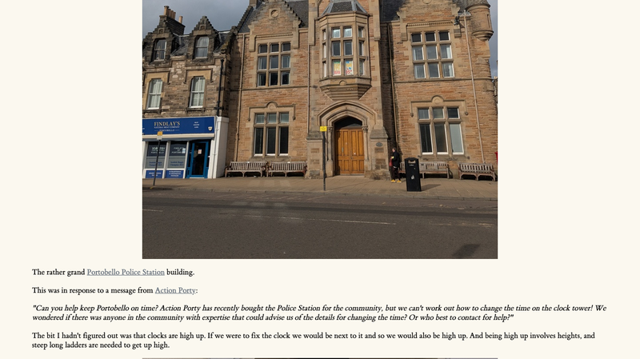
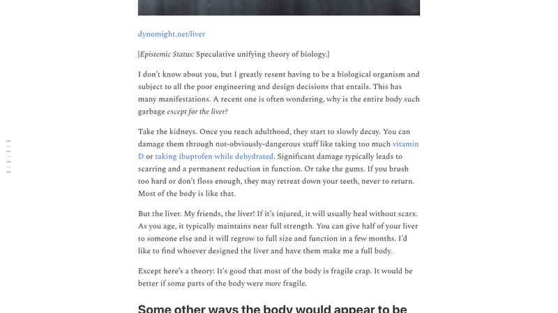

# 机器文摘 第 189 期

### Compositor：12MB 的开源"Mac 版 Photoshop"


[Compositor](https://github.com/robbietilton/Compositor)，5,878 Star，MIT。作者 Robbie Tilton 给自己写了一个 Photoshop 式的合成器，后来直接免费开源。微博上的介绍是"12 兆大小的 Mac 开源高仿复现版 Photoshop"——这个数字**实测甚至更小**：DMG 安装包 6.3MB，装完 App 约 10–11MB，主二进制只有 5.7MB。

为什么这么小？因为它**纯原生**：Swift 占 94.9%（SwiftUI + AppKit），C 占 2.8%（像素热循环），画笔和图层效果用 Metal 计算着色器跑在 GPU 上，滤镜走 CoreImage/Accelerate，AI 功能用系统 Vision 框架。**唯一的第三方依赖是 Sparkle.framework**（更新器），其余全部是 macOS 系统框架，不打包任何运行时，也不内置 ML 模型。对比一下：Electron 套壳的编辑器动辄几百 MB。

功能相当完整——图层面板、蒙版、剪贴蒙版、调整图层、GPU 图层效果、魔棒/对象选择/主体选择/内容识别填充、画笔/修复/图章/文字/形状、Camera Raw 滤镜、PSD/RAW/SVG 导入，以及全套 PS 快捷键。缺的是 CMYK、云功能和插件生态。有一个设计对 Agent 时代很友好：**项目格式 `.comp` 本质是个文件夹**（manifest.json + PNG 图层），**AI Agent 可以直接读写它，画布实时刷新**。

### Flet：用纯 Python 写手机 App



[Flet](https://github.com/flet-dev/flet)，17.1k Star，Apache-2.0。用纯 Python 写 Web/桌面/移动 App，不需要前端经验。"以前给 Python 脚本套个像样界面，要么 Tkinter 太土，要么自己去学前端"——Flet 让你继续用 Python 写界面和逻辑。

底层确实是 **Flutter**，架构是双端的：**Python SDK 负责逻辑，Flutter 客户端负责渲染**，每个控件都有 Python 端和 Flutter 端两部分，两端用 **MessagePack 自定义协议**通信（消息类型如 `update_control`、`control_event`、`patch_control`）。三种运行方式很有意思：桌面原生窗口（`flet run`）、Web 服务端通过 WebSocket、以及**浏览器里用 Pyodide/WASM 无服务器直接跑**。手机端通过预编译二进制包（pypi.flet.dev）解决 NumPy/pandas 这类原生依赖，`flet build` 底层调 Flutter 工具链打包上架。

一套代码覆盖 iOS / Android / Windows / macOS / Linux / Web 六端。对比同类：NiceGUI（FastAPI + Vue）和 Streamlit（脚本重跑模型）**本质上都只能在浏览器里看**——Flet 最大的差异化就是**移动端和桌面原生**，是 Python 生态里少见能真正交付手机 App 的框架。

### figures4papers：论文级图表的代码仓库



[figures4papers](https://github.com/ChenLiu-1996/figures4papers)，7.5k Star，CC BY-NC 4.0。作者陈刘（Chen Liu）是耶鲁大学计算机科学博士生，他把自己**为顶会/期刊论文实际画过的图表代码**集中归档整理——这些图已实际发表在 Nature Machine Intelligence、ICML、NeurIPS、ECCV 等。

关键定位：**这不是通用绘图库**，而是一份"照改就行"的真实案例集。仓库按"一篇论文一个文件夹"组织：`figure_ImmunoStruct/`、`figure_VIGIL/`、`figure_RNAGenScape/`……每个文件夹里是 `plot_<图类型>.py` 脚本加 `figures/` 输出目录，每张图同时产出**高 DPI PNG（位图）和 PDF（矢量）**双格式——后者是投稿要求的标准。总共约 25 个绘图脚本，覆盖组成/占比条形图、消融对比图、轨迹图、3D 示意、扩散瑞士卷等常见的论文图类型。

仓库里还有个值得一提的东西：`scientific-figure-making/` 目录是一个**给 AI 编码 Agent 用的技能包**（SKILL.md + references），包含 API、常见模式、设计理论、教程等参考文档。也就是说作者不仅把图存下来了，还把"怎么画科研图"这件事整理成了 Agent 可以学习的技能。

### What Sun got wrong：不是战略失败，是厌倦了经营



[What Sun got wrong](https://bcantrill.dtrace.org/2026/09/20/what-sun-got-wrong/)，Bryan Cantrill（Oxide CTO、前 Sun 工程师）的文章，HN 691 分、428 条评论。核心论点用一句话就能说完：**Sun 不是死于战略不行，而是"厌倦了经营企业的日常琐碎"**（had become bored with the mechanics of running a business）——作者说这是他 2011 年一条 HN 旧评论的 15 年后浓缩版。判断更狠：**对经营机制感到厌倦的公司，无论战略多成功都不可能成功。**

支撑它的案例极其具体（2005 年）：一家跑在 OpenSolaris 上、增长迅猛的云计算先驱创业公司，想买一大堆 Sun 硬件——这本来是"开源 Solaris"战略的完美验证。结果**打不通 Sun 的电话，好不容易打通了还被推销错的产品**。对比 Dell：半夜填了个网页表单，第二天早上本地销售 Steve 就上门了，两周内完成定价谈判、进机房、凭财报搞定租赁（甚至不需要个人担保）。客户把这写成了博文《The Sun Doesn't Shine on Me》，Cantrill 读到的时候刚创办 Fishworks，心都凉了——**"战略大胜，运营完败"**。Sun 最终没挺过去。

结尾还有个漂亮的转折：Cantrill 后来加入了那家"Sun 照不到光"的创业公司，Dell 的销售 Steve（Steve Tuck）也被招了进来——**多年后两人共同创办了 Oxide**。他说把"鼓舞"和"警醒"一并继承，才是最好的致敬。

HN 讨论里延伸出几个当下的类比：战略正确不等于成功，销售、客户响应才是生死线；沉溺于过去的成功会错过大范式转移（有前 Sun Labs 工程师说致命伤是"企业级聚焦"导致看不懂 OSS/Linux 的机会——映射到今天，问题是巨头会不会同样忽视 AI）；以及内部政治内耗——有前员工说"最大的敌人是 Sun 内部的其他团队"，泡沫的钱把问题掩盖了，泡沫一破就崩。

### Jev in 25 Lines of Python：一场高水平的"祛魅"



[Jev in 25 Lines of Python](https://www.nobodywho.ai/posts/jev-in-25-lines/)，作者 Duarte O.Carmo，HN 690 分。这是一篇**讽刺/戏仿博文**，主旨是"Jev 没那么神"。

背景：Jev 是被宣传为"下一代 LLM 范式"的决策模型（decision model），营销关键词包括 System One decision model、RLCD（Reinforcement Learning for Calibrated Decisions）、合成数据、API。作者认为它**本质就是**：给 LLM 一个带选项的 prompt，读取候选答案 token 的 logits，归一化成概率分布，作为"决策"输出。用他的话说——"它做分类、输出概率、快、本地、数据不外发"，不需要 RLCD、合成数据或者 API。

然后他真的用 25 行 Python 复现了：**加载模型**（PEP 723 内联元数据 + llama-cpp-python 加载 Qwen3-0.6B-GGUF，关键是 `logits_all=True`）；**构造 prompt**（给三个选项：Legitimate / Spam / Phishing，跑一次前向）；**logits → 概率**（取最后位置的 logits，抽出各标签 token 的 logit，用 logsumexp 归一化、exp 得概率）。示例输出是 `{'Legitimate': 0.031, 'Spam': 0.084, 'Phishing': 0.885}`——88.5% 判为钓鱼邮件。

这篇的价值不在于"揭短"，而在于把包装还原成机制：**把决策形式化为离散候选上的概率分布，本来就是 softmax 的天然用法**。理解了这一点，再看那些名词和融资故事，会清醒很多。

### ZuckOff：检测房间里有没有智能眼镜



[ZuckOff](https://zuckoff.app/)，HN 609 分。用途很直白：**知道房间里有没有人在用带摄像头的智能眼镜拍你**。

技术原理是**蓝牙 BLE**，不是红外、Wi-Fi 或磁信号——核心逻辑一句话："智能眼镜会在蓝牙上广播自己，ZuckOff 监听这些广播。"它靠**厂商签名（Manufacturer/Company ID）+ 服务 UUID + 设备名**来识别，检测规则全部来自真实设备的抓包，比如 `0x0D53`（Luxottica，即 Ray-Ban/Oakley Meta）、`0x058E`（Meta 可穿戴）、`0x03C2`（Snap Spectacles）、`0xFD5F`（Oculus VR 服务 UUID）。

形态是**纯手机 App**（iOS + Android），不需要额外硬件，用手机自带蓝牙扫描，配备后台告警、主屏小组件、锁屏实时活动、快捷指令/自动化启停。所有处理在本地完成、不需要账号，还支持把自有设备标记为免告警、日志导出 CSV。作者是独立开发者，与 Meta/Luxottica/Snap 均无关联，并接受用户寄硬件给他测试。

官网也明确写了局限，这点很诚实：**静默不等于没在录像，检测到也不等于正在录像**；信号强度只能给出大致距离，没有方向。它是一个"提高警觉"的工具，而不是反偷拍的保险。

### Spymarks, not Watermarks：水印正在变成追踪器



[Spymarks, not Watermarks](https://brand.io/article/spymarks/)，HN 697 分。作者提出了一组概念区分，值得记住：

- **水印（watermark）**：嵌在物理或数字媒介里**可见**的标记，用来验证真实性或声明所有权。
- **间谍标记（spymark）**：一种**隐藏信号**，让你的作品在你不知情、未同意的情况下**可被追踪**。

文章的核心指控对象是 Google 的 **SynthID**：它把"人类不可感知"（Google 自己的措辞）的秘密信号嵌入图像、音频、文本和视频。而这个信号**可以编码映射到你身份的数据库标识符**——用户记录、全名、IP 地址、出生日期、住址、政党归属等等。Google 的 SynthID-Image 论文提到，SynthID-O 变体能在 512×512 的图像里编码 **136 位载荷**——足够放一个 64 位的数据库 ID，还剩 72 位做纠错。

作者强调 SynthID 不是第一个这类系统，也远非唯一一个：OpenAI 和许多其他公司都在大规模开发。它们的公开说法是"帮助识别 AI 生成内容"，但实际上已经**超出了简单水印的范畴，内建了强追踪机制**。文章判断，社交媒体、内容生产工具和智能手机很快都会被这些算法填满——你发布的每一样东西里都可能藏着信号。

文章还给了一个可动手验证的例子（作者自己的照片）：把图片在频域做不可见修改，就能携带与用户关联的数据库 ID，读者可以对比原图和标记图、播放放大的差异动画、从 PNG 里解码出那个 ID。**当"真实性证明"同时具备身份追踪能力时，这两个功能就不再能分开讨论了。**

### Transformers Explained Visually：把 GPT 拆开给你看



[Transformer Explainer](https://poloclub.github.io/transformer-explainer/)，佐治亚理工 Polo Club 的作品，HN 656 分。GitHub 上开源，是那种"打开就想点两下"的教学工具。

它做的是把 GPT 式的 Transformer 模型**完整地画出来并且实时运行**：你在输入框里打字，可以看到这句话如何一步步变成 token、进入 embedding、经过多层自注意力和前馈网络，最后输出下一个词的概率分布。每一层、每个矩阵的维度都标得清清楚楚，注意力权重以热力图的形式呈现——你能直接看到模型在生成某个词时"看向了"句子里的哪几个位置。

它的特别之处是运行在浏览器里的小型 GPT-2 模型（通过 ONNX Runtime Web），所以不是示意图，而是**真实的推理过程可视化**。对于想理解 Transformer 内部机制又不想先啃论文的人，这类交互式工具的价值远大于文字教程——因为它允许你改输入、看变化、形成直觉。

顺带一提，做这个的 Polo Club 还出过 CNN Explainer、Diffusion Explainer 等一系列模型可视化工具，是这类教学材料里质量最稳定的一批。

### Ollaya：在自己电脑上跑"决策模型"



[Ollaya](https://ollaya.dev/)，517 Star，开源。定位很清晰："Run decision models locally"——对任何文本或 JSON **提出有类型的问题，毫秒级拿到校准过的答案**，全部在本地硬件上跑。

和聊天模型最大的区别在于**它不做逐 token 生成**：决策模型用**单次前向传播**直接返回答案。官方的例子很直观——丢进一段客户投诉：

```
$ ollaya run winnow:e4b "Third time this year you've double-charged me.
Refund it today or I'm cancelling and moving to a competitor."

intent             refund        0.91
is_urgent          yes           0.92
frustration        2.89 / 3
very angry         yes           0.86
refund_requested   yes           0.99
churn_risk         yes           0.99
```

性能数据是它的卖点：RTX 4090 上 `winnow:e4b` 一次回答五个问题端到端 **89 毫秒**，准确率 0.722——对比 TypeSafe 托管的 Jev（中位 236–276ms，准确率 0.738）。也就是说：**准确率差 2%，速度快 3 倍**。更小的 `laya` 模型约 10ms，在 CPU 上都跑得很好。它兼容 Jev 的输入输出格式，可以 drop-in 替换。

"决策模型"这条路线值得关注：很多实际任务并不需要模型"说一段话"，只需要它给出若干个带概率判断的字段——分类、意图、风险、优先级。把这类任务从生成式推理里拆出来，用一次前向传播解决，成本和延迟能降一个数量级。

### 修复 Portobello 警察局的钟楼



[Fixing the Portobello Police Station Clock](https://pointinthecloud.com/2026-04-11-211700.html)，HN 547 分。一个纯粹的工程手记，读起来非常舒服。

缘起是一封朋友的消息："我知道我们今天本来约在爱丁堡，但你介不介意改到 Portobello，陪我去修一下老警察局的钟？"——发信的背景是社区组织 Action Porty 买下了这栋 1877 年的警察局，却没人知道怎么调钟楼上的时间，于是公开求助。

钟楼里的发现很有意思：设备是**三个钟面共用的机械机构**，电机通过一连串齿轮驱动一根每分钟转一圈的轴，轴分成三路分别驱动分针，每个钟面上再用一个齿轮导出时针。改时间的办法是找到齿轮上的一个**棘爪（pawl）**，抬起来就能直接转动轴——每个指针在钟面上有配重，所以他们靠"想象看不见的指针在配重的对侧"来对时。中间还有个小插曲：他们一度以为钟在倒着走，后来才意识到自己站在钟的内部、看反了方向。

报时机构更像个考古现场：原始机构被改造过，接到一个**绝对不属于 1877 年的控制箱**——里面是一块 PIC 16F628 微控制器（日期码指向 2001 年）、若干继电器、电源和给铅酸电池充电的电路。箱子上没有厂家标记，也没有任何说明文档，只有一个含义不明的 "advance" 按钮（要按住几秒才生效，松开后报下一个小时），和一个闪烁长短码的 Status LED——作者到最后也没完全破译。一块匿名电路板加一个 25 年前的时钟，就这样靠"试出来"被接管了。

### 为什么人体除了肝脏都这么"垃圾"



[Why is the liver so weirdly regenerative?](https://dynomight.substack.com/p/liver)，dynomight 的文章，HN 570 分（标题很皮："为什么人体这么糟糕，除了肝脏"）。

先摆事实：肾脏成年后就开始缓慢衰退，受过伤就留疤、功能永久下降；牙龈退下去就长不回来；腿砍掉了就是砍掉了。但肝脏不一样——**受伤通常无疤愈合，随年龄保持接近满血，捐掉一半几个月内就能长回原尺寸和功能**。

作者给出的答案只有两个字：**癌症**。端粒随细胞分裂变短、分裂 50–70 次后就停止，这不是"设计失误"，而是**刻意用来拖慢癌症的设计决策**。因为一次突变让细胞开始疯长之后，端粒耗尽可能就是拦住它的那道墙。同理：为什么不能重长一条腿？那需要让全身细胞都保留一个"进入快速生长模式"的按钮加外部触发器——相当于让细胞长期处在离癌症更近的状态。肾脏为什么脆弱？让肾脏努力自修复大概在生物学上可行，但代价很可能是更多肾癌。"心脏癌"这个词听起来几乎不合语法，正是因为心肌细胞童年后就不再分裂。

那肝脏凭什么特殊？两个标准答案：**一是它的工作本身就一直在挨打**——它位于肠道的直接下游，毒素、细菌产物、病毒、寄生虫都先在它这里高浓度出现；而解毒化学本身往往自伤（它先把毒物分解成更有毒的东西，再递归处理）。按岗位说明它就一直在受损，所以必须能再生——进化让它这样设计，然后老实付那笔"癌症税"。**二是肝脏其实不特殊**——皮肤能扛创伤、肠道能扛消化酶和细菌，两者表层都在不断更新，而皮肤癌和结直肠癌都相当常见。真正特殊的是那些"藏起来"的器官：不用接触环境，就干脆牺牲再生能力换取安全。

于是有了一个漂亮的理论：**再生能力与癌症风险同源**。进化按器官是否接触环境来调这个参数。当然作者也承认这不完美——再生并不总是"选项"，皮肤和肠道层内相当同质，肝脏可以近似看作一堆重复功能单元（捐一半后那些单元变大就是"长回来"的机制），而神经元这类高度结构化的组织，根本无法用同样方式重来。

## 订阅
这里会不定期分享我看到的有趣的内容（不一定是最新的，但是有意思），因为大部分都与机器有关，所以先叫它"机器文摘"吧。

Github 仓库地址：https://github.com/sbabybird/MachineDigest

喜欢的朋友可以订阅关注：

- 通过微信公众号"从容地狂奔"订阅。


