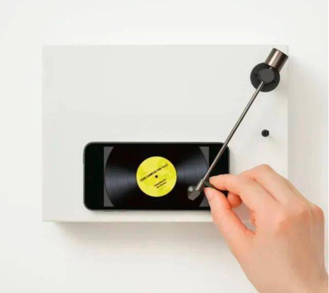

# 机器文摘 第001期

## 搞机

> TurnT是一个颇具创意的唱盘设计，它把智能手机与模拟黑胶的老式音乐播放方式相结合。用家把触笔放在手机屏幕显示的黑胶唱片上，它即开始播放。从内部结构上看，它其实是一个无线扬声器，可以连接到智能手机播放音乐。TurnT这种播放音乐的体验增加了互动的体验感，如同在实际的唱片上一样，挪开唱针会立即停止音乐，将其“向内”移动到手机屏幕上显示的光盘中心就可以播放音乐。要更改歌曲，您可以通过滑动来更改专辑，还可以重新定位。

- 参考文章：
  - [把手机变成黑胶唱机 --- Yamaha发布了与智能手机配合使用的独特音乐设备](https://www.sohu.com/a/573073318_121124377)

## 动向

### AI生成图像技术带来的“艺术危机”
> 近几周，基于AI生成的图像艺术作品的新闻越来越多，以DALL-E、Stable Diffusion等神经网络模型为代表的图像生成类AI进化越来越快，已达“以假乱真”程度。我也在动手尝试后惊叹他们的生成效果非常逼真和充满想象力。然而很快，此类AI就引起设计师、画师、艺术家的反对（恐慌？）。当然也有很多持积极态度，把它们当作工具加以利用，甚至不乏商业头脑灵活的人士，已经通过AI作画开始获取收益。于是引发了一系列的反应和讨论。

- 参考文章：
  - [知名图库Unsplash 宣布禁传AI生成图像](https://www.uisdc.com/unsplash-prohibited-ai)
  - [付费图库集体封禁AI生成图片](https://www.51cto.com/article/719747.html)
  - [AI 绘画 Windows 本地零基础搭建 Stable Diffusion](https://www.bilibili.com/read/cv18571483)
  - [AI数字绘画 stable-diffusion 保姆级教程](https://zhuanlan.zhihu.com/p/560226367)
  - [一个包装好的AI绘图开源GUI客户端](https://github.com/ahrm/UnstableFusion)

## 观点

> 程序员是计算机的翻译官。他们先是把人类的语言翻译成计算机的语言，现在又教会了计算机使用人类的语言。 
> - 来自[@t0mbkeeper](https://weibo.com/6827625527/M7vHNl9HD)

## 长文
- 对很多事情都有兴趣，但是生命的时间有限，怎么办？[这篇hacker news上的讨论（英文）](https://news.ycombinator.com/item?id=32628511)或许能提供一些建议。
- [这篇文章提到了一项关于焦虑的研究（英文）](https://www.calnewport.com/blog/2022/05/16/taking-a-break-from-social-media-makes-you-happier-and-less-anxious/)。研究表明，远离社交媒体（包括及时通讯工具）一个星期，可以显著提升幸福感、降低焦虑程度；
- 掌握一项技能需要时间和实践，降低预期，慢即是快。[《我是如何学会编程的》（中文）](https://geekplux.com/posts/how-i-learned-programming)，这篇文章是一位网友分享的关于他学习编程的历程。

## 资源
- [coding-fonts](https:///coding-fonts.netlify.app/) ​​​是一个不错的编程字体网站，可以在线预览各种适合编程开发时用的字体，让选择更加直观。
- [深度强化学习羊了个羊](https://github.com/opendilab/DI-sheep) 这个github仓库开源了一个通过AI强化学习来玩耍“羊了个羊”游戏的模型及代码，结构清晰，效果很棒，用于了解深度强化学习知识非常不错。
- [深度学习500问](https://github.com/scutan90/DeepLearning-500-questions)这本在线书籍以问答形式对常用的概率知识、线性代数、机器学习、深度学习、计算机视觉等热点问题进行阐述，目前在github将近50k颗星。

## 订阅
这里会隔三岔五分享我看到的有趣的内容（不一定是最新的，但是有意思），因为大部分都与机器有关，所以先叫它“机器文摘”吧。

喜欢的朋友可以订阅关注：

- 通过微信公众号“从容地狂奔”订阅。

- 通过[竹白](https://zhubai.love/)进行邮件、微信小程序订阅。

