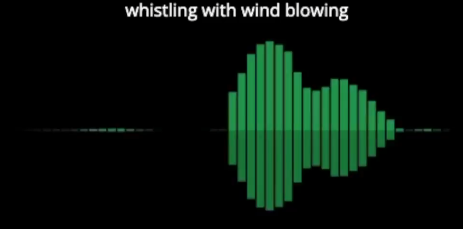
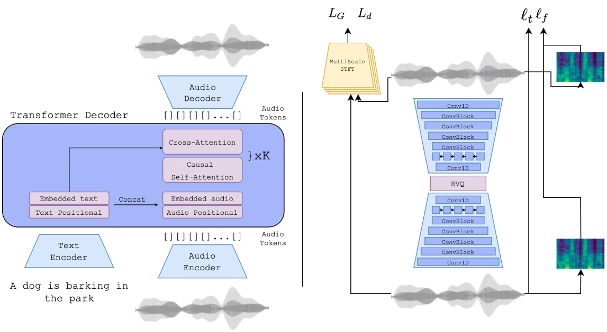
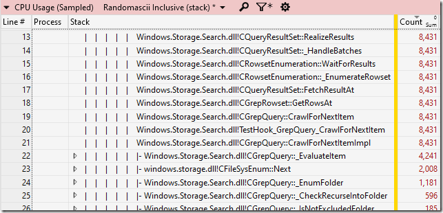

# 机器文摘 第002期

## 搞机

> MNT推出了一款名叫Pocket Reform的迷你笔记本电脑。它外形紧凑（屏幕只有7英寸），但功能齐全，据官方介绍，它的性能满足轻量办公需求，甚至还能玩一些游戏（ARM平台）。虽然现在的智能手机在性能方面已经有了很大提升，且便携性远超笔记本电脑，但是还是有相当一部分人倾向于在具有真实物理键盘的“电脑”上进行操作。

在我看来，这台设备可能对于希望随时随地写两行代码的程序员更加具有吸引力。
- 参考文章：
  - [可以装载口袋里的开源PC](https://spectrum.ieee.org/meet-an-open-source-pc-that-can-fit-in-your-pocket)

## 动向

### 文字直接生成3D模型

谷歌实验室的几个哥们上周发布了一个新作----DreamFusion。输入文字，就能生成带深度图和法线的3D模型。

开发团队声称：
> 最近在文本到图像合成方面的突破是基于在数十亿个图像-文本对上训练的扩散模型。将这种方法应用于3D合成将需要标记大量的3D资产和用于对3D数据进行去噪的高效架构，而目前这都不太可行。在DreamFusion中，我们通过使用预先训练的2D文本到图像扩散模型来执行文本到3D合成来规避这些限制。我们的方法不需要3D训练数据，也不需要修改图像扩散模型，证明了预训练图像扩散模型作为先验的有效性。

具体方法据称是来自他们新提出的“一种通过优化损失函数从扩散模型中生成采样的方法”该方法允许他们在任意参数空间中优化采样（例如3D空间）。

我看了一下官方给出的demo，3D模型还略显粗糙，不过可能将来算力提升之后会有改善。

现在，除了插画师受到了职业威胁，就连3D建模工程师的工作也有可能被AI取代？

- 参考文章：
  - [DreamFusion官方介绍](https://dreamfusion3d.github.io/)

### 通过文字描述生成语音的人工智能也来了

> Twitter 用户 Felix Kreuk 发布了从文本到音频 (Text to Audio) 的 AI 模型：AudioGen
> AudioGen 可以 
>   (1) 根据文本生成音频；(2) 续写指定的音频；(3) 同时做以上两件事，根据指定文本描述生成指定音频。
> 作者给出的展示DEMO里展示了如下文本生成的语音：
> （1）在风声中吹口哨
> （2）男人在说话时伴有鸟和狗的叫声
> （3）警报器和嗡嗡作响的引擎接近后走远
> （4）鸽子咕咕叫并伴有沙沙的声音
> （5）男人说话的声音，背景伴有人群欢呼声

从作者公布的架构图上可以看出来，采用的也是Transformer神经网络。之前在看到AI画图时我就想到同样的原理可能用于生成音频，结果这才没过几天，人家都已经做出来了。

- 参考文章：
  - [@海辛Hyacinth](https://weibo.com/1309158107/M8mPt5LgI)
  - [作者的demo和原理介绍页面（托管在github）](https://felixkreuk.github.io/text2audio_arxiv_samples/)

## 观点
> 站桩的简单，枯燥和有效，就好比持有 sp500 指数基金简单，枯燥但足以秒杀 95%以上的基金经理一样。
> 莫将容易得，便作等闲看。
- 来自[@硅谷王川](https://weibo.com/5339148412/LeTdmcfjW)

## 长文

- [为什么现在的软件这么慢（英文）](https://randomascii.wordpress.com/2022/09/29/why-modern-software-is-slow-windows-voice-recorder/)，作者在Windows系统（Windows 10, 21H2版本）下使用“录音机App”的时候获得了极差的体验（确切的说是软件启动后大概卡死了将近20秒）。于是动手分析到底是什么原因导致，然后发现主要是这个软件启动后疯狂扫描“用户”文件夹下的录音文件用于构建界面中的录音列表，这种密集IO操作导致软件停止响应。作者花了很大的篇幅来吐槽这种行为，对于微软工程师为什么这么做表示莫名其妙。不过由于我们现在的计算机大都使用了固态硬盘，而且我们的习惯一般不会在“用户”文件夹下存放太多文件，所以这个体验应该不太明显。但即使这样，我也同样对Windows系统现在的软件质量感到担忧。

- [内卷、汉明问题与认知迭代（中文）](http://zhangtielei.com/posts/blog-involution-analysis.html)，作者较为科学地分析了内卷的定义和形态，从而引申出了关于什么是“人生中重要的事”的思考，文章虽然比较长，但也清晰易懂，发人深省。部分引用如下：
  > 从大的方面说，社会需要创新，个人则需要突破，而创新和突破又都要求我们不断地精益求精。那么，内卷与精益求精是本质上一样的吗？如果不是，两者的区别在哪？

  > 在某件事情上花费太多精力，并不一定就是内卷；在无关紧要的事情上花费精力才是真的内卷。

  >汉明早年在贝尔实验室工作。那年春天，他经常和几位同事聚在一起在餐厅吃午饭。吃饭期间，他向其中一位叫Dave McCall的同事提了一个问题：“在你的领域里最重要的问题是什么？”大约一个星期后，再次一起午餐时他继续发问：“你目前正在研究的最重要的问题是什么？” 显然，这位同伴对于这两个问题的回答并不一样。于是他接着问：“如果你当前做的并不是最重要的事，那为什么还要一直花时间投入去做呢？”有了这「灵魂三问」之后，于是——在那个春天接下来的日子里，汉明不得不另找别的同伴一起吃午饭了……
  >汉明的问题听起来有些让人生厌，但后来演变成了一个在学术界很受关注的问题——汉明问题（The Hamming Question）。它本来说的是科研选题的事情，但实际上关乎人生最重要的选择。

  > 内卷，指的是在低水平的状态下无实质意义的消耗。这里的「低水平」，可能是客观的，也可能是主观的。
  > 针对主观的低水平状态，我们需要冲破意识层面的障碍，同时把读书、实践和思考结合起来，反复迭代，这样才可能跃升到更高的认知层次上。
  > 而针对客观的低水平状态，唯有认真对待汉明问题，选择好真正重要的人生大方向，才能避免卷入那些无关紧要的、无谓的消耗中去。这才是真正考验大智慧的时候了。

## 资源
- [每个程序员都需要知道的](https://github.com/mtdvio/every-programmer-should-know) ，整理了一份资源合集，包含了软件工程师技能相关的各类知识资源，包括算法、数据结构、浮点、Unicode、时间、内存、分布式、正则、安全、架构、工程哲学、实践、职业发展、软技能。。。等等，以及一些可用于技能训练和学习的站点。看起来非常符合我这种“收藏了就是学习了”的囤积爱好者的胃口。
- [Word Writer 6 6502汇编源码](https://github.com/jefflomax/word-writer-6-commodore-64)，是一份开源的Word Writer 6的6502汇编源码，可在模拟器下编译运行。用来学习6502汇编是一个不错的项目。上个世纪80年代爆火的计算机Commodore 64是很多复古计算机爱好者（包括我）的最爱，Word Writer 6是该平台上流行的文字排版编辑软件。
- [HTTP Archive的年度报告](https://almanac.httparchive.org/zh-CN/2022/)，这份报告详细（超级详细）分析了目前全球各在线网页中所使用的技术，从页面中的“CSS”、“Javascript”、“字体”以及用户体验中的“搜索引擎优化”、“移动端支持”等超过20个方面进行展示，内容十分详尽，有种看NBA的进球统计的感觉。
- [Javascript Quiz](https://javascriptquiz.com/)，一份关于Javascript的小测验，可在线作答，一共十道选择题，全是关于Js语法的常见坑，每道题答完之后都可以点击“info”图标获取关于这道题的详细解释。我试着做了一下，勉强及格。
- [Streams](https://www.musi-co.com/listen/streams)，这里有一批纯AI创作的音乐，由AI负责作曲和编曲，工程师只是把这些乐谱放入DAW软件中进行混音和录音，完成度很高，听起来相当上头。
- [学习合成器](https://learningsynths.ableton.com/zh-Hans/get-started)，这个网站提供了一本交互式电子书，讲解了电子合成器的原理，还单独提供了一个交互页面用于调制和体验各种合成器音色。我尝试了一下，真的很直观，在页面中直接可以修改各种振荡器波形、滤波器、LFO等参数，非常适合用于音色合成入门。
- [函数式编程指北](https://llh911001.gitbooks.io/mostly-adequate-guide-chinese/content/)，在线电子书，讲解函数式编程的范式，以Javascript进行举例，作者风趣幽默，深入浅出，觉得被函数编程概念唬住的可以去看看。

## 订阅
这里会隔三岔五分享我看到的有趣的内容（不一定是最新的，但是有意思），因为大部分都与机器有关，所以先叫它“机器文摘”吧。

喜欢的朋友可以订阅关注：

- 通过微信公众号“从容地狂奔”订阅。

- 通过[竹白](https://zhubai.love/)进行邮件、微信小程序订阅。
