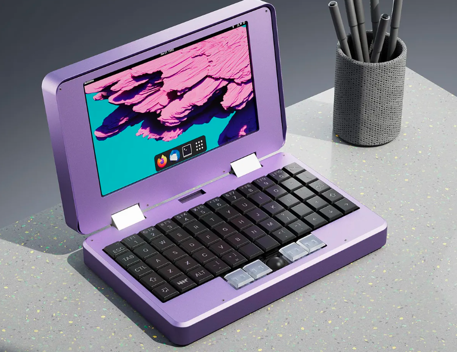
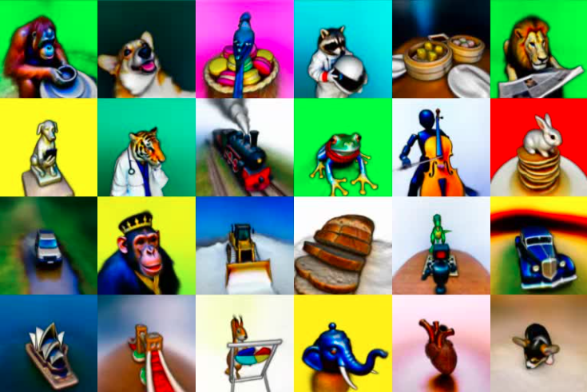

# 机器文摘 第002期

## 搞机

> MNT推出了一款名叫Pocket Reform的迷你笔记本电脑。它外形紧凑（屏幕只有7英寸），但功能齐全，据官方介绍，它的性能满足轻量办公需求，甚至还能玩一些游戏（ARM平台）。虽然现在的智能手机在性能方面已经有了很大提升，且便携性远超笔记本电脑，但是还是有相当一部分人倾向于在具有真实物理键盘的“电脑”上进行操作。

在我看来，这台设备可能对于希望随时随地写两行代码的程序员更加具有吸引力。
- 参考文章：
  - [可以装载口袋里的开源PC](https://spectrum.ieee.org/meet-an-open-source-pc-that-can-fit-in-your-pocket)

## 动向

### 文字直接生成3D模型

谷歌实验室的几个哥们上周发布了一个新作----DreamFusion。输入文字，就能生成带深度图和法线的3D模型。

开发团队声称：
> 最近在文本到图像合成方面的突破是基于在数十亿个图像-文本对上训练的扩散模型。将这种方法应用于3D合成将需要标记大量的3D资产和用于对3D数据进行去噪的高效架构，而目前这都不太可行。在DreamFusion中，我们通过使用预先训练的2D文本到图像扩散模型来执行文本到3D合成来规避这些限制。我们的方法不需要3D训练数据，也不需要修改图像扩散模型，证明了预训练图像扩散模型作为先验的有效性。

具体方法据称是来自他们新提出的“一种通过优化损失函数从扩散模型中生成采样的方法”该方法允许他们在任意参数空间中优化采样（例如3D空间）。

我看了一下官方给出的demo，3D模型还略显粗糙，不过可能将来算力提升之后会有改善。

现在，除了插画师受到了职业威胁，就连3D建模工程师的工作也有可能被AI取代？

- 参考文章：
  - [DreamFusion官方介绍](https://dreamfusion3d.github.io/)

### 通过文字描述生成语音的人工智能也来了

> Twitter 用户 Felix Kreuk 发布了从文本到音频 (Text to Audio) 的 AI 模型：AudioGen
> AudioGen 可以 
>   (1) 根据文本生成音频；(2) 续写指定的音频；(3) 同时做以上两件事，根据指定文本描述生成指定音频。
> 作者给出的展示DEMO里展示了如下文本生成的语音：
> （1）在风声中吹口哨
> （2）男人在说话时伴有鸟和狗的叫声
> （3）警报器和嗡嗡作响的引擎接近后走远
> （4）鸽子咕咕叫并伴有沙沙的声音
> （5）男人说话的声音，背景伴有人群欢呼声

从作者公布的架构图上可以看出来，采用的也是Transformer神经网络。之前在看到AI画图时我就想到同样的原理可能用于生成音频，结果这才没过几天，人家都已经做出来了。

- 参考文章：
  - [@海辛Hyacinth](https://weibo.com/1309158107/M8mPt5LgI)
  - [作者的demo和原理介绍页面（托管在github）](https://felixkreuk.github.io/text2audio_arxiv_samples/)

https://felixkreuk.github.io/text2audio_arxiv_samples/

## 观点
> 站桩的简单，枯燥和有效，就好比持有 sp500 指数基金简单，枯燥但足以秒杀 95%以上的基金经理一样。
> 莫将容易得，便作等闲看。
- 来自[@硅谷王川](https://weibo.com/5339148412/LeTdmcfjW)

## 长文
