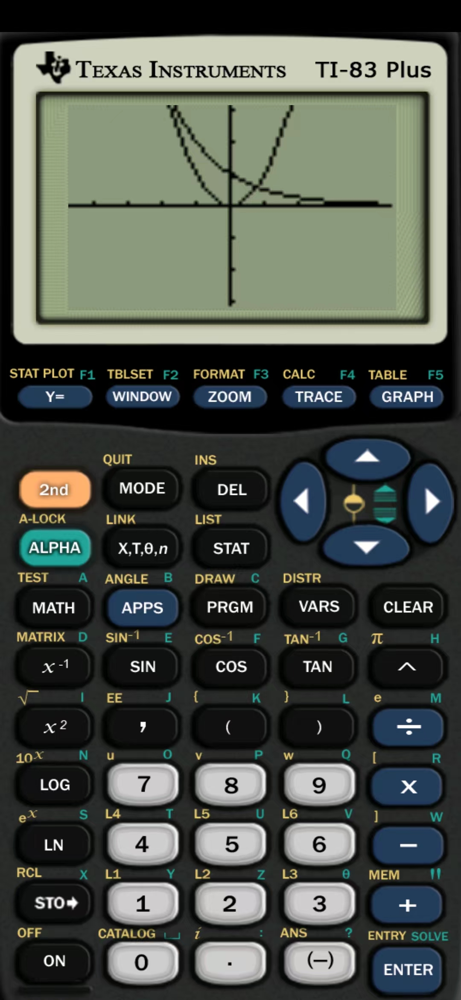
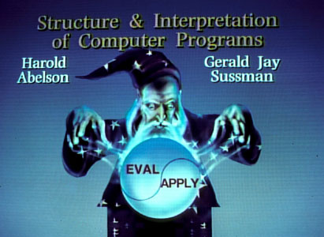
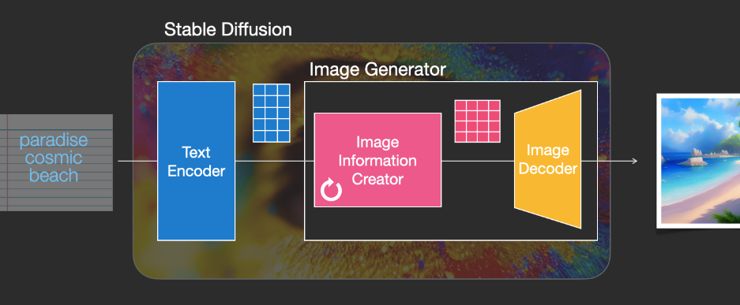
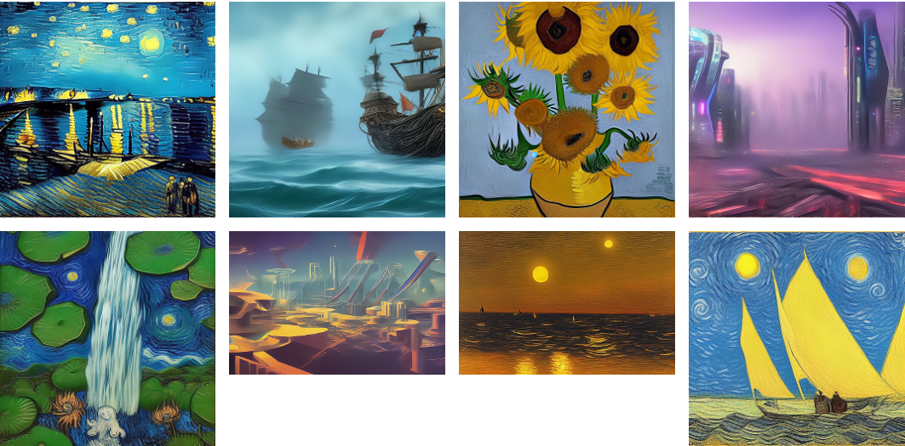
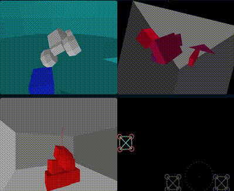

# 机器文摘 第 004 期
## 搞机

美国德州仪器公司出品的TI图形计算器是一种既能计算又能作图的新型的数学使用工具，它具备符号代数系统、几何操作系统、数据分析系统等，可以直观地绘制各种图形，并进行动态演示、跟踪轨迹。

TI实体计算器的售价十分昂贵（相较于其他消费类计算器），这里有一个开源项目[wabbitemu](http://wabbitemu.org/)，使用C语言编写的一个TI计算器的模拟器，可以在电脑上运行并模拟TI计算器，支持多种型号，如TI-82、TI-83、TI-83-plus（需要加载对应的ROM）等。

甚至有人基于这个项目编译出了Android的版本，安装后手机秒变成高级科学计算器。

想进一步了解TI计算器的强大，可以看一下这篇文章[《计算器与计算器游戏发展简史》](https://zhuanlan.zhihu.com/p/148392866)。

- [TI计算器模拟器安卓版本下载地址（含ROM文件）](http://www.liubaoyi.com/wp-content/uploads/2014/11/Android_Wabbitemu.zip)
- [TI计算器使用说明书](http://www.liubaoyi.com/wp-content/uploads/2014/11/CX-C-CAS-%E5%9B%BE%E5%BD%A2%E8%AE%A1%E7%AE%97%E5%99%A8%E6%93%8D%E4%BD%9C%E6%8C%87%E5%8D%97.zip)

以上资源来自[@Karen的日志](http://www.liubaoyi.com/)

## 动向

## 观点
>社交媒体的正确使用方法:
> 一，不浪费一秒钟时间和知识结构相差太大的人去解释/讨论。你没有义务也没有这个精力。对任何不友好评论，迅速拉黑。 
> 二，通过公开展示你的思考，来寻找在知识结构，兴趣或技能上，可能与你产生互补作用，或者 1＋1>2 的效应的朋友。公开展示长期留存的文字记录，效率最高。

来自[@硅谷王川](https://weibo.com/5339148412/Mal0hACJr)

## 长文
### 我是如何用21天刷完SICP

SICP 全称 Structure and Interpretation of Computer Programs，翻译过来叫《计算机程序的构造和解释》，是一本关于计算机程序设计的总体性观念的基础教科书，由麻省理工学院出版社与麦格罗希尔出版社共同出版营销。作者是麻省理工学院教授哈尔·阿伯尔森、杰拉德·杰伊·萨斯曼。

这本书是计算机编程领域非常经典的一本教科书，内容覆盖范围非常广泛，从编程入门一直到教你亲手设计实现一个编程语言解释器。虽然是一本几十年前的书，但是书中的编程理念如数据驱动、过程抽象等到现在仍不过时。可以说是程序员修炼“内功心法”必读的一本好书。

这篇[《我是如何用21天刷完SICP（中文）》](http://numbbbbb.com/2016/03/28/20160328_%E6%88%91%E5%A6%82%E4%BD%95%E7%94%A8%E4%B8%A4%E5%91%A8%E6%97%B6%E9%97%B4%E5%88%B7%E5%AE%8C%20SICP/)的文章讲述了作者通过阅读本书学习的过程和心得，里面的观点可以借鉴，我在看完之后也想再把这本书拿出来学习一遍。

觉得看书太晦涩的，可以到下面这个项目里下载本书作者课堂讲解视频（国内好心人给做了翻译字幕）
- [『计算机程序的结构和解释』公开课 翻译项目](https://learningsicp.github.io/)
- [百度网盘SICP文件夹](https://pan.baidu.com/s/1o78bsYA)
- [中译版视频专辑列表（bilibili）](https://www.bilibili.com/video/av8515129/)

### 图解Stable Diffusion模型

这篇[图解Stable Diffusion模型（英文）](https://jalammar.github.io/illustrated-stable-diffusion/)详细讲解了 Stable Diffusion（最近比较火的那个可以通过文字描述进行绘图的AI模型）的工作原理。文中使用清晰的图示阐述了“扩散”模型是怎样通过给图片增加噪声一步一步生成图像的。

### Wine是如何工作的

Linux桌面用户都遇到过在不得不运行 Windows 软件的时候，这个时候就可以使用这个叫做 Wine 的兼容程序，它可以让你在 Linux 下执行 win32 程序。（ Valve 最新出品的游戏掌机 Steam Dect 就使用了 Wine 作为兼容层来运行 Windows 平台下的游戏）。

Wine 的名字来自于 “Wine Is Not an Emulator” 这个英文缩写。

这篇[《Wine是如何工作的（英文）》](https://werat.dev/blog/how-wine-works-101/)介绍了它的基本工作原理。

### 在 Windows 记事本里运行光线追踪

光纤追踪（Ray Tracing）是一项计算机图形学技术，使用该技术渲染的计算机图像具有逼真的全局光照效果。

这篇[《记事本中的光线追踪 30FPS》](http://kylehalladay.com/blog/2020/05/20/Rendering-With-Notepad.html)记录了作者突发奇想要在Windows上的记事本中进行光线追踪渲染的趣事。

其原理是通过系统API获取到记事本窗口的句柄，然后利用钩子函数给记事本的窗体发送相应的“消息”以及覆盖对应的内存数据来实现对记事本窗体界面的“魔改”。最终实现了在另一个进程里执行光线追踪算法，然后借用记事本中显示的字符来替代画面像素，从而“渲染”出画面的效果。

## 资源
- [SerenityOS项目](github.com/SerenityOS/serenity)，一个从头开始的桌面操作系统，内核采用类似Unix的架构，界面外观则仿照了上世纪90年代Windows的窗口风格。作者并未将其定位成玩具，而是一款具备生产力的操作系统软件。 除了操作系统本身，这个项目还有配套的编程语言Jakt、自己的浏览器引擎LibWeb和浏览器Ladybird ​​​
- [《中文技术文档写作规范》](https://github.com/ruanyf/document-style-guide)，[阮一峰老师](https://www.ruanyifeng.com/blog/)整理的技术文档写作规范，规定了标题、文本、段落、标点符号等文档元素的使用约定，需要经常编写技术文档的朋友可以收藏看看。
- [Freehand意绘](https://freehand.yunwooo.com/)，一个在线的AI绘图工具，可以根据文字描述帮助你生成图片，界面简洁友好，使用方便。
 

- [计算机科学自学指南](https://github.com/izackwu/TeachYourselfCS-CN)，提供了一份自学计算机科学的全方位资料大全，可以根据内容系统地进行学习计算机科学相关的知识。

  >互联网上，到处都有许多的学习资源，然而精华与糟粕并存。你所需要的，不是一个诸如「200+ 免费在线课程」的清单，而是以下问题的答案：
  >
  >你应当学习 哪些科目，为什么？
  >对于这些科目，最好的书籍或者视频课程 是什么？
  >在这份指引中，我们尝试对这些问题做出确定的回答。
- [UNIX环境中的高级编程](https://stevens.netmeister.org/631/)，一套编程教程，在课程中，主要学习用C编程语言开发复杂的系统级软件，同时深入了解Unix操作系统（以及属于该家族的所有操作系统，如Linux，BSD，甚至Mac OS X）及其编程环境。

  >涵盖的主题将包括用户/内核接口，Unix的基本概念，用户身份验证，基本和高级I / O，文件系统，信号，进程关系和进程间通信。还将涵盖Unix系统上软件开发和维护的基本概念（开发和调试工具，如“make”和“gdb”）。

- [写在C头文件里的3D物理引擎](https://codeberg.org/drummyfish/tinyphysicsengine)，一个仅用C99标准写在C头文件里的超小物理引擎，没有依赖，直接包含头文件即可在你的工程中使用，功能完整，内置向量、三角函数、引力等计算库。
  

## 订阅
这里会隔三岔五分享我看到的有趣的内容（不一定是最新的，但是有意思），因为大部分都与机器有关，所以先叫它“机器文摘”吧。

喜欢的朋友可以订阅关注：

- 通过微信公众号“从容地狂奔”订阅。

- 通过[竹白](https://zhubai.love/)进行邮件、微信小程序订阅。

