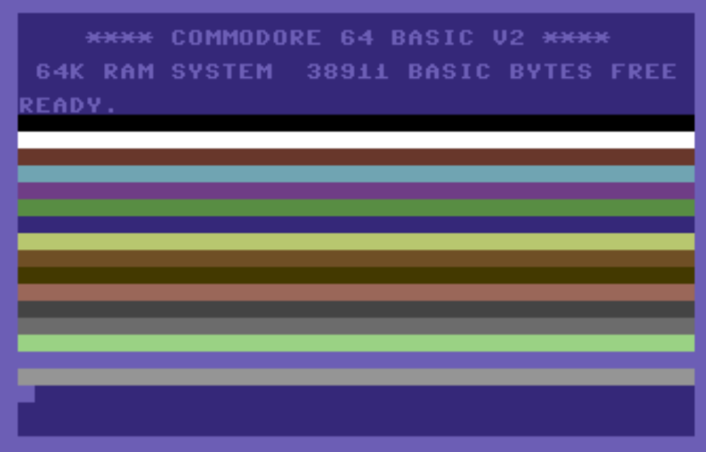
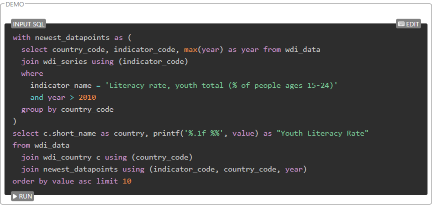
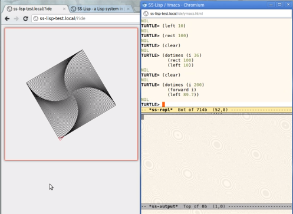
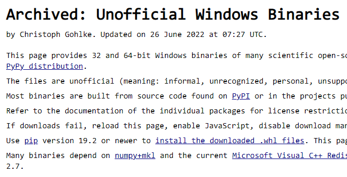
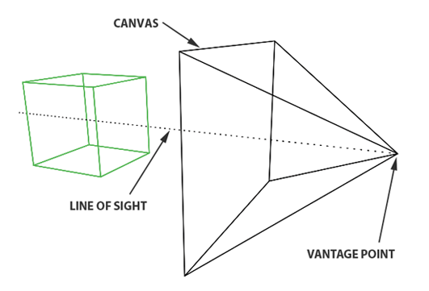
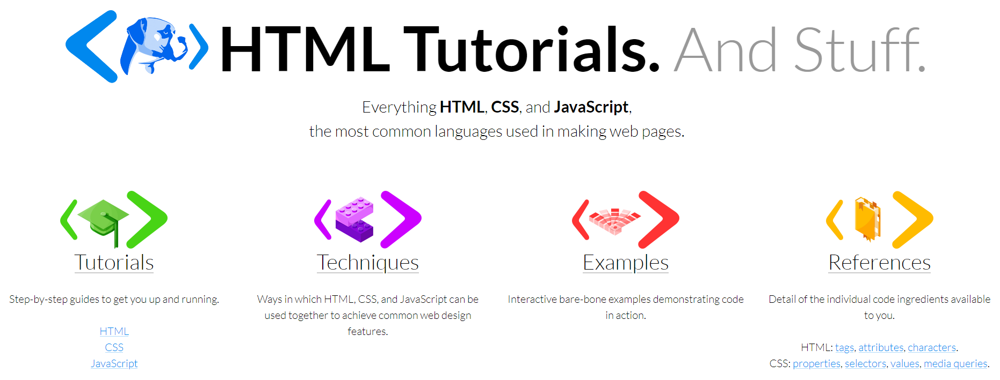

# 机器文摘 第 005 期

## 长文
### [穿越到 1983 年学习 BASIC](https://linux.cn/article-11091-1.html)

>很多著名的程序员，尤其在计算机游戏行业，孩童时期就在苹果 II 和 Commodore 64 这样的 8 位计算机上开始编写游戏，John Romero、Richard Garriott 和 Chris Roberts 都是这样的例子。这好理解。在 8 位计算机时代，很多游戏只能在计算机杂志和书籍中以印刷的 BASIC 程序清单方式得到。如果你想玩其中一款游戏，就必须手工键入整个程序。不可避免的，你可能遇到一些问题，所以你就得调试你的程序。等到你让它可以工作起来了，你就已经对程序是如何运行的有了足够的了解，你就可以开始自己修改它了。如果你是一个狂热的游戏玩家，你几乎必然会成为一名优秀的程序员。

喜欢小霸王的小伙伴（老伙伴？），不可错过的文章，一起跟随作者回忆一下如何在老古董电脑上运行BASIC程序，顺便怀念一下当年靠着一本说明书就在小霸王学习机上编写（抄写）游戏的时光。

- 文中提到的[ Commodore64 电脑可以在这里下载模拟器](https://vice-emu.sourceforge.io/)。

### [在 Github 的 Pages 服务里跑 SQLite](https://phiresky.github.io/blog/2021/hosting-sqlite-databases-on-github-pages/)
作者尝试做一个小网站来显示一些统计数据，于是他想到了用数据库，但是，使用数据库需要托管和维护后端服务，或者每次将整个数据集下载到浏览器中（当数据集超过10MB时，体验就变得很差劲）。

于是作者开始琢磨有没有办法找到一个可以在静态服务器上搞一个数据库服务得可能，毕竟提供静态服务的地方有很多（如 GitHub，GitLab，Netlify 等等）。

一通折腾下来（借助了 WASM 技术并适当的进行一些魔改），作者竟然实现了一个 100% 静态托管的数据库服务。

### [语句、表达式和海象操作符](https://www.zlovezl.cn/articles/stmt-expr-and-walrus-operator/)
这是一篇介绍如何通过“海象操作符“（类似这样：`foo := 'bar'`）使得Python语句更加精炼的文章。

这种操作符之所以可以使得语句更加精炼，主要原因就是它使得一句代码既进行了赋值然后又作为表达式返回了值。

之前写 Python 代码的时候都没注意还有这种写法，而且貌似这在 C 和 C++ 中都是基本的特性。不过 C 和 C++ 是赋值语句`=`直接就返回了表达式的值，同时这给程序员提供了出错机会（有不少人应该还记得条件判断时少写了个等号导致的问题）。

### [给个人开发者的一些建议（英文）](https://news.ycombinator.com/item?id=32647091)

hacker news 上的网友针对有志于运营自己的SaaS产品的个人开发者提了一些心得和建议。

摘抄一点儿如下：
- 关于做什么，做那些你自己都愿意付费的东西，别指望做出一个你自己都不想花钱使用的产品有别人来买单；
- 还是关于做什么，不要做需要漂亮UI的东西，那会让你陷入编码之外的很多麻烦（确实很牵涉精力），如果提供的工具能够通过简单交互就能提供优质服务最佳；
- 如果有可能，尽量提供自助服务模式，也就是说让用户不用见到你就可以自行操作付款了（作者这是有多社交恐惧？）；

## 资源
- [数据结构与算法可视化](https://visualgo.net/zh)，是一个学习算法知识的好工具。通过动图来演示和讲解数据结构和算法实现原理，针对每一个常用算法不仅有直观的图示，还附有一篇详细的文档，内涵原理知识以及代码实例，网站甚至还提供了答题练习功能，可以一边学习一边做题。

- [SLip](https://lisperator.net/slip/)，一个在浏览器中运行的Lisp解释器，使用Javascript实现。网站提供了一个简易的IDE，可以直接在页面中进行编程开发，还提供了图形绘制的扩展包，用于学习lisp语言非常合适。

- [针对 Windows 预先编译的 Python 扩展包](https://www.lfd.uci.edu/~gohlke/pythonlibs/)，在使用Python的时候，尤其是在Windows环境，经常会遇到有些扩展包由于依赖某些二进制库的原因导致无法通过pip直接安装，自己动手编译又十分麻烦。这个网站提供了各种预编译版本，可以直接下载网站提供的whl文件到本地然后安装。

- [ 3D 渲染器入门](https://www.scratchapixel.com/lessons/3d-basic-rendering/introduction-to-ray-tracing)，一套计算机图形学的入门教程，从原理讲解开始，手把手教你用C++语言编写一个自己的光线追踪渲染器。

- [HTMLDOG](https://htmldog.com/)，前端开发基础知识大全，主要是 HTML、CSS、Javascript 的手把手教学以及语言参考。

## 订阅
这里会隔三岔五分享我看到的有趣的内容（不一定是最新的，但是有意思），因为大部分都与机器有关，所以先叫它“机器文摘”吧。

喜欢的朋友可以订阅关注：

- 通过微信公众号“从容地狂奔”订阅。

- 通过[竹白](https://zhubai.love/)进行邮件、微信小程序订阅。

