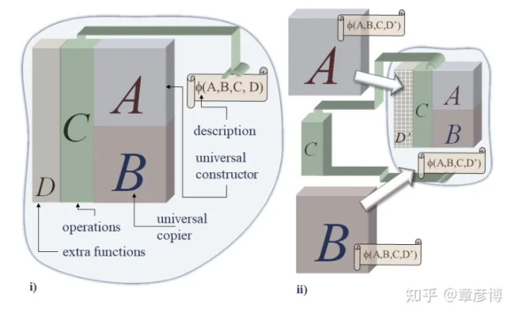
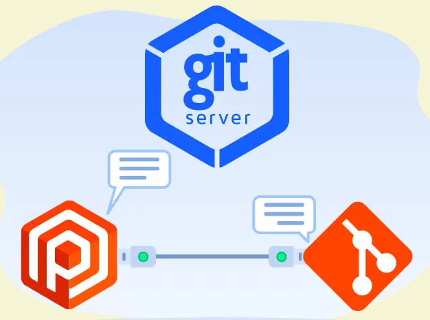
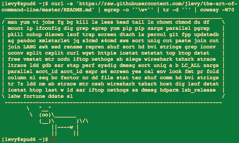

# 机器文摘 第 006 期

## 长文
### 怎样写一段代码把自己打印出来？

近期在知乎上看到一个[如何编写代码打印自己的问题](https://www.zhihu.com/question/22006572/answer/2722369370)，感到十分有趣。以前也在网上见到过类似的代码，用 C 或者 Javascript 等各种语言实现的版本都有。当时只是感叹代码写的十分神奇，一段代码在运行之后竟然输出自己的源代码，而且一个字符也不差，并没有搞懂其中的原理。这篇回答里，作者给出了详细解释。并指出，冯·诺依曼早在他编写的《自复制元胞自动机理论》一书中的提出了这种事情在理论上的通用方法。
> 如上图所示，自复制系统有五个基本部件：A：通用构造器；B：通用复制器；C：控制器；D：其他函数；ϕ(A,B,C,D)\phi(A,B,C,D)\phi(A,B,C,D) : A, B, C, D的编码；当自复制过程启动的时候，B将编码复制一份。A再根据复制出的编码构造出ABCD。最后，C再将这些结构组合起来，构造出一个新的、复制的结构。可以看到，自复制、自打印程序的核心就在于通用构造器和编码，因为复制器、控制器都是比较容易实现的。

具体实现的示例，文中有更详细的说明。

最后，此问题可以引申到，大自然中生命基于基因的复制机制，也是与此相关，甚至其背后都是同样的机制。

### Kevin Kelly 在 68 岁生日时给出的 68 条建议

[凯文·凯利（又称KK， 作者，著有《失控》《科技想要什么》《必然》等）](https://baike.baidu.com/item/%E5%87%AF%E6%96%87%C2%B7%E5%87%AF%E5%88%A9/6607570)，上个月 28 号是他的 68 岁生日，他准备了 68 条简短的建议，作为礼物送给年轻人。

有人翻译了[KK 在 68 岁生日时给出的 68 条建议](https://zhuanlan.zhihu.com/p/143834871)。

摘抄几条如下：
> 任何一项大工程（修房子、拍电影、开发 app）完成度为 90% 的时候，你都要做好心理准备：剩余的大量细节工作会占掉你另一段与之前相当的时间。

> 不要担心自己问的问题听起来很傻。99% 的情况下，其他人都有和你一样的问题，只不过羞于问出口而已。

> 别成为一群人里最聪明的那个。和那些比你聪明的人待在一起，向他们学习。如果能找到和你观点相左的聪明人，那就更好了。

> 别做最好的。做唯一的。

> 任何真实之物都源于虚构之意。想象是宇宙中最强大的力量，也是你能够日益精进的能力。生命中可以因不知众人所知而获益的能力，仅此一项。

> 经验往往被高估了。招募的时候，要看资质，技能则可以培训。许多令人惊奇和赞叹的事情，都是由第一次做的人做出来的。

### 怎样搭建一个最简的 GIT 服务器

GIT 是现在软件开发过程中必不可少的版本控制工具，功能非常强大，我们平时直接使用单位的私有服务或者在线的云服务（如：Github 等）。

如果想要搭建个人的服务，可能就比较繁琐一些。[阮一峰老师的这篇博客](https://www.ruanyifeng.com/blog/2022/10/git-server.html)就解答了怎样采用极简的技术路线，为自己搭建一台 GIT 服务器。

> 自己搭建 Git 服务器的原因，无非就是不方便访问外网，不愿意代码放在别人的服务器，或者有一些定制化的需求。
> 这时，你可以选择开源的 Git 服务器软件。
> Gitlab CE
> Gitea
> Gogs
> Onedev
> 这些软件里面，Gogs 的安装是最简单的，但是功能相对比较弱。功能越强的软件，安装越复杂。
> 如果你只是想远程保存一份代码，并不在意有没有 Web 界面，或者其他功能，那么根本不用安装上面这些软件，一行命令就够了。

### 为什么很多程序员讨厌低代码？

“低代码”（一般指：不用或少用编写代码的方式进行软件开发）这个词近两年又开始火了，它代表着对软件工程的一种美好“幻想”，即：花费更低的代价去构建复杂的软件系统。

虽然每隔一个时间周期都会被重提一次，但是每次都未能如愿。

现在既然又被频繁提及，我在知乎上发现了这样一篇[关于低代码话题的回答](https://www.zhihu.com/question/561025857/answer/2734260311)。从程序员的视角表达了对低代码这种期望的观点，有兴趣的朋友可以点进去看看。

> 软件工程这门学问，研究的就是“如何利用工程思想，从整体上降低开发复杂性”；但与之同时，它不得不反复强调“软件工程试图解决的、是人为引入的不必要的复杂性；但工程的本质复杂性是无法逃避的。因为没有银弹，没有银弹，没有银弹！”

我个人的观点是：低代码或者配置化、拖拽式软件开发，很难平衡对复杂现实的抽象程度和开发便利性的矛盾关系。如何做到既提供方便的组件同时又不限制对个性化需求的实现，这需要非常强大的设计能力以及对于特定应用场景的取舍。目前来看，如果要做到或者接近上述状态，必然要先消耗巨量的成本，至于是否值得，可能不同的主体会有不同的选择吧。

## 资源
- [从加减乘除到机器学习](https://github.com/Visualize-ML/Book4_Power-of-Matrix)，一本不错的数学扫盲书，如果你在学习人工智能的时候对数学感到吃力的话，这本书非常适合阅读，一点也不枯燥。主要讲解线性代数相关的知识。

  

- [命令行的艺术](https://github.com/jlevy/the-art-of-command-line/blob/master/README-zh.md) 想成为命令行高手，掌握这一篇就够了。
  > 熟练使用命令行是一种常常被忽视，或被认为难以掌握的技能，但实际上，它会提高你作为工程师的灵活性以及生产力。本文是一份我在 Linux 上工作时，发现的一些命令行使用技巧的摘要。有些技巧非常基础，而另一些则相当复杂，甚至晦涩难懂。这篇文章并不长，但当你能够熟练掌握这里列出的所有技巧时，你就学会了很多关于命令行的东西了。
  
  

- [基于实际项目的学习](https://github.com/practical-tutorials/project-based-learning)，这是一个巨大的代码工程资源索引，里面列举了针对各种编程语言的个人项目，当你不知道该如何去深入学习一门编程语言的时候，选择一个这里的项目然后自己动手跟着练一遍效果绝对惊人。入选的项目都十分有趣，比如怎样用 C 写一个解释器、怎样写一个自己的编辑器、自己动手实现 TCP/IP 协议栈，等等。

- [霞鹜文楷](https://github.com/lxgw/LxgwWenKai)，一款开源中文字体，基于 FONTWORKS 出品字体 Klee One 衍生。用来看书非常舒服，特别是在排版上。微信读书已经内置，如果是第三方支持自定义字体的可以试试。

## 订阅
这里会隔三岔五分享我看到的有趣的内容（不一定是最新的，但是有意思），因为大部分都与机器有关，所以先叫它“机器文摘”吧。

喜欢的朋友可以订阅关注：

- 通过微信公众号“从容地狂奔”订阅。

- 通过[竹白](https://zhubai.love/)进行邮件、微信小程序订阅。

