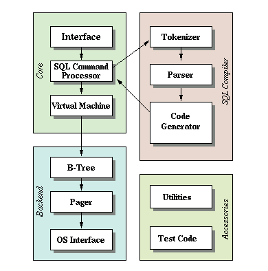
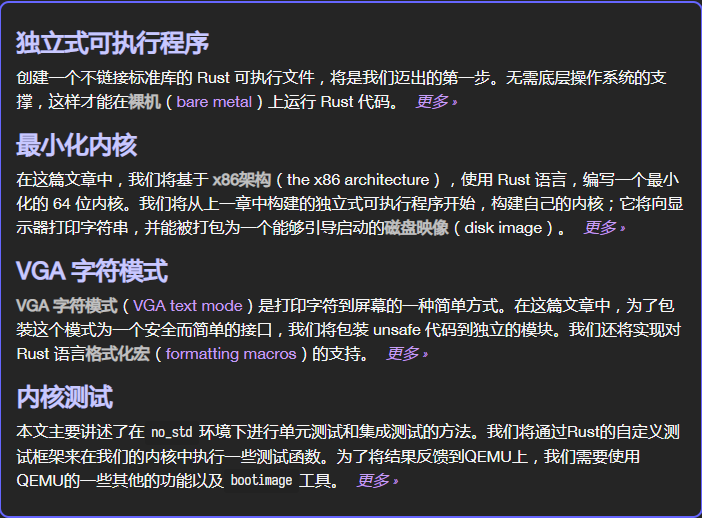
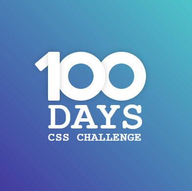
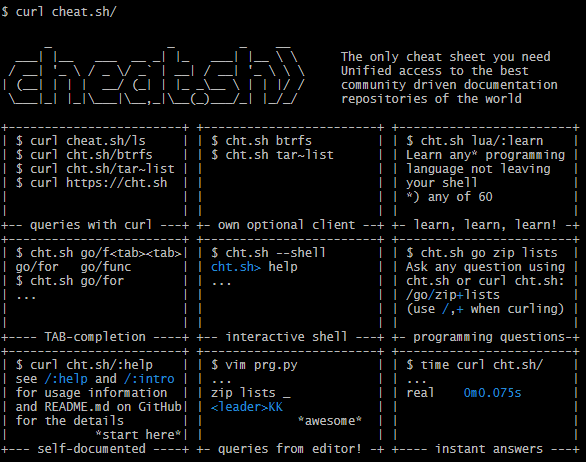
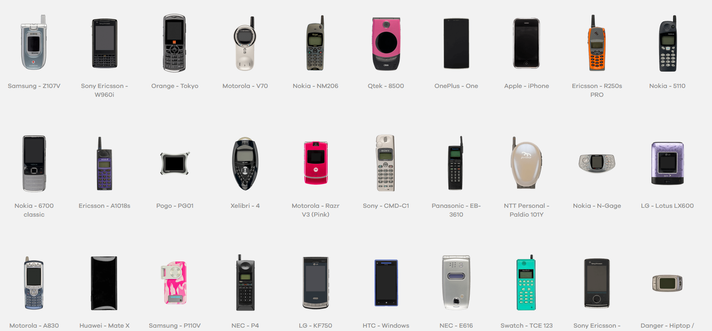
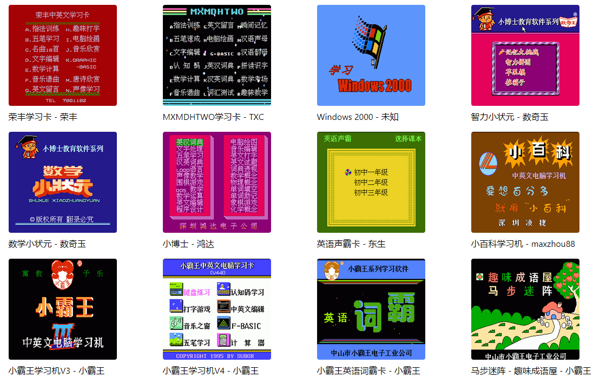

# 机器文摘 第 007 期

## 长文
### 如何在 HTML5 Canvas 制作可精确控制时间的动画

使用 Canvas 对象在网页中制作动画非常简单，有不少人喜欢直接使用定时器 `setinterval` 以一定的时间周期循环执行绘图代码来实现动画效果。但是这种做法有一个弊端，由于显示刷新率以及计算机硬件性能的不同，会导致在不同机器上的表现差异。比如你希望你的动画角色在 1 秒内移动 50 个像素，但是实际执行起来却很难控制。[基于时间的动画](https://www.viget.com/articles/time-based-animation/)这篇文章讲解了如何使用浏览器的 `requestAnimationFrame` API 来实现精准控制动画时间的效果，里面给出了一个很简单的样例，但是基本上给出了一个完整的“更新、渲染、通过时间变化计算运动距离”的游戏控制架构。

### 如何使用纯 Web 技术开发一个相机 App

如果不习惯复杂的移动 app 开发环境，直接使用 Web 技术开发一些小的 App 也是十分方便的。我近期希望通过网页实现一个拍照的应用，并且希望不使用手机的原生相机功能，而是自己控制一些相机参数、后期效果、增加特定的取景框等等。于是我找到了一篇教学指南：[Make a Camera Web App](https://blog.prototypr.io/make-a-camera-web-app-tutorial-part-1-ec284af8dddf)，只需几十行代码就实现了一个相机 App 。感兴趣的朋友可以点进去看看。

### 数据库是如何工作的，从零开始写一个数据库

如果和我一样好奇数据库是如何实现的，可以看看[这篇文章](https://cstack.github.io/db_tutorial/)。带你用 C 语言从头撸一个数据库出来。

### 使用 Rust 写一个操作系统

Rust 逐渐火起来了，这篇 [2018 年的文章](https://os.phil-opp.com/zh-CN/)整理了一份教程，作者尝试使用 Rust 写一个操作系统，我之所以收录它是因为作者还在 Github 开源了代码，并且这系列教程甚至提供了多国语言的版本。制作精良。应该是实践操作系统知识的好教材。

## 资源
- [100 天精通 CSS ](https://100dayscss.com/)，这个网站给了你 100 个关于 CSS 技术的挑战题目，也许练完之后可以达到深入应用 CSS 的效果，我尝试了几个挑战，有些题目的设置有些偏炫技范畴了，想在工作中使用估计会被打死。
  
  

- [Linux 命令在线帮助工具](http://cht.sh/)，对于我这种经常记不住命令用法的人来说真的是一种福音。比如我就经常记不清 `tar` 命令的用法，面对压缩包解压或者文件打包的工作每次都是去网上搜索一番。有了这个在线工具，直接在命令行中使用 `curl`请求他的网址就可给出命令的样例用法详解，非常方便。比如执行`curl cht.sh/tar` 就会给出 tar 的使用样例了，我直接复制粘贴之。
  
  

- [手机博物馆](https://www.mobilephonemuseum.com/)， 网站收录了各品牌手机的各代产品资料，包括手机图片、型号参数、当时发布的广告等。不过我看了一下，资料应该还不齐全，有些手机只是列了个名字和型号在那儿，还缺少详细信息，估计还在继续收集中。

  

- [中文家用游戏博物馆](http://www.famicn.com/) ,收录了比较齐全的家用游戏机及掌机的中文版游戏资料。可以直接在线通过模拟器玩耍。有不少经典的 FC、GB、MD 游戏，甚至还有小霸王学习机的 ROM ，可以在线体验。
  
  
  
## 订阅
这里会隔三岔五分享我看到的有趣的内容（不一定是最新的，但是有意思），因为大部分都与机器有关，所以先叫它“机器文摘”吧。

喜欢的朋友可以订阅关注：

- 通过微信公众号“从容地狂奔”订阅。

- 通过[竹白](https://zhubai.love/)进行邮件、微信小程序订阅。

