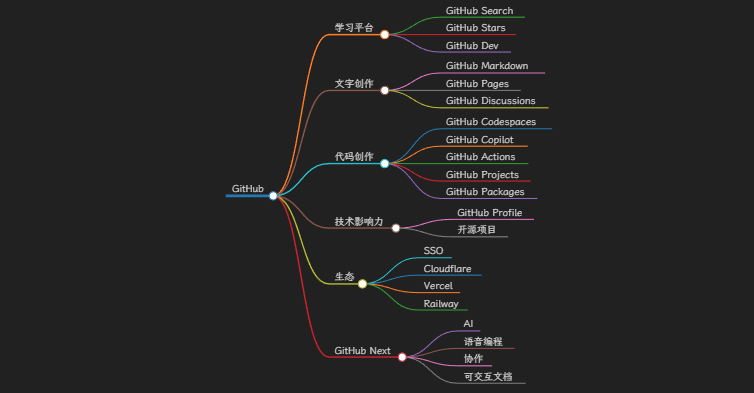
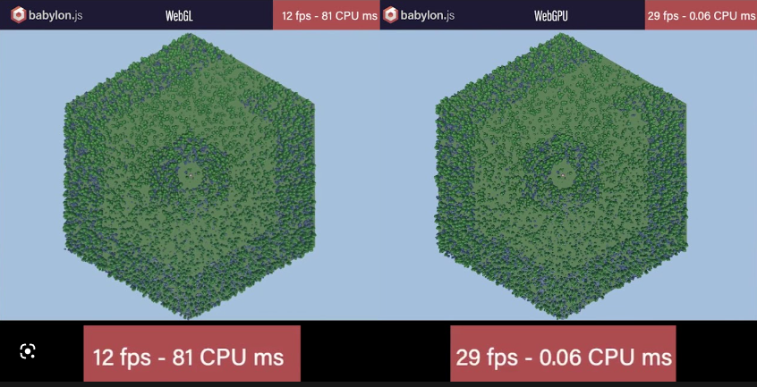
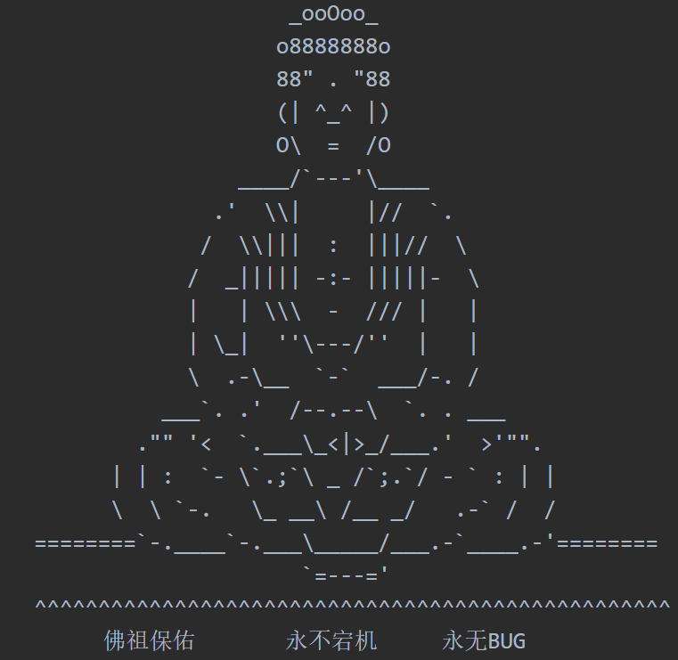
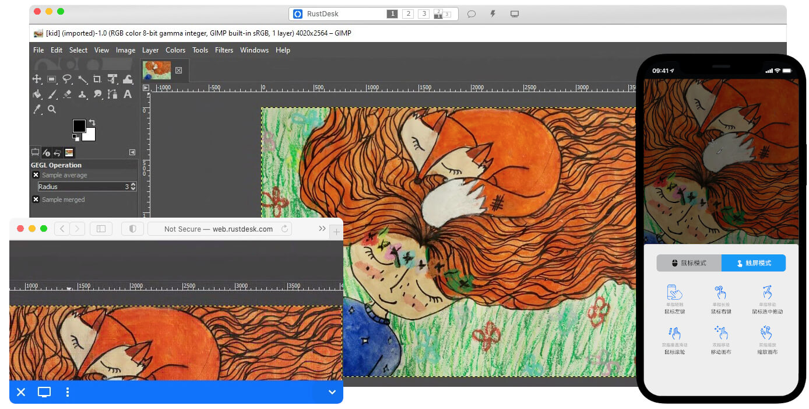

# 机器文摘 第 008 期

## 长文
### 用好 GitHub，给自己建立一个全方位的私有云平台

很多人都有进行个人的知识管理和数字资源管理的需求，市面上也有很多软件工具或者平台来满足这样的需求，但是大部分都是收费的，且自由度不高。我个人经常使用 Github 作为知识管理仓库，我的网络日志、技术博客、私人小项目、电子书籍等都放在上面，生活中已经离不开这个网站了。

近期读到这样一篇文章--[善用 Github](https://www.bmpi.dev/self/use-github-better/)，全方位讲解了 Github 如何使用，如何将其提供的服务发挥最大化的作用，看完受益匪浅。
  > GitHub 是微软旗下的一个在线软件源代码托管服务平台，也是一个拥有八千多万开发者用户的社区。很多开发者应该对GitHub有一定的了解，但非技术人员大多可能并不会去使用它。本文更多是想给非技术人员来介绍这个平台，看完这篇文章，希望能让更多人在上面来学习、创作与展示自己的作品。

### WebGPU 是什么？跟 WebGL 有什么关系？

前几天我想在网页上制作一个小游戏，用于尝试一下图形编程相关的技术。用到了一些基于 Web 技术的 3d 图形框架，比如 Three.js、Babylon.js 等等。在尝试的过程中遇到了一个新的名词 WebGPU，之前总是在听说 WebGL 相关的技术，结果说了这么多年，WebGL还没普及，怎么又冒出来一个 WebGPU？于是找了一篇文章，浅扒一下各个图形接口的历史。就是这篇[浅入浅出 WebGPU](https://www.51cto.com/article/698100.html)。

  > 2016年6月，Google 产生了使用新API来代替WebGL的想法，称之为 WebGL Next。
  > 2017年1月，Khronos Group 举办了WebGL Next研讨会，Chromium一马当先，展示了可以基于OpenGL和Metal独立运行的新图形系统原型，同时Apple和Mozilla也分别展示了自己的原型，三者都非常类似于Metal Api。
  > 次月，Apple就向W3C提交了一个名为 WebGPU 的技术概念验证方案，基于Metal图形开放接口，最终W3C采纳了 WebGPU 这个名字作为下一代标准，Apple的提案进入了正式的小组提案中。
  > 3月，Mozilla向Khronos Group提交了基于Vulkan的名为WebGL Next提案。
  > 2018年6月，Chrome团队宣布着手实现WebGPU，这意味着Khronos的失败，WebGPU胜出，大家以后还是团结在W3C的周围。
  > 按照预期，工作组希望在2021年底发布WebGPU 1.0 标准，不过目前只有草案。
  > WebGPU 1.0 草案：https://www.w3.org/standards/types#WD

### 扔掉 Photoshop 改用字符串绘图

相信很多人都接触过使用字符绘制的图片，这在程序员圈子里甚至发展为一门专有的艺术 “[ASCII 艺术](https://zh.wikipedia.org/wiki/ASCII%E8%89%BA%E6%9C%AF)”。不过我现在不是要说这些，我在一篇 2015 年发表的文章里，发现了这个：有个猛男在自己的程序里彻底抛弃使用 Photoshop 制作的图片资源，改用字符串来描述各种图形（程序界面的图标），然后自己再用代码将其渲染成为高清的图像。

不得不说，作者对此很沾沾自喜，他甚至设计了一套自用的语法规范，用于特定字母代表特定的符号关系，这样就可以组合出各种复杂的图案了。

不过我也在文章的评论区见到了跟我有同样疑惑的读者留言：“这不就是重新发明了 [SVG](https://zh.wikipedia.org/wiki/%E5%8F%AF%E7%B8%AE%E6%94%BE%E5%90%91%E9%87%8F%E5%9C%96%E5%BD%A2) 吗？唯一的区别就是没有用 XML 作为载体”。

不过文章记录的整个开发过程还是很有趣的，希望了解朋友可以点进去看看 [Replacing Photoshop With NSString](http://cocoamine.net/blog/2015/03/20/replacing-photoshop-with-nsstring/)

## 资源
- [FFmpeg原理](https://ffmpeg.xianwaizhiyin.net/)，FFmpeg 这个开源项目可能圈外的人士了解不多，但实际上我们生活中一刻也离不开它。现在的网络直播、网络视频网站和移动App、各种视频剪辑合成软件，都或多或少的使用了 FFmpeg 提供的编解码技术。这本在线书籍对于想进一步了解 FFmpeg 以及视频编解码技术的朋友是个不错的参考资料。
  > 本书《FFmpeg原理》主要讲解 FFmpeg 原理性的知识，前面几章主要讲解一些音视频开发的基础知识，例如原始数据 YUV 跟 RGB，封装格式 FLV 跟 MP4 ，压缩编码的基本概念，还有封装格式分析。

- [开源虚拟与远程桌面基础架构](https://rustdesk.com/zh/)，远程桌面软件，开箱即用，无需任何配置。(我个人目前还是使用windows的远程桌面多一些，不过这个开源的rustdesk看起来不错)
  > 您完全掌控数据，不用担心安全问题。您可以使用我们的注册/中继服务器，或者自建，亦或者开发您的版本
  

- [Learn X in Y minutes](https://learnxinyminutes.com/)，这里的教程几乎涵盖所有编程语言，完全没有废话。英文版、中文版都有。如果有编程语言基础的话，通过这个网站确实可以在几十分钟内掌握一门新的编程语言的核心知识。

- [Flash 保存计划](https://flash.zczc.cz/)，Flash 虽然消失了，但是它曾经创造的辉煌一直在我们的记忆里，现在偶尔还想起一些经典的小游戏。这个网站里收藏了很多经典的Flash小游戏，通过一些黑科技复活了它们，可以在浏览器里运行体验。反正我一打开了黄金矿工，就半天停不下来。
  
  

- [CodeGeeX: 多语言代码生成模型](https://keg.cs.tsinghua.edu.cn/codegeex/index_zh.html)，又一个能帮你写代码的 AI 模型。提供有官方的 VSCode 插件。我试了一下，效果跟 Github 的 copilot 还有一定的差距。
  > CodeGeeX是一个具有130亿参数的多编程语言代码生成预训练模型。CodeGeeX采用华为MindSpore框架实现，在鹏城实验室“鹏城云脑II”中的192个节点（共1536个国产昇腾910 AI处理器）上训练而成。截至2022年6月22日，CodeGeeX历时两个月在20多种编程语言的代码语料库（>8500亿Token）上预训练得到

- [计算机网络基础学习（英文）](https://iximiuz.com/en/series/computer-networking-fundamentals/)，一个在线讲解网络基础知识的教程，优点是内容简洁，不用特别多的专用名词唬人，另外还提供了在线实验的环境。
  > 关于计算机网络的书籍往往令人生畏 - 数千页，无聊的图表......这个教程以几千字的字数引导您了解网络基础知识！它还提供动手实验室来实践所获得的知识。

  

## 订阅
这里会隔三岔五分享我看到的有趣的内容（不一定是最新的，但是有意思），因为大部分都与机器有关，所以先叫它“机器文摘”吧。

喜欢的朋友可以订阅关注：

- 通过微信公众号“从容地狂奔”订阅。

- 通过[竹白](https://zhubai.love/)进行邮件、微信小程序订阅。

