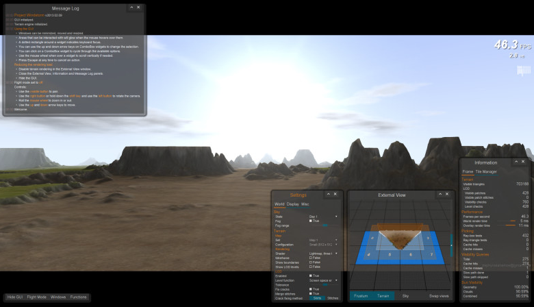
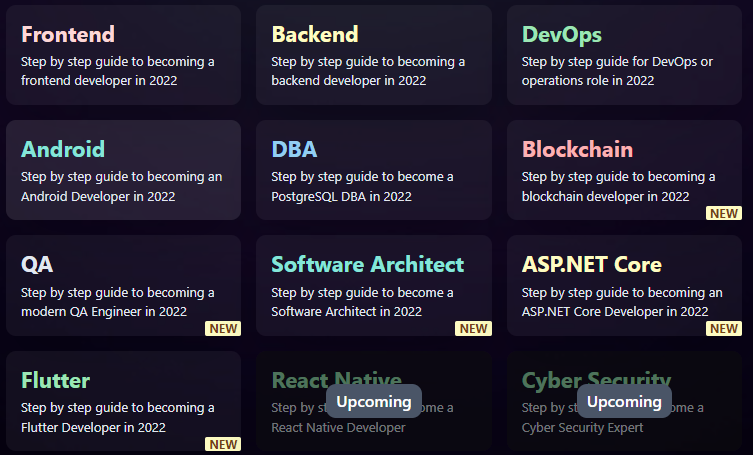
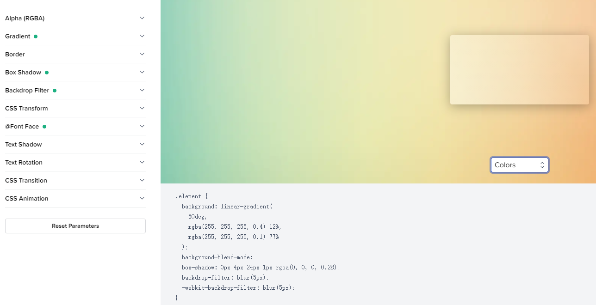
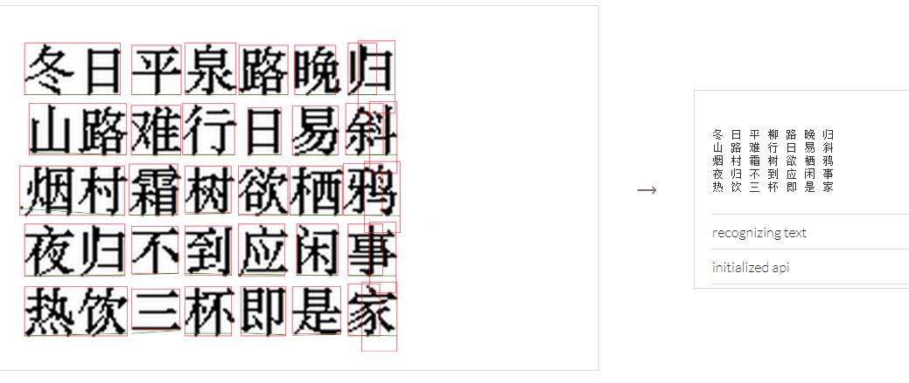

# 机器文摘 第 009 期

## 长文
### 游戏中的“精灵”

[精灵（sprite）](https://zh.wikipedia.org/wiki/%E7%B2%BE%E7%81%B5%E5%9B%BE)这个词来自古法语单词“esprit”，意思是“精神”——源自拉丁语“spiritus”。在民间传说中，精灵是活泼、俏皮和神奇的小生物。然而对于在游戏开发者来说，它又是另一个含义了。

这篇[精灵的惊人历史（英文）](https://wireframe.raspberrypi.com/articles/the-surprising-history-of-sprites)，介绍了不同的游戏厂商，在早期硬件机能有限的条件下，如何实现“角色在屏幕上移动”这个现在看似十分简单的事情的。

对于不了解“精灵”的含义的，稍作如下解释：
> 2D 游戏在处理需要动起来的角色时，出于性能考虑，将一部分图形的绘制与背景画面的绘制分开，对于频繁需要刷新（动起来的）部分，单独处理，使他们感觉像是漂浮在背景画面的“幽灵”似的，故名“精灵”。

### 任天堂 NES 的一些技术细节

NES 是任天堂推出一款极其成功的家用游戏机（NES ： Nintendo Entertainment ，System 是其在北美发售的名称，亚洲叫 FC ：Family Computer），不少80、90后的朋友应该都玩过（或者是国内山寨厂商仿制的*霸王之类）。

NES 使用极其经典的 6502 CPU。这块 CPU 有多经典呢，苹果的 Apple1代2代 都是这个U，史上销量第一的个人电脑 Commodore 64 也是这个 U，国内早年比较流行的文曲星也是。

[我做了一个 NES 模拟器](https://medium.com/@fogleman/i-made-an-nes-emulator-here-s-what-i-learned-about-the-original-nintendo-2e078c9b28fe)，这篇文章的作者在编写模拟器的过程中挖出了不少技术细节，里面还提到了硬件存在的各种 BUG （没错，要模拟的话必须连 BUG 都得模拟，不然有些游戏玩不了），想要了解的朋友可以点进去看一下。

作为模拟器爱好者，我对 6502 处理器非常好奇，一度希望自己动手也实现一个，而且这款处理器真的非常适合模拟器入门，毕竟只有三个寄存器和百十条指令。

[文中提到的 NES 模拟器在 Github 上开放了源码](https://github.com/fogleman/nes)，有兴趣的可以学习。

### 一个桌面开发程序员为了学习 Javascript 而手撸了一个基于 WebGL 的游戏引擎

学习一样技能最好的方式就是动手去做。

当我经常感叹牛人怎么那么多的时候，往往忽略了牛人的学习过程。

以为他们天生就那样。

事实上他们的技能也是靠努力训练得来的。

不过，学习方法确实很重要。

[我对 Javascript 的尝试（英文）](http://zephyrosanemos.com/)，这篇文章的作者原本是一个桌面程序开发者（类似 CAD 软件之类）。

他突然想要学习前端开发，掌握 Javascript 语言。

于是结合自己之前的知识，使用前端技术做了一套很优秀的 Demo 程序，一个性能和外观都很不错的游戏引擎。

文章里作者详细介绍了实现过程中对技术、算法的选择等等。

内容很长，但还算友好，比较干货。

## 资源
- [开发者之路](https://roadmap.sh/)，汇总了各个技术路线的学习资料，包括前端、后端、运维、计算机科学、区块链、移动端、质量管理等等。
  
  总之极其全面。
  目前在 Github 有两百多万颗星，被 fork 了 三十多万次。
- [chrome 插件下载](https://crxdl.com/)，访问谷歌浏览器插件商店有困难吗？试试这个网站，可以直接下载插件的包文件，下载后拖入浏览器即可安装。不过我已经转换到微软的 Edge 阵营了，用不到这个了。
- [CSS3 生成器](https://www.toptal.com/developers/css3maker)，对于 CSS 的属性参数总是记不住，这个网站就很适合我。每次要调背景渐变、圆角、阴影、动画曲线等等，都得现去搜。有了这个网站，直接在线点点拖拖，直接把代码拷走即可。
  
- [tesseract.js](https://tesseract.projectnaptha.com/)，可直接在浏览器里运行的 OCR 引擎，支持多国语言（超过 100 种）文字识别。
  

## 订阅
这里会隔三岔五分享我看到的有趣的内容（不一定是最新的，但是有意思），因为大部分都与机器有关，所以先叫它“机器文摘”吧。

喜欢的朋友可以订阅关注：

- 通过微信公众号“从容地狂奔”订阅。

- 通过[竹白](https://zhubai.love/)进行邮件、微信小程序订阅。

