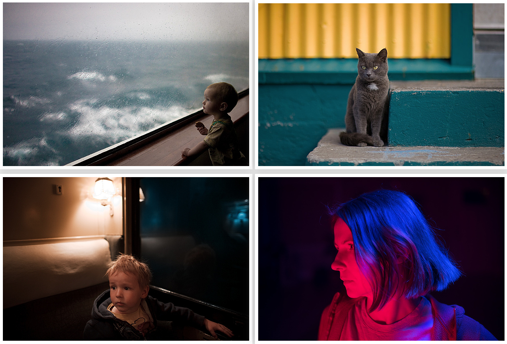
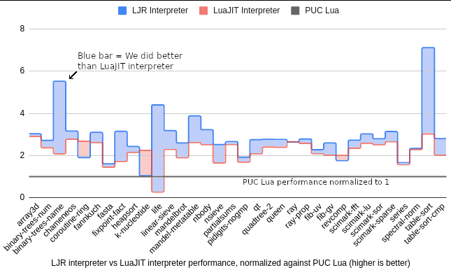
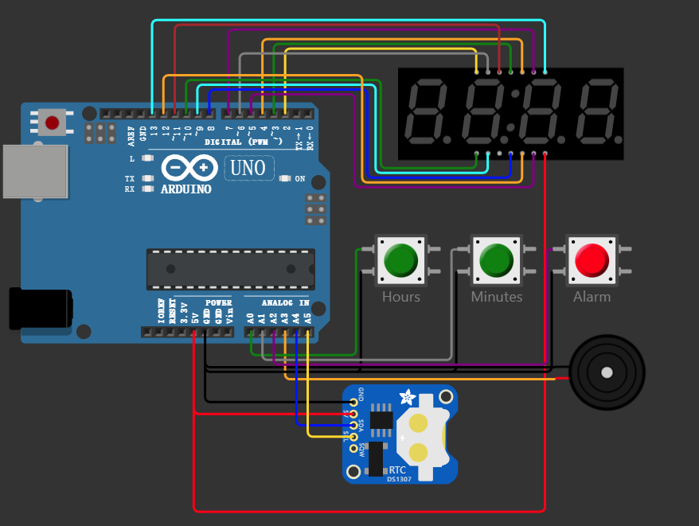
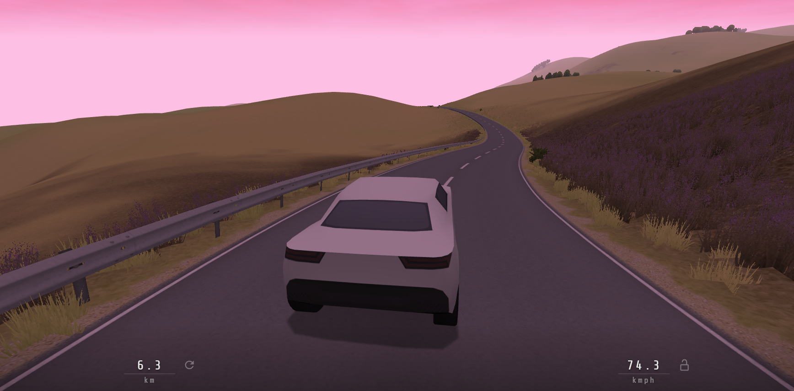
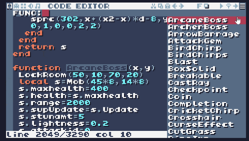

# 机器文摘 第 010 期

## 长文
### 极客摄影指南

相机，也是机器的一种。

我用它记录生活，捕捉生活中转瞬即逝的美好瞬间。

有个问题一直困扰着我，怎样拍出不那么“到此一游”的照片？

怎样才能“掌控”相机这个机器？

这篇[《极客摄影》（英文）](https://lcamtuf.coredump.cx/photo_basics/)能够帮助你对摄影做一个真正深入的理解（而不是学习那些充斥社交平台的各种浮于表面的“技巧”）。

作者是一个热爱摄影的技术男，有二十多年摄影经验。

听他给你讲讲什么是“光”和“构图”。

一篇就够了。

### MS-DOS 背后的设计

包括我在内的不少 80 后接触电脑是从 MS-DOS 开始的。

对于它的黑窗口和命令行都有着很深的印象。

上大学时执行最多的命令是`format c: /s /q`

当年还玩过不少在 DOS 平台的游戏，比如仙剑奇侠传、主题医院等等。

只是当时没工夫对系统本身做深入了解。

顶多是，自己在学习汇编语言时，对 DOS 又仔细端详了几眼。

这篇[《凑近看看 MS-DOS 》（英文）](https://patersontech.com/Dos/Byte/InsideDos.htm)，介绍了 DOS 系统的设计标准、内存分配、磁盘文件结构、FAT文件系统的技术细节等等。

想要窥探技术细节的可以点进去看看。

### 构建最快的 Lua 解释器

给动态语言编写解释器可能不算太难（如果只是能跑的话）。

但是如果要编写一个高性能的、好用的动态语言解释器，比如像谷歌浏览器所用的 V8 引擎那样，就比较困难了。

[《构建最快的 Lua 解释器》](https://sillycross.github.io/2022/11/22/2022-11-22/)这篇文章站在更高维度提供一种方法，即：编写一种可以自动生成编译器（解释器）代码的程序，以使得制作高性能解释器变得更加容易。

我看了一下，大概就是自动化生成之前需要手工处理的编译器优化代码。作为编译原理学的不怎么明白的我，对此不敢评论。

### 为什么 Linux 内核没有单元测试？

我对单元测试的态度一般，既不强烈支持，也不反对。

听说有的开发团队由于对于单元测试十分狂热，已经到了不允许写注释，都用单元测试替代的地步。

前不久，在 HN 上有网友发起了一个引战的讨论：“[既然单元测试这么好，为什么 Linux 内核源码不用呢？](https://news.ycombinator.com/item?id=33742130)”

以下为部分观点：
> 单元测试被严重高估了，TDD有一些好主意，但有一段时间它变成了一种宗教。

> 单元测试与TDD宗教不是一回事。它只是意味着将事物划分为小单元并尽可能详尽地测试其功能。

> SQLite不是反例吗？他们有更多的单元测试代码，而不是实际运行的代码。

## 资源
- [Python 100 天从入门到精通](https://github.com/jackfrued/Python-100-Days)，Python 好学吗？好学又不好学，上手容易，精通难。这里有套开源教程囊括了从入门到实战应用（语言基础、数据处理、Web开发、网络开发、爬虫、深度学习等）的所有课程。这个仓库目前已经在 Github 上获得了 12 万star。可以说是好评如潮，想深入学习 Python 的不容错过。赶紧到我收藏夹里吃灰。

- [在线单片机模拟器](https://wokwi.com/)，想要学习单片机开发，又没有硬件设备吗？这个网站最合适。不需要担心手残不会电烙铁，也不用担心买不到芯片。直接在线进行模拟接线，直接运行编写的代码，结果实时展现。
  

- [slow roads](https://slowroads.io/)，一个在线赛车游戏。基于网页制作。亮点在于作者实现了无限地图。所有地形和道路均使用程序生成。游戏有自动驾驶模式，如果只想观赏路边风景的话，可以开启。
  

- [TIC-80](https://tic80.com/)，TIC-80 是一台用于制作、播放和分享小型游戏的幻想计算机。有内置的开发工具：代码、sprites、地图、声音编辑器和命令行，这足以创建一个迷你复古游戏。在退出时，你将得到一个盒式文件，它可以在网站上存储和播放。
另外，游戏可以打包成一个播放器，可以在所有流行的平台上运行，并按你的意愿分发。为了制作一个复古风格的游戏，整个创作过程是在一些技术限制下进行的。240x136 像素的显示屏，16 种颜色的调色板，256 个 8x8 的彩色 sprites，4 channel sound 等等。
  

## 订阅
这里会隔三岔五分享我看到的有趣的内容（不一定是最新的，但是有意思），因为大部分都与机器有关，所以先叫它“机器文摘”吧。

喜欢的朋友可以订阅关注：

- 通过微信公众号“从容地狂奔”订阅。

- 通过[竹白](https://zhubai.love/)进行邮件、微信小程序订阅。

