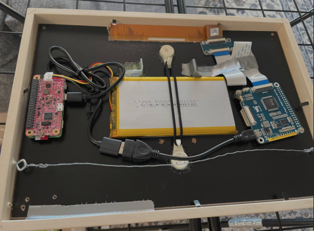
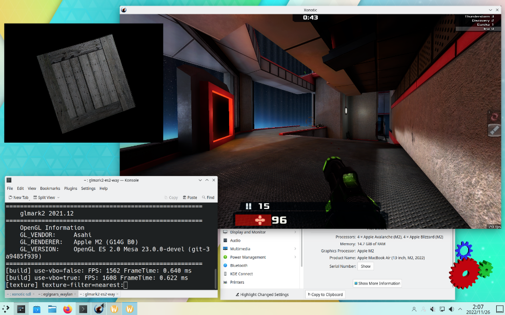
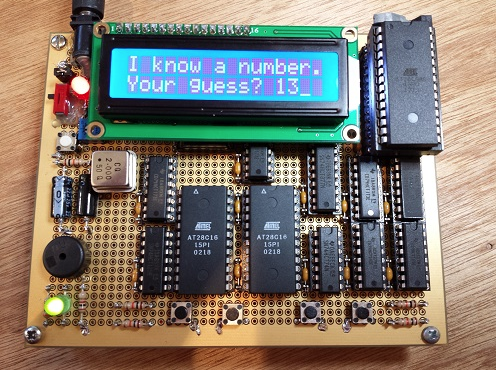
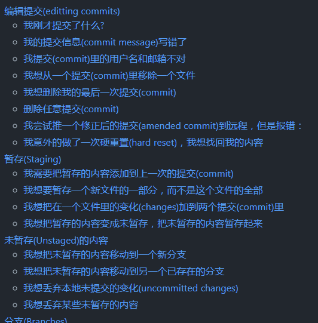

# 机器文摘 第 011 期

## 长文
### 自己动手做一个天气墨水屏

有个喜欢动手的哥们，发现了自己及家人的一项小需求，即从家出门的时候想快速知道天气情况。

虽然这种需求抬眼看一下手机也能实现，但是本着“懒惰使人进步”的核心思想(作者懒得掏出手机)他动手实现了一套基于电池供电的可以显示天气预报信息的电子墨水屏。

这篇[《做一个天气墨水屏》](https://kimmo.blog/posts/7-building-eink-weather-display-for-our-home/)记录了作者从诞生点子到产品出炉的全过程。

另外作者还开源了项目的源代码，[可在这里获取](https://github.com/kimmobrunfeldt/eink-weather-display)。

### M1 GPU 的故事

GPU 大家都知道，[这里有篇文章介绍了它的工作细节](https://asahilinux.org/2022/11/tales-of-the-m1-gpu/)。

作者来自一个给苹果 M1 芯片适配 Linux 驱动的团队（苹果官方不提供驱动，所以这意味着需要做一些逆向工程）。

本文记录了这些工作中比较有趣的部分，还顺便介绍了 GPU 的一些底层工作原理。

### 在 Commodore 64 上实现位图滚动条的显示

Demosense 是一项挖掘计算机硬件机能极限的活动。

通常创作者们会通过各种编程技巧来实现看似无法达到的效果。

由于 Commodore 64 这台古董电脑十分经典，现在仍有不少Demosense爱好者在为它开发程序。

[这篇文章](https://www.c64demo.com/side-border-bitmap-scroller/)讲述了著名 C64 demo 程序 [Memento Mori](https://csdb.dk/release/?id=195841) 的实现过程，程序在 Commodore 64 上显示了一副巨大（对于C64来说）的图片。

这在圈内属于首创。

### 动手做一个 4 位 CPU

计算机组成原理是不是还没学明白？没关系，我们可以自己亲手做一个简单的 CPU 。

[Nibbler](https://www.bigmessowires.com/nibbler/) 是一款 4 位 CPU，使用标准 7400 系列逻辑芯片（单个计数器、寄存器、缓冲器和门）构建而成。是一个简单 CPU 的教育示例，易于理解和构建，但仍然能够运行游戏和其他有趣的程序。Nibbler 在 5 x 4 英寸（127 x 102 毫米）穿孔板上使用绕线制造。CPU总共包含17个芯片。

作者公开了设计图纸和相关资料，可在文章内部的链接中获取。

## 资源
- [纯手撸一个解释器](http://www.craftinginterpreters.com/)，编译原理没学明白没关系，这本在线电子书手把手教你写一个自己的解释器。
  

- [Git 飞行规则 (Flight Rules)](https://github.com/k88hudson/git-flight-rules/blob/master/README_zh-CN.md) ，一个十分全面的 Git 使用指南，把你能遇到的情况都想到了。
  

- [Vim 高级进阶](https://thevaluable.dev/vim-advanced/)，如果你已经学会了怎么退出 Vim，恭喜你，已经击败了 80% 的选手。想要在 Vim 中进行更高效的编辑操作，这份高手指南十分适合作为参考。
  

- [Flexbox 布局交互指南](https://www.joshwcomeau.com/css/interactive-guide-to-flexbox/)，这篇在线教程讲解了如何使用 Flexbox 进行页面布局，难能可贵的是直接在页面中提供了交互操作界面，可以一遍学一遍实践，非常方便。
  

- [在线 AI 标注工具](https://www.makesense.ai/)，想要训练自己的 AI 模型，比如目标检测、图像分类等等，可以使用这个在线工具进行数据标注，直接上传图片然后在线标注，完成后可导出 VOC、Coco 等格式的数据集。
  

## 订阅
这里会隔三岔五分享我看到的有趣的内容（不一定是最新的，但是有意思），因为大部分都与机器有关，所以先叫它“机器文摘”吧。

喜欢的朋友可以订阅关注：

- 通过微信公众号“从容地狂奔”订阅。

- 通过[竹白](https://zhubai.love/)进行邮件、微信小程序订阅。

