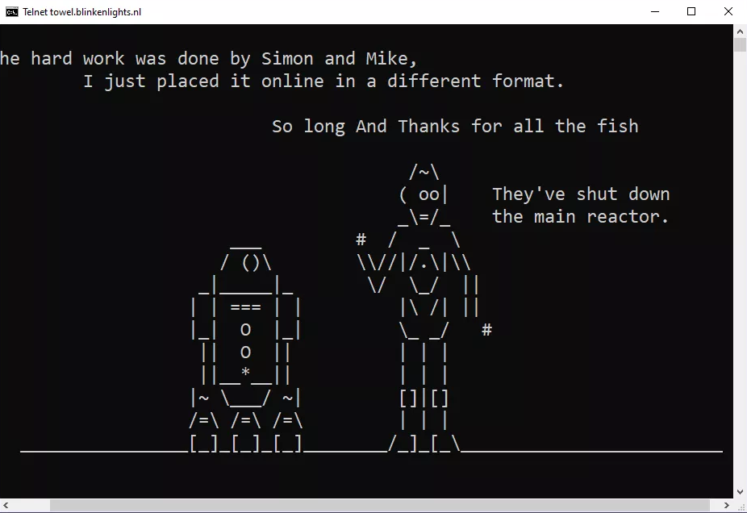
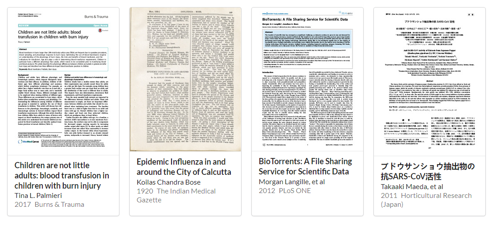
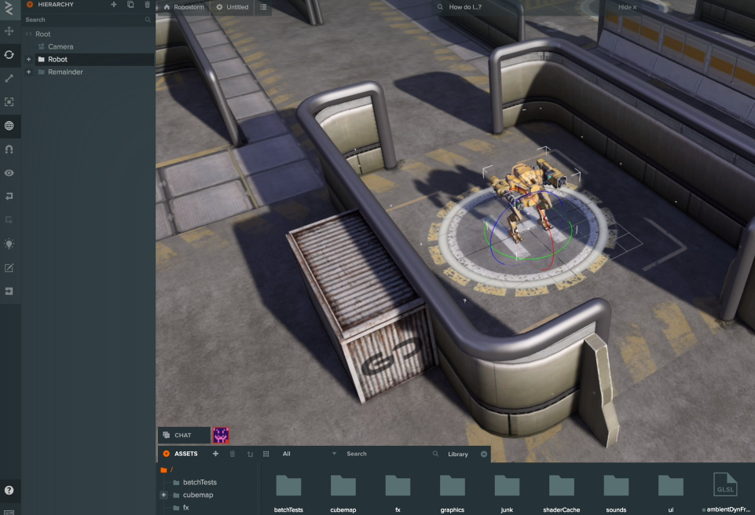
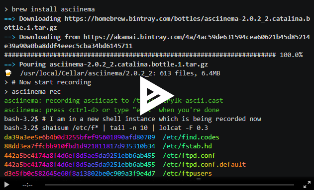
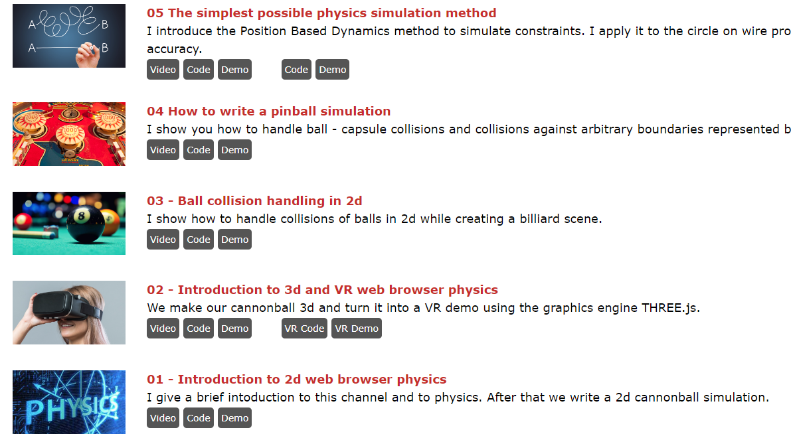
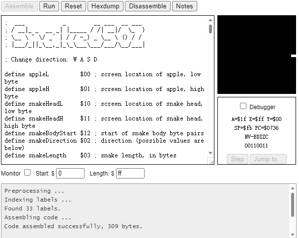

# 机器文摘 第 012 期

## 长文
### 使用 Github 登录被第三方网站滥用了吗？

为了方便账号注册，现在很多网站都提供了基于 Github 账号登录的方式。

我个人也更倾向于使用这种方式登录。

毕竟可以少填一些注册信息，减少思考密码的麻烦。

但是这样做有什么安全问题没有？我之前还真的没有考虑过。

上周有一个[在 HackerNews 上的帖子](https://news.ycombinator.com/item?id=33917962)，有人遇到了在使用 Github 账号登录某些网站之后，导致他的账号莫名给别的仓库添 Star 的情况。

这引发了大家关于 Github 账号权限管理以及通过第三方鉴权进行账号登录和注册的讨论。

看完觉得在第三方鉴权授权时还是应该慎重使用才好。

### 每个黑客都知道的命令行快捷键

在图形化界面、触控操作交互界面已经十分普及的今天，普通用户可能现在很少能接触到命令行操作了。

但是对于软件开发者、IT运维工程师等人员来说，命令行还是属于离不开的操作界面。

而且对于有些工作任务来说，使用命令行完成起来要更加高效。

[这篇文章](https://www.masteringemacs.org/article/keyboard-shortcuts-every-command-line-hacker-should-know-about-gnu-readline)讲解了常见命令行交互时的一些快捷操作，比如常见的行内编辑、快速移动光标到命令开头、历史记录搜索等等。

掌握之后可以在各种命令行交互界面中进行使用（基本风格一致）。

### 基于颜色循环的动画技术

在计算机硬件资源匮乏的上世纪 90 年代，开发人员为了在有限条件下实现丰富的效果真是挖空心思。

比如，还记得 Windows 98 的启动画面吗？

蓝天白云，Windows 徽标，底部有一个蓝色的渐变色条，在缓慢的滚动。

这就用到了一个叫做[“颜色循环”](https://en.wikipedia.org/wiki/Color_cycling)的技术。

  > 来自维基百科：颜色循环，也称为调色板移动，是计算机图形学中使用的一种技术，其中颜色被更改以产生动画的假象。这种技术主要用于早期的电脑游戏，因为存储一个图像并更改其调色板比将动画存储为几帧需要更少的内存和处理器能力。

[这里有个博客](http://www.effectgames.com/effect/article-Old_School_Color_Cycling_with_HTML5.html)使用 HTML Canvas 复刻了一批采用颜色循环创作的作品，效果非常惊艳。

另外网站还开源了用于展示这些作品的图形引擎，虽然现在已经不再维护了，但是用于学习和探索还是很有研究意义。

### 软件逆向工程入门

软件的加密和破解在普通用户眼里十分神秘。

这篇[软件逆向工程入门](https://to-be-deleted-in-2022.emily.st/2015/01/27/reverse-engineering/)比较深入浅出地介绍了一些常用手法，跟着作者可以浅尝一下在内存中寻找注册号、修改汇编指令以使得软件保护失效等体验。

## 资源
- [计算机课后作业](http://nifty.stanford.edu/)，斯坦福大学计算机专业评选的历年来优秀作业作品。如果不知道自己编程需要练习什么的话，可以打开参考参考，很有实用价值，比起在 Leecode 上刷算法的题目，这些作业都在解决实际问题。

- [互联网档案学术](https://scholar.archive.org/)，全文检索索引包含超过2500万的研究文章和其他保存在互联网档案馆里的学术文档。 该馆藏涵盖从18世纪期刊的数字化副本，到最新的Open Access会议记录和从万维网上抓取的预印本。
  
  

- [PlayCanvas Web 优先的游戏引擎](https://playcanvas.com/)，一个免费的游戏引擎，倡导以 Web 优先，在网页中提供从开发到发行的全部流程支持。
  
  

- [命令行会话记录器](https://asciinema.org/)，Asciinema 是一个免费开源软件，用于帮助用户录制在命令行中的操作行为，便于在互联网上分发自己的操作示范、教学演示。比起直接视频录屏的方式，这种以字符方式的记录更加节约资源，无论是记录、传播还是回放环节，都很轻量。
  
  

- [十分钟物理](https://matthias-research.github.io/pages/tenMinutePhysics/index.html)，这套教程集合了一组十分钟左右的视频短片，每次介绍一个基本的物理概念并通过 Web 前端技术编程实现模拟。除了视频之外，网站还提供了源代码、演示环境等配套资源。

  

- [Easy6502](http://skilldrick.github.io/easy6502/)，一本学习 6502 汇编的电子书（没错，我就是特别喜欢这款 CPU）。网站带有交互界面，提供了一个简易模拟器，可以边学边练，教程最后会带你实现一个基于汇编的贪食蛇游戏。
  
  

## 订阅
这里会隔三岔五分享我看到的有趣的内容（不一定是最新的，但是有意思），因为大部分都与机器有关，所以先叫它“机器文摘”吧。

喜欢的朋友可以订阅关注：

- 通过微信公众号“从容地狂奔”订阅。

- 通过[竹白](https://zhubai.love/)进行邮件、微信小程序订阅。

