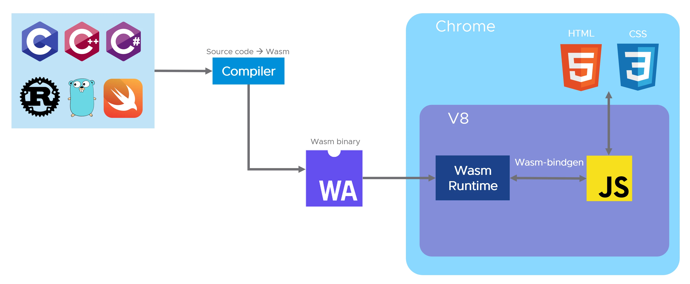
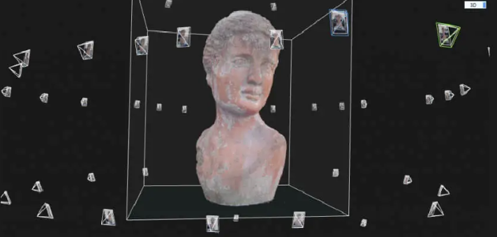
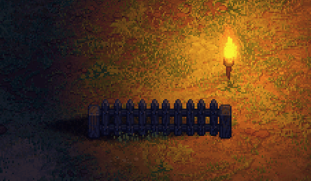
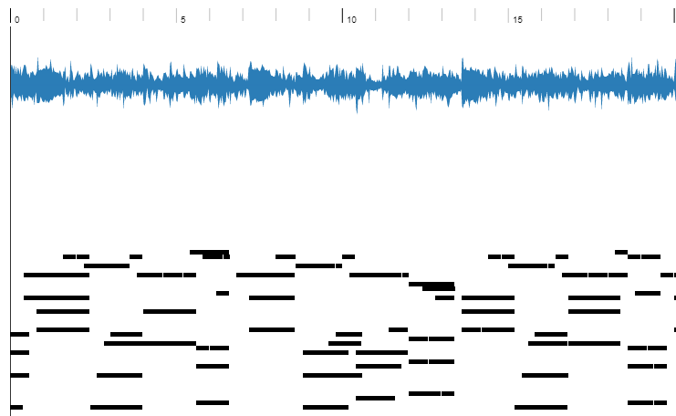
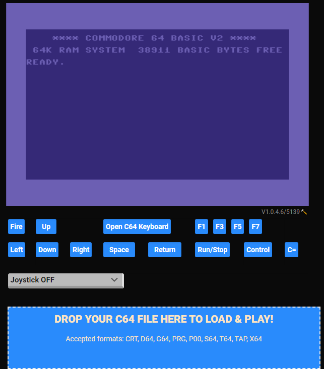

# 机器文摘 第 015 期

## 长文
### [编程就是玩儿](https://austinhenley.com/blog/programmingasplay.html)

对于程序员或者技术从业者来说，以一种什么样的心态工作将十分影响成果的产出。

[这篇文章](https://austinhenley.com/blog/programmingasplay.html)的作者给大家分享了他自己的感受----“不把编程视为严肃的工作、目标只是玩得开心、为了好玩而编程”。

他同时也是 [《为什么我喜欢做无用的东西》](https://news.ycombinator.com/item?id=27256867)帖子的作者。

除了文章本身之外，[在 HN 配套的讨论帖子在这里](https://news.ycombinator.com/item?id=34086416)。

这种类似于“寓教于乐”、“做自己开心的事儿”等等内容，一直是一个值得探讨的话题。

我个人也倾向于以兴趣和爱好来驱动自己，只是如果这个兴趣和爱好顺便能够挣钱，那就更好了。

### [WebAssembly：没有容器的 Docker](https://wasmlabs.dev/articles/docker-without-containers/)

最近 [Docker](https://www.docker.com) 宣布与 [WasmEdge](https://github.com/WasmEdge/Wasmedge) 合作支持 WebAssembly 。

WebAssembly 和 Docker 我们都听说过，在前面的文摘中我还尝试过自己使用 Rust 编写运行在网页里的 WebAssembly 应用程序。

Docker 也是我工作中每天都要用到的容器技术。

那他们两个有什么关系？放在一起能碰撞出什么火花？

[这篇文章](https://wasmlabs.dev/articles/docker-without-containers/)将讲解这两种技术的结合在云原生架构下的使用。

看来 WebAssembly 技术不仅可以在浏览器环境中发挥作用，还能在云计算、边缘计算等领域发光发热，前途不可限量嘛。

### [3D 摄影测量建模技术](https://www.jeffgeerling.com/blog/2021/modeling-my-grandpa-3d-photogrammetry)

3D 摄影测量建模，是一种通过对物体多角度拍摄照片，然后使用计算机通过软件算法合成为 3D 模型的技术。

从最开始在专业领域（如：建筑工程、考古）使用，到现在已经普及到普通人只需安装手机 App 也能轻松实现了。

这篇[用3D摄影测量法对我的爷爷建模](https://www.jeffgeerling.com/blog/2021/modeling-my-grandpa-3d-photogrammetry)记述了作者如何使用 3D 摄影测量建模技术给自己爷爷的雕像进行“数字化”的过程。

里面详细记录了整个过程所使用的开源软件和相关的配置细节。

对于一些想要进行一次实操演练的朋友来说可能有用。

### [在 2D 游戏中如何模拟 3D 的光影效果](https://www.gamedeveloper.com/programming/graveyard-keeper-how-the-graphics-effects-are-made)

《守墓人》是一款经典的 2D 角色扮演游戏，比起它的精彩剧情和有趣的玩法，出色的画面效果也是该游戏取得成功的重要原因。

这篇[《守墓人的图形效果是如何制作的》](https://www.gamedeveloper.com/programming/graveyard-keeper-how-the-graphics-effects-are-made)文章，由该游戏的核心开发者于 2018 年发表，讲述了很多关于实现在 2D 画面带来更加有立体光影效果的特殊技巧。

文章虽然老了一点，但是技术没有过时。

读进去可以深深体会到：一个优秀作品的创造，离不开对各种不可能的挑战和极限的突破。

## 资源
- [Flash 游戏大全](https://bluemaxima.org/flashpoint/)，上一期里我摘录了一个关于复刻 Flash 游戏的故事。后来也勾起了我对于 Flash 小游戏的怀念。便深入探索了一下现在这个阶段该如何再去运行那些老游戏。Flashpoint 是一个 Web 游戏保存工程，号称已经累计保存了包括 Flash 在内的 35 个平台的超过十万个小游戏。这个工程在 2018 年 1 月启动，试图在 Flash 消亡之前将之前的经典内容进行备份。现在提供两种版本的下载包，一种全量下载的大概 1.3 TB，包含了全部游戏。一种增量下载的，700多MB，只带了部分游戏，但是支持随下随玩。
  
  

- [根据音频自动生成钢琴旋律](https://sweetcocoa.github.io/pop2piano_samples/)，一个开源的 AI 模型，可以根据歌曲的音频识别出里面的旋律主线，并且使用钢琴演奏出来，效果十分神奇。
  
  

- [C64 Emulator](https://virtualconsoles.com/online-emulators/c64/)，一个在线的 commodore 64 电脑模拟器，可以直接将磁盘镜像拖拽到网页上进行加载，页面还提供了虚拟键盘。
  
  

- [沙雕 App](https://shadiao.pro/)，收集了各种有趣网站、工具的导航站，之前就关注过，最近好像升级了，喜欢恶搞的同学可以到里面找到一些比较有恶趣味的小程序。
  
  

## 订阅
这里会隔三岔五分享我看到的有趣的内容（不一定是最新的，但是有意思），因为大部分都与机器有关，所以先叫它“机器文摘”吧。

喜欢的朋友可以订阅关注：

- 通过微信公众号“从容地狂奔”订阅。

- 通过[竹白](https://zhubai.love/)进行邮件、微信小程序订阅。

