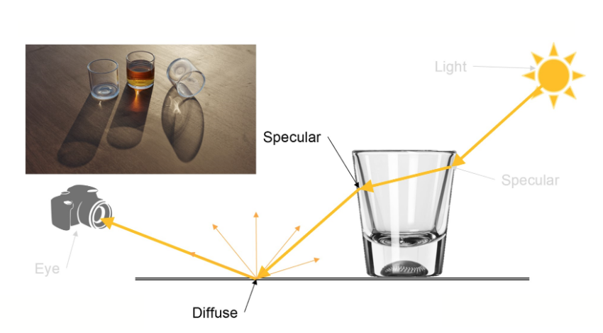

# 机器文摘 第 017 期

*预计春节期间暂停更新，节后恢复。*

## 长文
### [怎样在 1 位色深的 LCD 屏幕上显示灰度](https://www.zephray.me/post/grayscale_lcd/)

只有 1 位色深的 LCD 屏幕按理说是不能显示灰度的，因为他的像素点要么纯黑、要么纯白，显示的图案效果肯定非常差。

如果说非要显示灰度的话，我第一个想法是通过[抖动算法](https://zh.wikipedia.org/wiki/%E6%8A%96%E5%8B%95_(%E6%95%B8%E4%BD%8D%E8%A8%8A%E8%99%9F%E8%99%95%E7%90%86))进行模拟（即通过像素点的稀疏程度来制造错觉，如下图）。

然而这篇文章的作者采取了更为巧妙地方法，使用 PWM （脉冲宽度调制）技术，利用每个像素点的点亮时间不同来制造灰度错觉。

之前只是见过使用 PWM 调整 LED 灯泡的亮度，像这种用法我倒是第一次见。

### [作为一名数据工程师和作家，我为什么要用 (Neo)vim](https://www.sspaeti.com/blog/why-using-neovim-data-engineer-and-writer-2023/)

很多人都被 Vim 复杂的功能和陡峭的学习曲线吓到过。

也有很多人本着对效率的极致追求，而选择了征服 Vim，从而走上高效（折腾）的路线。

本文作者作为一名数据工程师，讲述了他学习 Vim 的心路历程，也许对于现在还在观望的人有所启发。

我个人使用 Vim 已十多年时间，虽然从未触及特别深入的技能（如宏定义、寄存器等），但是 Vim 这种神器的特点就是，只要你忍者难受越过操作的及格线，剩下的技能你稍微多掌握一点，就能马上给你带来非常丰厚的回报。

### [焦散是什么？如何正确地渲染焦散？](https://www.chaos.com/cn/blog/what-are-caustics-and-how-to-render-them-the-right-way)

焦散(Caustics)在现实生活中随处可见，但在渲染图中却很稀有。这篇文章解答了为什么渲染焦散很难，以及有哪些方法可以迂回实现。

找到这篇文章是因为我在 Github 上发现了[一个使用 webgl 实现焦散渲染的项目](https://github.com/pmndrs/drei#caustics)，效果非常不错，于是想研究一下背后的原理。

## 资源
- [常用设计模式有哪些](https://refactoringguru.cn/design-patterns)，一本在线电子书，图文并茂，以比较直观的方式介绍了软件开发常用的设计模式，支持英文、日文、中文等多国语言。
  
  

- [谷歌的软件工程](https://abseil.io/resources/swe-book/html/toc.html)，好几年前的一本书，讲述在谷歌做软件开发的体验和最佳实践，现在出了可免费阅读的电子版。
  
  

- [开源低代码开发框架 ToolJet](https://github.com/ToolJet/ToolJet)，免费开源的低代码开发框架，带有可视化编辑器，从数据持久化到前端界面全部无需编写代码。
  
  

- [一个无聊的 Neovim 插件](https://github.com/Eandrju/cellular-automaton.nvim)，一个没啥用的 Neovim 插件，唯一能做的事情是当你感到无聊时，可以将你的文本编辑区里的文本执行一个“元胞自动机”动画，看起来还算解压。
  
  

- [最大的 AI 工具箱](https://www.futurepedia.io/)，喜欢研究 AI 的不要错过这个网站，收集了各种 AI 模型的开源项目和相关网址，涵盖了图像识别、自然语言处理等常见的、时兴的 AI 技术。
  
  

## 订阅
这里会隔三岔五分享我看到的有趣的内容（不一定是最新的，但是有意思），因为大部分都与机器有关，所以先叫它“机器文摘”吧。

喜欢的朋友可以订阅关注：

- 通过微信公众号“从容地狂奔”订阅。

- 通过[竹白](https://zhubai.love/)进行邮件、微信小程序订阅。

