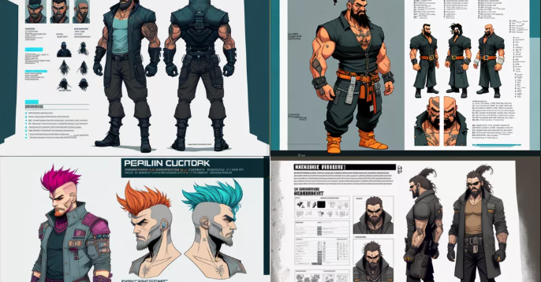
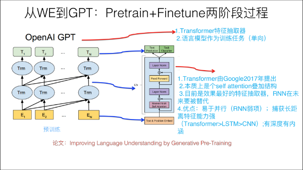
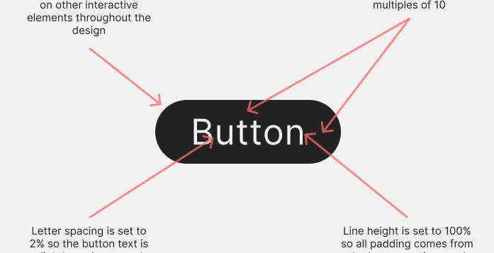
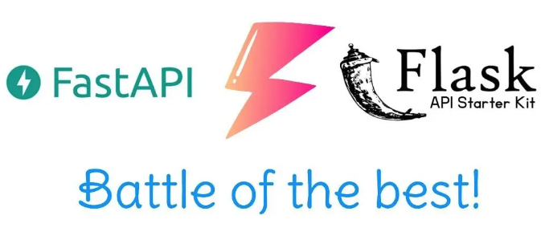
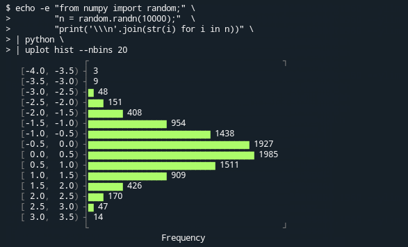
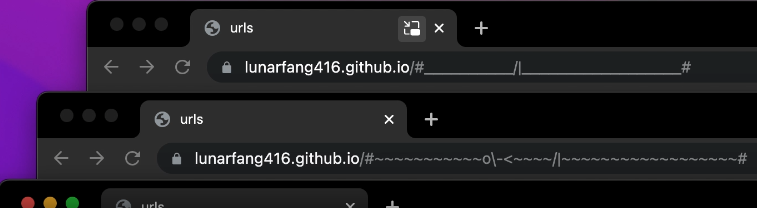

# 机器文摘 第 019 期

## 长文
### 现阶段 AI 能对游戏开发提供多大帮助

AI 在最近有多爆发自然不用我再赘述，抛开那些狂热的能够引起焦虑的言论（比如 AI 即将替代大量工作岗位），也有不少人选择跟 AI 和平相处。

这篇[《AI 辅助图形》](https://www.traffickinggame.com/ai-assisted-graphics/)的作者是一个有着游戏制作二十年经验的从业者，近期想尝试尽可能地利用各种 AI 加持的辅助工具，试图通过他们提升制作效率。

作者从游戏的概念原型阶段，一直到三维模型资产的制作和游戏场景的搭建，均选用了具有 AI 能力的效率工具进行支持。

最终结论是，虽然在过程中会有这样那样的不顺手，但这些工具确实能够帮助他节约大量工作时长。

所以作者的看法是，他很愿意将 AI 工具看作他的同事。

照这么说的话，留给人类的工作真的是不多了。

### ChatGPT 学习笔记

ChatGPT 在春节后又起了一波热度。

网上到处都是关于它的段子，有人用它写论文，有人拿来给孩子辅导作业，有人写情书，有人当个动嘴的甲方让它写程序。

喜得微软恨不得现在就把它接到搜索引擎里，逼得谷歌提前释放出自己的类似模型。

国内的百度也表示将在3月份发出自己的大规模语言模型。

要我说就不要这么着急，不妨拨开迷雾，看看 ChatGPT 是个什么东东。

在网上发现这篇[《ChatGPT 通俗笔记》](https://blog.csdn.net/v_JULY_v/article/details/128579457)，讲述了这个模型的发展历程，以及一些基本的概念原理。

此类中文资料不多，给这篇文章作者点赞。

### 视觉设计的一些规则

现在专业的界限越来越模糊，每个人都应该掌握一些基本的设计理念，以便在日常工作中输出的成果具备基本的美感。

这篇[《视觉设计安全法则》](https://anthonyhobday.com/sideprojects/saferules/)，浅显易读、明确具体，对于视觉设计活动很有指导意义。

看完之后无论是自己动手做 PPT 还是软件的 demo 原型，都可以用到。

我觉得甚至对于摄影构图、房屋装修都能有所借鉴，因为美是相通的。

### Python 做后端开发的技术选型

有时候想做一些 Web 应用的原型，Python 是我的首选语言，写起来顺手又省事，能节约不少时间。

但是由于用的不够深入，在选择开发框架的时候，稍微有些困惑。

比如同样都能提供快速的开发能力，Fastapi 和 Flask到底选哪个？

如果你也有跟我一样的疑惑，可以看看这篇[《Fastapi 和 Flask 详细对比》](https://www.turing.com/kb/fastapi-vs-flask-a-detailed-comparison)。

文章深度分析了这两个框架的异同以及所适用的工作场景。

## 资源
- [YouPlot](https://github.com/red-data-tools/YouPlot)，控制台绘图工具，可以在控制台窗口用字符的方式进行绘图，支持柱状图、散点图等。
  

- [网页在线联机 CS1.6](https://play-cs.com/zh/servers)，只需浏览器即可联机玩反恐精英 1.6，这个网站通过 WASM 技术将 CS 1.6 移植到了网页中运行，现代浏览器均可支持，第一次加载时间略长，但体验还算流畅，在线人员数量也挺多，随时可以匹配到。
  

- [交互式 SVG 参考](https://fffuel.co/sssvg)，一个可以在线了解 SVG 图形标准细节的网站，提供交互式界面进行实时演示。
  

- [浏览器地址栏里的动画](https://github.com/LunarFang416/url-animations)，一个有意思的 Js 库，通过动态修改浏览器地址栏的 URL 地址来实现动画，效果还比较萌。
  

## 订阅
这里会隔三岔五分享我看到的有趣的内容（不一定是最新的，但是有意思），因为大部分都与机器有关，所以先叫它“机器文摘”吧。

喜欢的朋友可以订阅关注：

- 通过微信公众号“从容地狂奔”订阅。

- 通过[竹白](https://zhubai.love/)进行邮件、微信小程序订阅。

