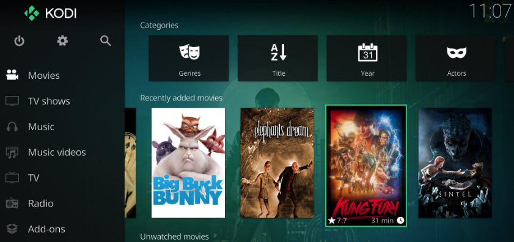
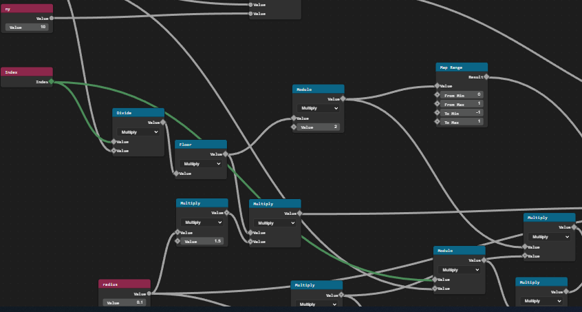
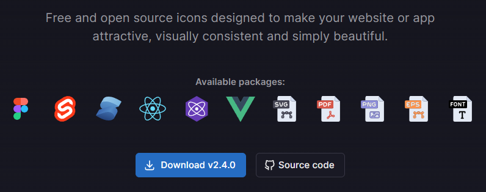
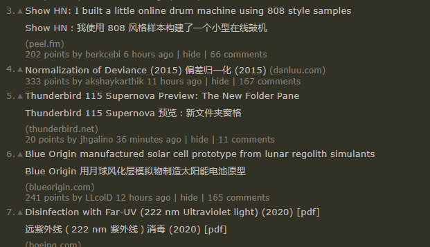

# 机器文摘 第 020 期

## 长文
### 怎样获得非凡成就

多年来，我对成功学嗤之以鼻。

但也对有些人的成功给予应有的尊重。

我所欣赏的成功人士有一种特殊气质，我说不上来具体是什么特点，有点儿像反叛精神，又有点儿对手工技术的狂热。

这些人里对我影响比较大的是《黑客与画家》的作者 保罗·格雷厄姆（[Paul Graham](https://zh.wikipedia.org/zh-hans/%E4%BF%9D%E7%BD%97%C2%B7%E6%A0%BC%E9%9B%B7%E5%8E%84%E5%A7%86)）。

他创建了著名的 [YC 孵化器公司](https://zh.wikipedia.org/zh-hans/Y_Combinator)，也打造了很多成功的产品。

今天推荐的这篇文章[《How To Be Successful》](https://blog.samaltman.com/how-to-be-successful)的作者，是保罗·格雷厄姆非常推崇的一位创业者。

文章分享的观点乍看有成功学的影子，但读完却能引人思考。

这里是中文翻译版：[《观察成千上万创业者后，关于如何获得非凡成就的13条思考》](https://mp.weixin.qq.com/s/pQYztNmmQ6W4fRxPIEsWYQ)

我觉得这些观点至少可以给长期埋头技术工作的人们一些启发，我稍微列举几条如下：
  > - 这个世界很少人能做到将眼光放长远，而那些有长远眼光的人会得到市场的丰厚回报。
  > - 把时间花在做正确的事上，比花长时间进行工作更重要。
  > - 跟着你的好奇心走。因为对你来说兴奋的事情对其他人来说也同样兴奋。
  > - 成为内驱型的人(即：自己去做一件事的原因来自于自己，而不是外部的力量或别人的期望)。

### 怎样在客厅建立自己的私人影院

智能电视或者智能盒子已成为现在客厅的标配。

如何充分发挥它们的作用，早已是技术爱好者的孜孜不倦探索的课题。

前些天我偶然收到一份公开的云盘链接，使用开源的 [AList](https://github.com/alist-org/alist)(一个支持网盘存储的文件列表程序，可以通过多种协议将网盘映射为本地访问的存储路径) 进行构建。里面整理了大量的影视资源，有不少是高质量、高码率的蓝光原盘文件。

这就激发了我的好奇心。

由于自己一直按耐住折腾 NAS 的念头，这些年一直没有收集电影。

但现在既然有在线的资源，不妨尝试一下。

于是我找到了这篇[《利用KODI和云盘打造4K高清私人云影院》](https://wp.gxnas.com/12278.html)（仅作研究，观影和收藏还需支持正版）。

按照文章的指导，成功给电视安装了 KODI（一个媒体中心 App），并进行了配置，可以非常方便地浏览、观看互联网云盘上的高清电影。

比起云盘官方所出品的各种 App 在体验上更加灵活、完美。

### “噪声”在计算机图形学里的作用

想要计算机产生的图形更加的接近自然，生成各式各样的噪声是必不可少的算法。

之前在读[《The Nature of Code》](https://natureofcode.com/)（中文译作：代码本色）一书的时候，作者花了大量篇幅讲解关于噪声、随机等对于模拟自然界中各种现象的重要作用。

或许在噪声里就隐藏着大自然最深处的秘密。

这篇[WebGL进阶——走进图形噪声](https://zhuanlan.zhihu.com/p/68507311)可以让你领略一些图形噪声的神奇。

很多场景都给出了 WebGL 实现的源码，可以边学边练。

## 资源
- [ThreeGN](https://threegn.app/)，一个基于网页的三维建模程序，特点是具有类似 Blender 的几何节点编辑功能。
  

- [tabler](https://tabler-icons.io/)，一个开源的图标库，可用于 Web 或 移动端应用开发，全部免费使用。
  

- [immersive-translate](https://microsoftedge.microsoft.com/addons/detail/%E6%B2%89%E6%B5%B8%E5%BC%8F%E7%BF%BB%E8%AF%91/amkbmndfnliijdhojkpoglbnaaahippg)，一个在线翻译浏览器插件，支持 Edge、Firefox、Chrome 等浏览器，优点是可以在网页上追加中文显示，原文和译文同时展示，对于想提升外语水平的人士，是个不错的对照工具。
  

## 订阅
这里会隔三岔五分享我看到的有趣的内容（不一定是最新的，但是有意思），因为大部分都与机器有关，所以先叫它“机器文摘”吧。

喜欢的朋友可以订阅关注：

- 通过微信公众号“从容地狂奔”订阅。

- 通过[竹白](https://zhubai.love/)进行邮件、微信小程序订阅。

