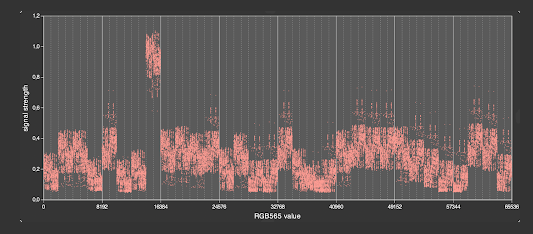
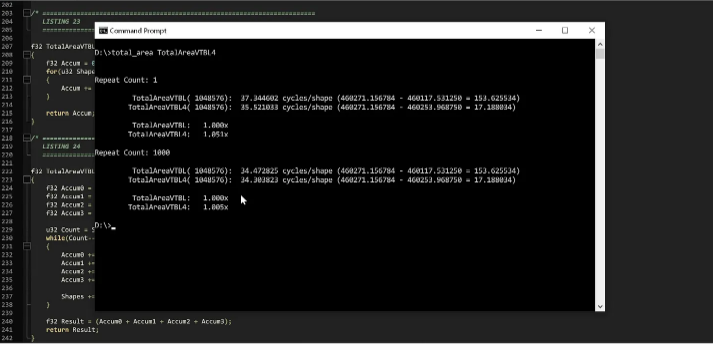
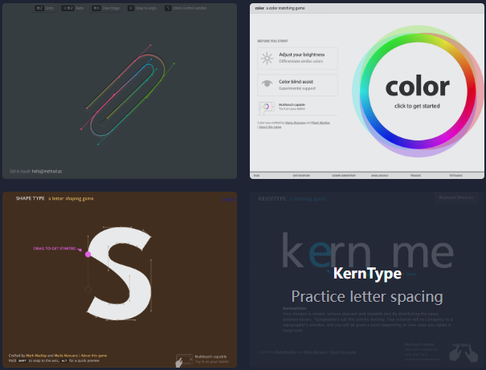
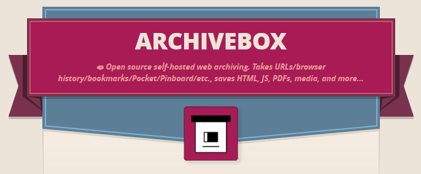
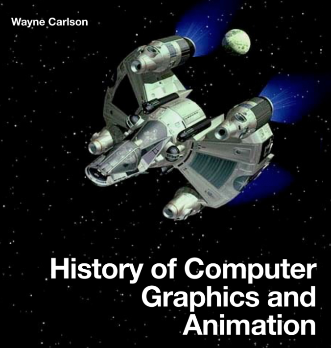

# 机器文摘 第 023 期

## 长文
### 视频信号可以被窃听吗？

我之前听到过一个传说。

使用高灵敏度的天线，再加上一些奇妙的设备。

可以窃听（窃视？）到附近（方圆数百米）范围之内的显示器显示的内容。

这个传说流传的时候，还是CRT显示器的时代，当时的视频接口主要是VGA，采用模拟信号进行传输。

如果显示器或者视频线缆所作的屏蔽不够充分的话，难免会有信号泄露。

而VGA信号又没有任何加密，被别有用心的人收看是有一定的可能的。

时间发展到今天，视频接口早已升级，我以为除非不小心无线投屏到了邻居家，否则就不会有视频内容泄露的情况。

然而，[今天要说的这篇文章](https://www.windytan.com/2023/02/using-hdmi-radio-interference-for-high.html)则证实了上述传说的可能。

不过，比起传说中的窃听，作者走的更远一些。

起因是作者在家里摆弄无线电的时候，发现了一个信号干扰源，最后发现来自他的一个树莓派设备。

于是经过一番操作，作者不但成功通过无线接收的方式将视频信号显示了出来。

还利用这种无线信号的干扰（或泄露？）实现了叠加数据的传输。

### 怎样用密码保护一个静态页面？

说到网站上的数据权限保护，一般我们会需要后端程序配合。

比如使用账号系统，给用户角色分配不同的权限，使其访问后端接口时获取不同的数据。

如果没有后台程序，只有静态页面会怎样？

这儿有个开源工具，[可以帮你生成带有密码保护的静态HTML页面](https://robinmoisson.github.io/staticrypt/)。

具体使用方法和原理也很简单。

输入你想设置的密码和你的HTML页面原始代码，这个工具可以使用AES-256加密算法对其进行加密。

然后在浏览器加载时，页面自动使用一个js库实现自解密。

这个方法用于临时保护一些静态的内容还是挺有效的，而且很方便。

### 写代码越“干净”越好吗？

有不少人宣称自己有代码“洁癖”。

对于设计模式和面向对象有着非常深的执念（或者函数式编程也是）。

市面上也充斥着很多“之美”、“之道”、“之禅”之类的书籍，强调代码要给人读、整洁干净。

我并不反对上述观点，甚至自己也有一点这样的“洁癖”，只是有时内心会有一丝怀疑的时候，觉得如果过于追求某些东西可能会偏离了解决问题的根本目标。

这篇[《“干净”的代码，糟糕的性能》](https://www.computerenhance.com/p/clean-code-horrible-performance)，帮我吐槽了一些事情。

但作者在文中所举的例子稍微有些牵强，不必过于纠结。

### 不知道怎么练习编程怎么办

经常有人困惑在学习了一门新的编程语言之后，不知该做些什么。

就像是掌握了词语却写不出好的小说，掌握了规则也下不好象棋。

我们从小受到的教育方式导致了，在学习技能这一块，缺失实践的动力和方法。

这篇[给无目标的新手程序的一些建议](https://prog21.dadgum.com/80.html)，虽然内容不多，但是可以看出作者也是个老油条了。

给出的一些提示都很实在，对于技能练习方面，提的都是我希望我能遵从的。

比如：
  > 用技能解决你实际生活中的问题。
  > 做一些你真正会用到的东西。

## 资源
- [写给 React 开发者的 TypeScript 指南](https://www.freecodecamp.org/chinese/news/typescript-for-react-developers/)，针对React程序员的TypeScript的学习资料，解答了我一部分为什么要用TS的问题。
  
- [Method of Action](https://method.ac/)，一些免费的工具和在线小游戏（颜色搭配、贝塞尔曲线等），可以帮助你学习和掌握设计理念和工具。
  
- [Archivebox](https://archivebox.io/)，一套开源的互联网内容保存方案，可以将你喜欢的页面下载下来，并自动爬取相关链接、图片等内容，类似于互联网档案馆的https://archive.org，不过可以自己搭建。
  
- [History of Computer Graphics and Animation](https://ohiostate.pressbooks.pub/graphicshistory/front-matter/cover/)，一本讲解计算机图形和动画发展历程的电子书，里面记录了计算机图形学相关的许多参考资料，曾用于俄亥俄州立大学的授课。
  

## 订阅
这里会隔三岔五分享我看到的有趣的内容（不一定是最新的，但是有意思），因为大部分都与机器有关，所以先叫它“机器文摘”吧。

喜欢的朋友可以订阅关注：

- 通过微信公众号“从容地狂奔”订阅。

- 通过[竹白](https://zhubai.love/)进行邮件、微信小程序订阅。

