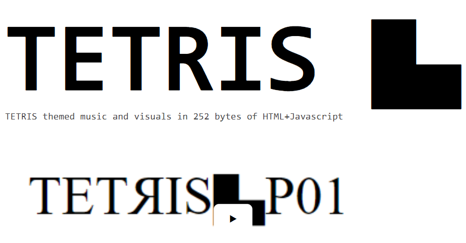
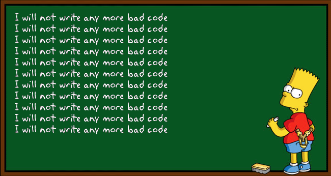
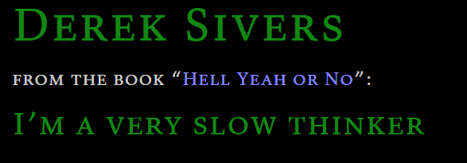
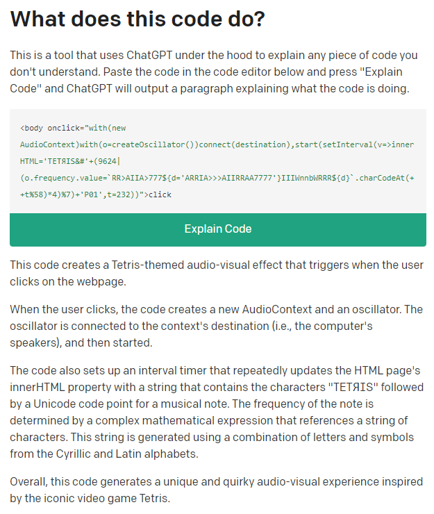
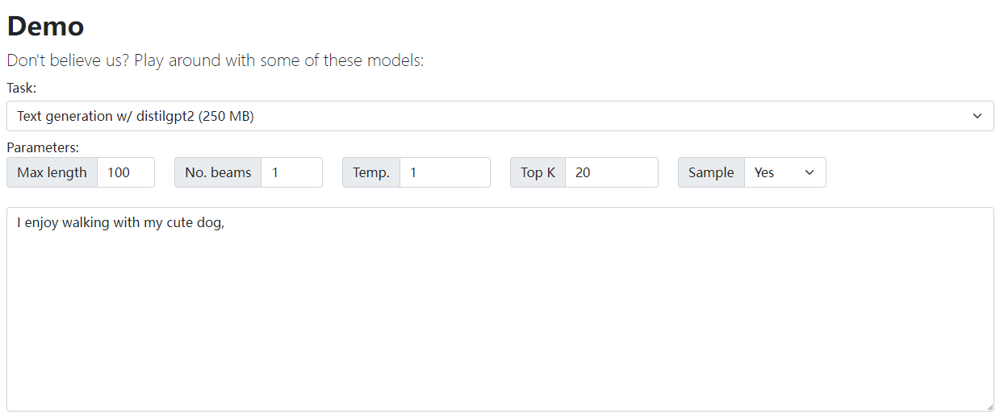

# 机器文摘 第 025 期

## 长文
### 252个字节实现播放音乐和动画

这里有个网页介绍了一个demo作者使用一段JavaScript代码实现了一个[一边播放俄罗斯方块背景音乐一边播放字符动画的网页](http://www.p01.org/256b_tetris_theme/)，原理是利用HTML5的AudioContext对象进行声音合成，通过定时器触发基于当前时间t值的不同频率，实现音乐播放。具体代码如下：
  ```javascript
  <body onclick="with(new AudioContext)with(o=createOscillator())connect(destination),start(setInterval(v=>innerHTML='TETЯIS&#'+(9624|(o.frequency.value=`RR>AIIA>777${d='ARRIA>>>AIIRRAA7777'}IIIWnnbWRRR${d}`.charCodeAt(++t%58)*4)%7)+'P01',t=232))">click
  ```

### 诺基亚发布的“可维修”手机

说到诺基亚，用过的朋友第一个映入脑海的词就是“砸核桃”。

那是iPhone还没发布的非智能手机年代。

手机可更换电池和外壳在那时是一个标准设计，谁要是不支持这些都不好意思跟人打招呼。

那时我经常把我的诺基亚掉在地上摔得七零八落，然后淡定地捡起来像电影里特工拼装自己的手枪那样，一个个把零件组装起来，形成“一把”手机。

或者等手机快要没电的时候，像换弹匣那样给手机换一块电池，立马满血复活。

这样的日子自从iPhone发布之后就再也没有了。

[诺基亚近期发布了一款手机](https://www.theguardian.com/technology/2023/feb/25/nokia-launches-diy-repairable-budget-android-phone)，再次让我想起我那掉地上摔开几瓣的手机。这款手机号称具有良好的“可维修”性，普通用户也可一个人在家轻松拆卸。可以自行更换包括电池、屏幕、充电端口等零件。

### 不要重复自己是编程的好原则吗

不要重复自己，永远不要从头开始重写代码！

这是很多程序员收到的忠告。

然而它是绝对正确的吗？

这里有篇文章[《重复自己，重写一切》](https://programmingisterrible.com/post/176657481103/repeat-yourself-do-more-than-one-thing-and)，作者在文章中探讨了编程中的一些习惯，他认为这些习惯可以使代码变得更难理解、更难维护，并可能导致代码的冗长和不必要的复杂性。文章提到了重写代码可以给程序带来更好的抽象和可维护性，所以建议定期通过重新写代码的方式重构你的程序。

说实话，我不知道作者是怎样看待所谓“屎山”代码的，也许当他面对有些代码时，他的观点也会变为：“能跑的代码，就尽量别动它了”。

### 慢下来

这篇文章的题目是[“慢下来”](https://sive.rs/slow)，作者是Derek Sivers，一位创业者、作家和音乐家。在这篇文章中，他分享了自己对于“慢下来”这个主题的一些思考和感悟。

虽然是个急性子，但是我很认同文章里的观点。

## 资源
- [反跟踪识别的套件](https://www.macpierce.com/the-camera-shy-hoodie)，如果你觉得被公共场所的摄像头拍摄和记录或者识别侵犯了你的隐私，这里有一套开源的穿戴套件可以考虑。它通过在身上穿戴可以发射红外线的LED设备，使得摄像头画面过曝。以获得保护隐私的效果。不过仅用于研究，不知道是否符合有些国家的法律法规。网站提供了配件清单和详细的装配说明（pdf）供下载。
  
- [AI帮你解释一段代码](https://whatdoesthiscodedo.com/)，有人使用openai的开发接口提供了一个专门帮人们解释代码执行的工具，输入代码，输出解释。并提供vscode的插件。我把文章开头那段播放音乐的Javascript代码发给他让他解释，效果如下图：
  
- [在网页中运行GPT模型](https://xenova.github.io/transformers.js/)，一个可以在浏览器中执行Transformer模型的开源程序，可以执行轻量的模型，实现如翻译、语音转文字、图像转文字等任务。
  
- [AI生成工具箱](https://aitxt.io)，近期，基于chatGPT模型的应用大爆发，这里有一个整理好的工具箱，可以使用ai做很多内容生成工作，包括帮你编写周报、润色文字、写道歉信、写外卖好评等，效果还不错。
    

## 订阅
这里会隔三岔五分享我看到的有趣的内容（不一定是最新的，但是有意思），因为大部分都与机器有关，所以先叫它“机器文摘”吧。

喜欢的朋友可以订阅关注：

- 通过微信公众号“从容地狂奔”订阅。


- 通过[竹白](https://zhubai.love/)进行邮件、微信小程序订阅。

