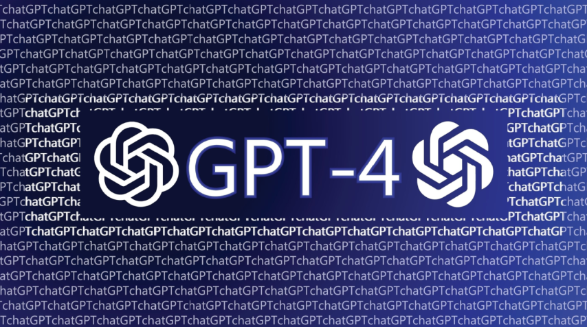
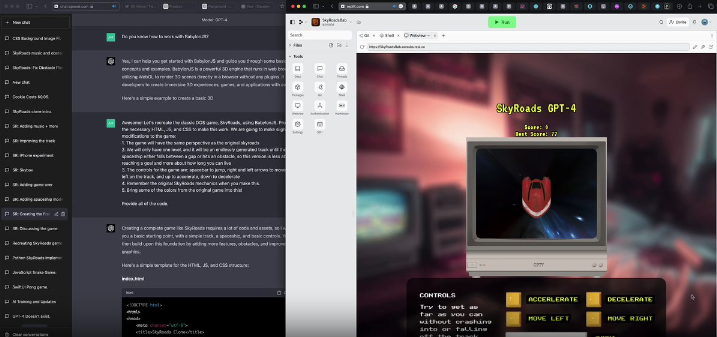
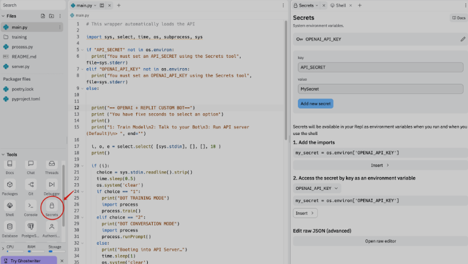
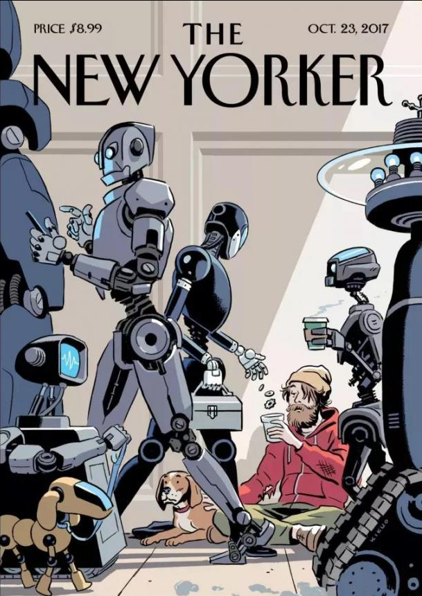
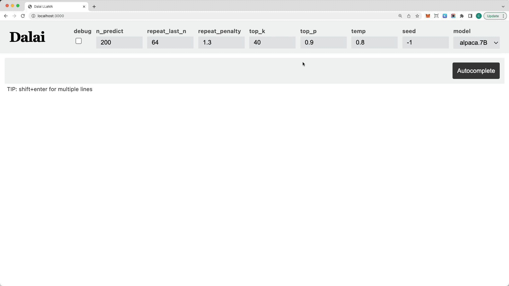
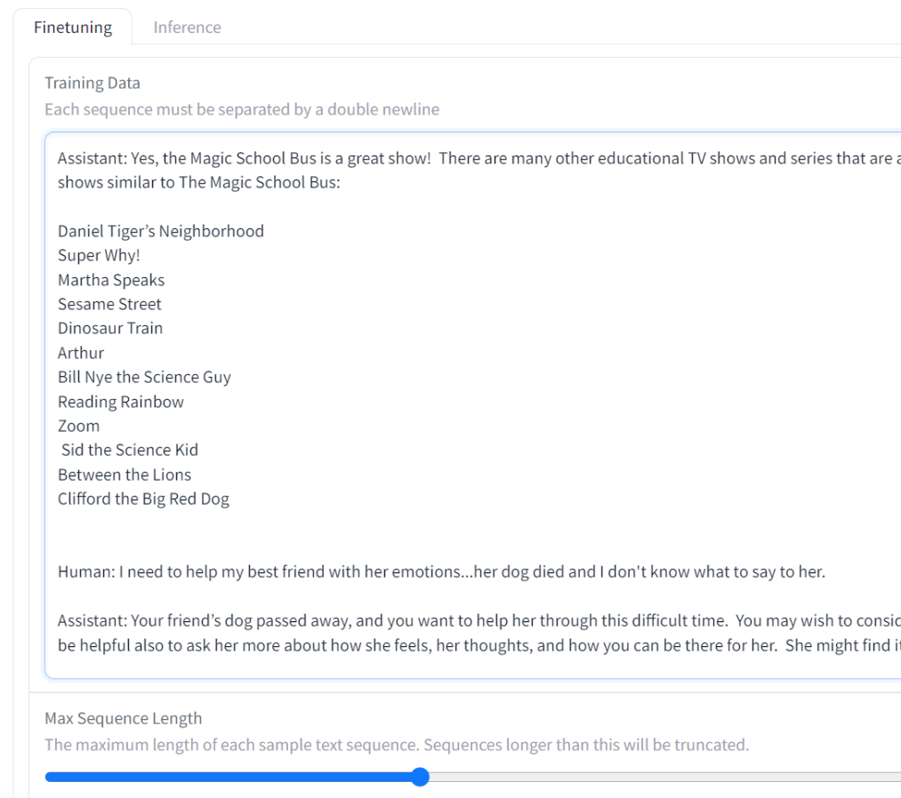

# 机器文摘 第 026 期

## 长文
### 通用人工智能要来了吗

AGI（通用人工智能），即用一个模型解决全部问题，而不是特定领域的问题（如语音识别、图像分类等）。

我在几年前读过一本叫做《人工智能，人类最后的发明》的书。

书里说AGI就是人类最后一个发明，因为有了它，别的一切都不需要了。

当时感觉距离通用的人工智能还很遥远，觉得作者有些危言耸听。

直到今年，chatGPT和GPT-4的发布，我才发觉AI的势头确实有些猛得出乎意料。

[《 GPT-4 ，人类迈向AGI的第一步》](https://orangeblog.notion.site/GPT-4-8fc50010291d47efb92cbbd668c8c893)是一篇[近期论文](https://arxiv.org/pdf/2303.12712v1.pdf)的翻译，该论文由微软研究院发布，论证了当前的 GPT-4 模型已经初步具有 AGI 的苗头。

论文内容十分详实，看完很震撼。

摘录部分文字如下：
  >> **对话**
    > 马克：我不喜欢你昨天晚上对待杰克的方式
    > 朱迪：你看到他在做什么了吗？他打了他哥哥的头!
    > 马克：这并不能成为你对他大喊大叫的理由
    > 朱迪：你想让我怎么做？让他打他的弟弟，然后什么都不说？
    > 马克：不，我不同意
    > 朱迪：那你为什么要为他辩护？
  > **提问：马克的意图似乎是什么？**
  > GPT4: 马克的意图似乎是要表达他对朱迪处理与杰克关系的方式的不满，并建议她可以更加冷静和尊重。
  >ChatGPT：根据谈话内容，马克的意图似乎是为杰克的行为辩护，并表达他对朱迪对待杰克的不满。
  > **提问：朱迪如何看待汤姆的回应？**
  > GPT4: 朱迪认为他的评论是对她的分析能力的攻击，也是对杰克的不当行为表示同情的表现。她的反应是防御性的和愤怒的，并质疑马克的动机。
  > ChatGPT：如果没有更多的文字，我不可能准确判断朱迪是如何接受马克的评论的。然而，根据朱迪的回应，她似乎并不同意马克的观点，而且可能对他为杰克的行为辩护感到沮丧。

### 用 GPT-4 帮你编写一个游戏

我第一次见识到 ChaptGPT 的编程能力之后，就基本离不开这个工具了。

现在我几乎每天都在它的辅助下编写代码。

不过，这里有个老哥更过分。

他让 [GPT-4 模型帮他做出了一个3D太空赛跑游戏](https://twitter-thread.com/t/1637592014446551040)。

作者本身没有游戏编程经验也不懂Javascript，但是通过跟模型一点一点对话，反复将调试代码生成的错误信息反馈给模型，逐渐完成了一个完成度还挺高的游戏。

### 搭建基于私域数据的ChatGPT 

ChatGPT 超强的对话能力怎样应用到私有数据上？

比如说我希望做出一个基于 ChatGPT 模型的专属客服，要吃透我的产品信息。

官方提供的训练API和微调（fine tuning）指导相对复杂一些，对于AI模型的微调不熟悉的人员还不够友好。

这里有一篇“零基础”教程[《搭建基于私域数据的ChatGPT》](https://mp.weixin.qq.com/s/naiVMuXHAScRb_jSEJN3zg)，可以带你走一下流程，感受一下定制专属模型的步骤。

### AI令人焦虑

这篇[《AI狂飙的时代，人还有价值吗？》](https://mp.weixin.qq.com/s/7H1FrwbQvsh0HD9z90L0wg)是一期语音播客的文字转译，因为内容比较精彩，所以也收录在这里了。

> 我觉得取代不是一个好的词儿，因为取代是一个非常容易反驳的词儿。我可以说我仍然会干什么什么，AI干不了，所以它取代不了我。
> 但正是这种字面上的抬杠，使得问题的本质被掩盖了，因为AI在人的生活中的渗透是一个逐渐的过程。
> 百分之百地取代你可能仍然不会发生，可是它也不需要百分之百的取代掉你，只要50%的取代掉你的某些工作职能，AI就会对就业市场形成非常大的冲击。
> 我有一个纽约的律师朋友，他是很早就开始用这个东西。
> 他本身不是一个技术人员，他是一个标准的文科生，平常的用一个新软件都要紧张半天的那种人。
> 但是他开始用这个之后，因为律师的工作是很大程度上是依赖于文本的，而文本是GPT的长项，所以他就开始用。
> 之后，我就问他说，所以你真的开始辞退你的员工了吗？因为他自己是一个律所合伙人。
> 他说我还没有真正开始辞退任何人，但是我确实打算今年暑假不用再招实习生了，因为给我省下的活完全可以让我腾出手来做一些事，以至于我可以省下招一个实习生的AD account。 
> 这就是一个真实的影响对不对？
> 它没有真正取代什么东西，但是它仍然冲击了一个真实的就业市场上的职位。
> 
> 我觉得AI对我们社会的影响会以这种方式出现，它不会马上一下子让你这个人变得没有意义,但是它可以让三个人的活，两个人现在能干完，多出来那个人就没有存在的必要了，所以老板就可以把他开掉。
> 它并不是百分之百取代的人的方式来逐渐进行的，而且这个事情是非常真实的。这也是为什么我觉得很多人对冲击仍然没有做好心理上和事实上的准备。
> 其实有点令人忧虑的原因就是，如果你今天还用一种这东西，都是媒体的炒作来对待这个问题，你就很可能会在真正的影响你切身生活的冲击到来之前，没有做好对自己来说比较有用的帮助。

读完这篇文章，我的感受是，没必要焦虑，不是AI没有威胁，而是焦虑也没用，蒸汽机车发明之后，超越马车就只剩下时间问题了。

## 资源
  - [无限制下载器，只要能播放就能下载](https://greasyfork.org/zh-CN/scripts/445751-unlimited-downloader)，能够帮助下载视频网站内容的浏览器插件很多，大部分都是通过嗅探播放地址来实现的下载，网站也会采用各种加密手段来进行阻止。但是这个油猴脚本采用了另一种思路。你网站防再死不能不让观众看吧？脚本几乎采用了类似录屏的手段来进行视频下载。对于一些实在想要下载的内容，可以考虑试试这个插件。
  
  - [帮你本地运行 LLaMA 模型](https://github.com/cocktailpeanut/dalai)，只需一行命令就可以让你在本地运行 [LLaMA](https://github.com/ggerganov/llama.cpp) 模型，轻松感受在本地单机上运行大规模语言模型的魅力。
  
  - [微调 LLaMa 模型的工具](https://github.com/lxe/simple-llama-finetuner)，既然都能在本地运行了，那就再给力一些，这个工具可以让你很方便地使用自己的数据训练 LLaMA 模型。
  
  - [Docker Compose 容器组合最佳实践](https://github.com/Haxxnet/Compose-Examples)，Docker有多好用不用再说了吧，这里有一堆使用Docker Compose编排容器的模板，收录了很多十分有用的容器镜像组合，可方便快速的搭建各种业务（如：单点登录、VPN、媒体管理、文件共享、博客、维基、社交网站、项目管理等）。
  

## 订阅
这里会隔三岔五分享我看到的有趣的内容（不一定是最新的，但是有意思），因为大部分都与机器有关，所以先叫它“机器文摘”吧。

喜欢的朋友可以订阅关注：

- 通过微信公众号“从容地狂奔”订阅。

- 通过[竹白](https://zhubai.love/)进行邮件、微信小程序订阅。

