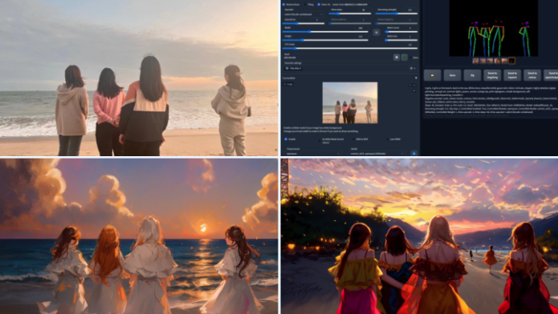
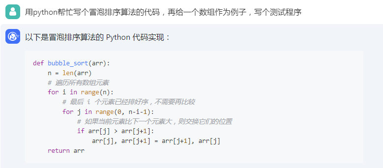
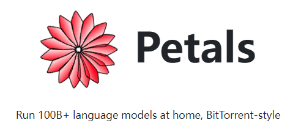
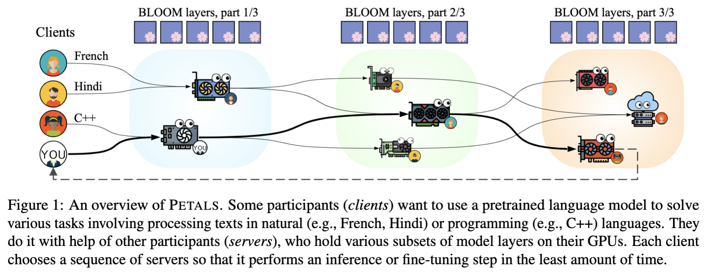
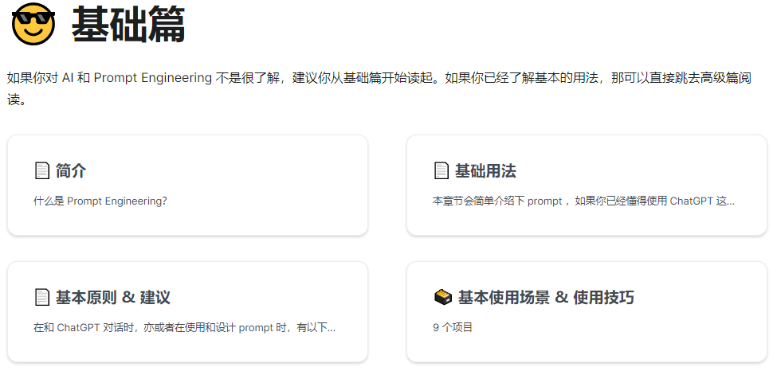

# 机器文摘 第 027 期
## 长文
### 搭建本地AI作图应用

AI对话机器人火爆的同时，去年由Stable-Diffusion模型引爆的AI作图技术也没有放慢进化的脚步。

这里面的佼佼者[Midjourney](https://zh.wikipedia.org/zh-cn/Midjourney)已经发展成了强大的图像生成系统。可以轻松定制出照片级图像，其效果足以乱真。

不过目前在国内使用Midjourney还比较麻烦，即便能够访问，使用量也会受限制，能否自己搭建一个呢？

答案是肯定的。

跟去年刚问世的时候不同，现在基于Stable-Diffusion模型的生态也已经十分完备，很多开源软件、框架、插件围绕这个模型开发。

利用这些软件可以快速在本地计算机上构建一套属于自己的图像生成服务。

这里有一篇博客以[手把手的方式教你如何在最快速的时间搭建自己的图像生成服务](https://www.freedidi.com/8474.html)。

里面还列举了一些微调好的定制模型下载地址，合理的使用这些模型，你会发现打开新世界的大门。

### 搭建本地chatGPT应用

本来不想再提chatGPT了，因为最近说的有些太多了。

但是无奈当前的开源生态对于语言模型是在是太追捧了，技术发展迅雷不及掩耳。

很快就出现了一批可以自己搭建的AI对话模型。

今天我挑两个我认为效果比较好的（且对中文支持比较好的）介绍一下。

注意，跟目前流行的基于OpenAI的接口进行套壳的程序不同。我说的是完全在本地搭建自己的服务。

第一个：[ChatGLM-6B](https://chatglm.cn/blog)，一个具有62亿参数的中英双语语言模型。通过使用与 ChatGLM（chatglm.cn）相同的技术，ChatGLM-6B 初具中文问答和对话功能，并支持在单张 2080Ti 上进行推理使用。

搭建过程比较简单，按照[README](https://github.com/THUDM/ChatGLM-6B/blob/main/README.md)文档中的步骤下载模型、执行脚本程序即可。

第二个：[中文 LLaMA & Alpaca 大模型](https://github.com/ymcui/Chinese-LLaMA-Alpaca)，开源了中文LLaMA模型和经过指令精调的Alpaca大模型。这些模型在原版LLaMA的基础上扩充了中文词表并使用了中文数据进行二次预训练，进一步提升了中文基础语义理解能力。同时，在中文LLaMA的基础上，本项目使用了中文指令数据进行指令精调，显著提升了模型对指令的理解和执行能力。

搭建过程略微繁琐一些，需要通过自己的手段下载到开源的LLaMA原始模型（当然这对于技术人员来说不是问题）。

然后按照文档中的教程，执行模型合并、量化等脚本，最终通过开源程序LLaMA.cpp实现模型的本地运行。

### 合作运行千亿参数级语言模型

按照众人划桨开大船的思路，之前在带宽不足的年代诞生了BT下载。

如今，当我们的本地显卡无法应付超大AI模型时，有人开始用同样的思路解决问题。

[Petals](https://petals.ml/)就是这么一个分布式模型微调、运行的框架，可以让你轻松在家运行超过千亿参数的大模型（当然是在线跟大家一起协作）。

其原理是大家分别加载模型的一小部分，然后与其他人一起通过协同的方式进行推理或者微调。

## 资源
- [Prompt Engineering 教程](https://learningprompt.wiki/)，一份教你如何更好使好地使用 ChatGPT 和其他 AI 产品的免费教程。
  
- [Prompthero](https://prompthero.com/)，跟聊天机器人、绘图机器人交流的prompt大全，与上面的教程不同，这是一个模板库大全，有创作灵感但是不知道该如何描述的时候可以去参考一下。
  
- [Civitai](https://civitai.com/)，与上面相同，不过专门用于图像生成，而且路子比较野，有大量的NSFW内容，要搭配Stable-Diffusion的各种微调模型使用。具体使用方法，可参考前文中介绍如何搭建本地图像生成服务的部分。

## 订阅
这里会隔三岔五分享我看到的有趣的内容（不一定是最新的，但是有意思），因为大部分都与机器有关，所以先叫它“机器文摘”吧。

喜欢的朋友可以订阅关注：

- 通过微信公众号“从容地狂奔”订阅。

- 通过[竹白](https://zhubai.love/)进行邮件、微信小程序订阅。

