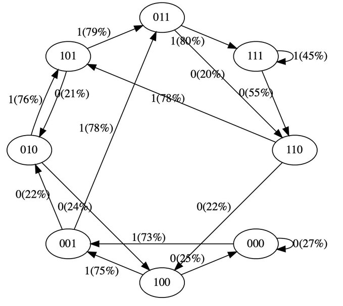
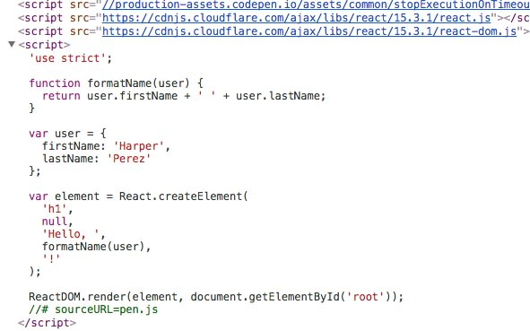
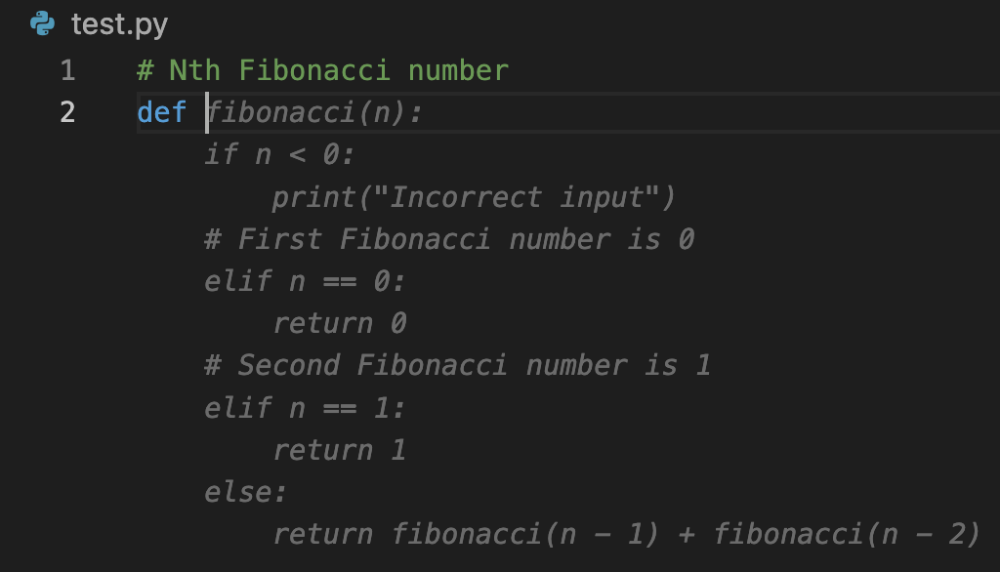

# 机器文摘 第 028 期
## 长文
### 极简代码理解 GPT 模型结构

在[twitter上有网友发布了一个简单的示例代码](https://twitter.com/karpathy/status/1645115622517542913)，讲解了 GPT 语言模型的运行原理，为了方便大家理解，作者用了极简的模型设置，即语言文字只保留了1和0两个字符，上下文长度也仅为3，可以很直观地感受到训练过程是如何起作用的。

作者[提供了托管在colab的python源码](https://colab.research.google.com/drive/1SiF0KZJp75rUeetKOWqpsA8clmHP6jMg?usp=sharing)，可以在线体验。

### 用开源语言模型训练自己的数字化身

随着开源语言模型的训练和微调变得越来越简单，果然有人开始整活。

已经有网友[通过自己的微信聊天记录和博客文章训练出有自己风格的AI](https://greatdk.com/1908.html)。

作者使用目前对中文支持最好的开源模型 chatglm-6b 作为预训练模型（我上期介绍过它的部署和使用）。

经过一番折腾后终于训练出还算凑合的模型。

我们的世界离[《黑镜》中的黑暗故事](https://movie.douban.com/subject/11502153/episode/1/)越来越近了。

### 四十年工作经验程序员的职业建议

国外有位“老程序员”退休了，是真正的到了退休年龄的退休。

他从1981年入行，直到去年退休。这期间他做过各种开发，跳过槽也被辞退过，打过工也创过业。

这不容易。

所以，他决定[以“一个退休程序员”的身份分享一些心得](https://thecodist.com/how-i-stayed-relevant-over-four-decades/)。

摘抄部分要点如下：
> 保持开阔的眼界：每天花时间获取真正的资讯，看到趋势，在事物流行起来之前发现他们。
> 保持学习：不要拒绝和敌视新技术，要为你所用。
> 要有自己的项目（做一些真正的事情）：作为程序员不要浪费聪明才智和外部资源，要学着开始一个自己的项目。

### 进入心流的入口

进入心流（Flow）状态是一种很忘我的体验，也是知识工作者高效产出的必要条件。

有不少创作者都体会过那种全身心的投入并且忘记了时间的感觉。

一旦进入那种状态，很多问题能够很快得到解决，大脑飞速运转并且不会感觉到劳累。

这种状态最忌讳被打断，因为一旦打断，再进入就会比较困难。

这里有篇文章介绍了一些小技巧，可以让你在不得已中断心流之后，能够比较快速地恢复状态。

作者将这些技巧比喻为高速服务区进入主路之前的加速匝道，姑且称为[进入心流的入口](https://census.dev/blog/an-on-ramp-to-flow)。

## 资源
- [Spline](https://spline.design/)，一个免费易用的 3D 设计工具，可实时协作，提供了丰富的物料库，可以基于它来快速创建有趣的 3D 场景，支持处理细腻动画交互，此外还可以导入本地模型和声音素材，支持到处多种输出格式包括WebGL、视频、链接等，很适合新手。
  
- [Draw With Flowers!](https://codepen.io/ksenia-k/pen/poOMpzx)，在threejs里用着色器语言编写的一个特效demo，可以随着鼠标移动绘制绚丽的花朵。
  
- [React 源码阅读](https://github.com/numbbbbb/read-react-source-code)，一本开源电子书，通过阅读React的源码来详细理解前端框架的原理。
  
- [Codeium](https://codeium.com/download)，Github copilot 的免费平替，提供vscode、vim、neovim等常见编辑器的插件，我试了一下，效果可以接受。
  
## 订阅
这里会隔三岔五分享我看到的有趣的内容（不一定是最新的，但是有意思），因为大部分都与机器有关，所以先叫它“机器文摘”吧。

喜欢的朋友可以订阅关注：

- 通过微信公众号“从容地狂奔”订阅。

- 通过[竹白](https://zhubai.love/)进行邮件、微信小程序订阅。

