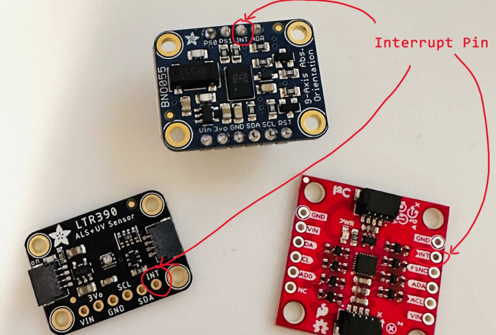
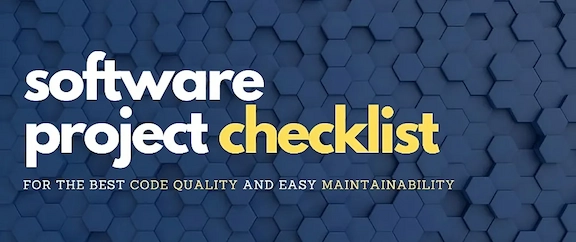
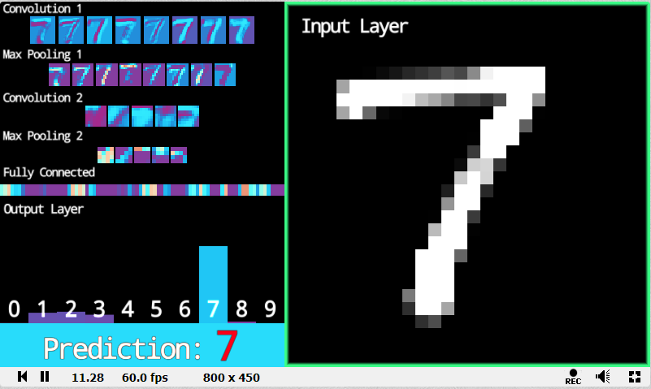
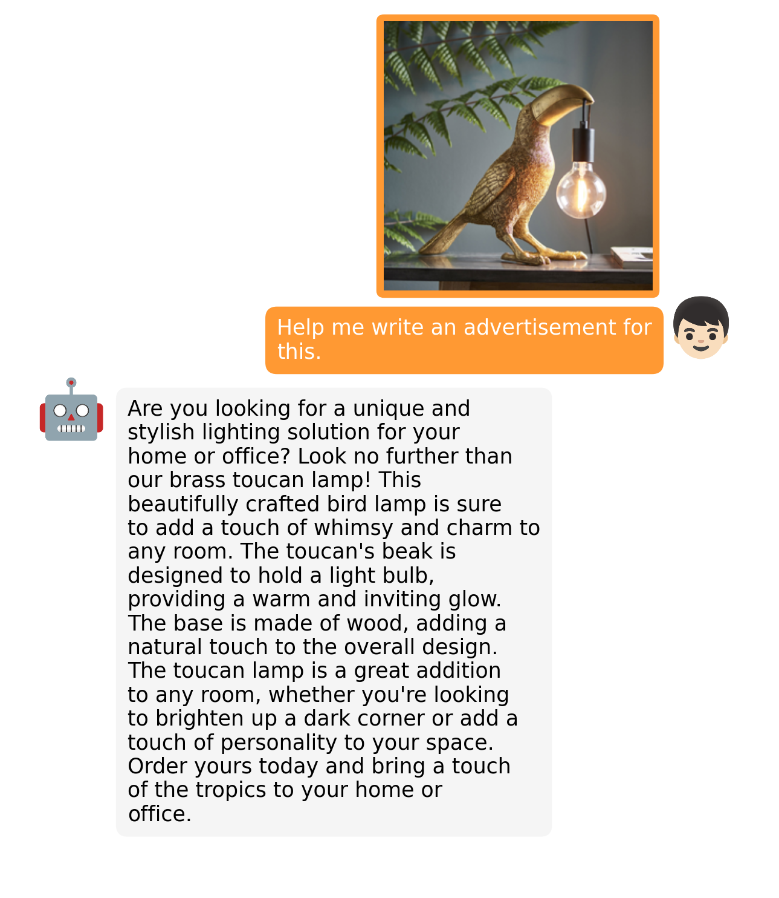

# 机器文摘 第 029 期
## 长文
### 计算机的“中断”机制是如何实现的？

稍微了解过计算机原理的朋友都知道，计算机是通过“中断”的机制实现对键盘输入、鼠标移动、硬盘读写等操作的。

让我给小朋友讲解这些基本的知识时，我也可以侃侃而谈，说上半个小时不带重复。

但是真要解释“中断”的机制是如何实现的，我想即便是现在科班出身的本科生也未必能够说明白。

原因我觉得除了缺少实践之外，也跟大部分书上的理论内容离实际工程较远有关。

这篇[漫谈中断](https://r12f.com/posts/interrupts/)从实际的硬件实例（x86）出发，详细介绍了中断的实现机制，普及了“外部中断”、“内部中断”、“软中断”等概念，以及人们怎样通过“中断控制器”逐渐解决了多设备中断处理的问题。是一篇很值得阅读的科普文章。适合对计算机组成原理、操作系统等技术有兴趣的朋友阅读。

### 怎样提升软件项目的可维护性？

不同的项目团队对于软件项目的可维护性所做出的努力不同。

有不少团队宁愿在修改bug上加班加点，也不愿意为可维护性多花一丁点精力。

不过，如果你要开始一个新的软件项目或者想要改善一个已经存在的项目的可维护性。

这里有一份[软件项目可维护性检查清单](https://hix.dev/tutorials/general/software-project-checklist)可以参考。

作者主要从版本控制、软件测试、静态分析、依赖库管理、多语言支持、多平台支持、开发环境管理等方面给出了可以改进的行动清单，以及基于开源工具的最佳实践建议。

### 怎样榨干chatGPT？

ChatGPT是由OpenAI训练的一款大型语言模型，能够和你进行任何领域的对话。

现在跟年初账号紧张的情况比起来已经方便了很多。

在这么多开源工具和套壳网站的帮助下，我想现在大部分人都能够比较方便的体验它了吧。

但是可能很多人还不知道如何更好的发挥它的作用。

有网友整理了一份开源的[chatGPT中文调教指南](https://github.com/PlexPt/awesome-chatgpt-prompts-zh)，内容极为详尽，可以帮你榨干chatGPT的全部潜能。

### 怎样让AI作画理解你的意图？

对于现在强大的AI绘图应用，有些人可能会认为只输入一个单词就能生成一张很酷的图片。

然而，虽然AI模型越来越善于理解我们想要的内容，但它们还不能读懂我们的思想。

因此，如果你想生成一张看起来像你所想的那样的图片，你需要编写正确的提示。

这个[AI绘图prompt编写指南](https://boostpixels.com/short-guide)可以给你提供一些帮助。

## 资源
- [维修指南](https://zh.ifixit.com/Guide)，各种设备的维修教程大全，详细到每一个步骤的照片，设备型号齐全； 
  
- [glsl-CNN](https://shadertoy.com/view/msVXWD)，有大神用glsl语言，仅通过webGL的片元着色器实现了一个手写识别的CNN神经网络。可以在浏览器直接体验，效果惊艳。
  
- [dinov2](https://github.com/facebookresearch/dinov2)，Meta AI新发布的全能视觉模型，模型支持：图像分类、分割、图像检索和深度估计。比较厉害的地方在于它是一个自监督模型，直接从图像中学习特征，而不依赖文本描述，即可训练计算机视觉模型。
  
- [minigpt-4](https://minigpt-4.github.io/)，GPT4 的图像支持迟迟不开放，这个开源的MiniGPT4 却已经做到了类似的多模态效果，官方演示看起来非常棒。只用了四张A100训练了10小时，模型甚至只有13B。
  
- [street-fighter-ai](https://github.com/linyiLYi/street-fighter-ai)，有个B站UP主在GPT的帮助下， 写了个 强化训练的AI模型，终于打败了街霸里的 AI，实现了儿时的梦想。
  
## 订阅
这里会隔三岔五分享我看到的有趣的内容（不一定是最新的，但是有意思），因为大部分都与机器有关，所以先叫它“机器文摘”吧。

喜欢的朋友可以订阅关注：

- 通过微信公众号“从容地狂奔”订阅。

- 通过[竹白](https://zhubai.love/)进行邮件、微信小程序订阅。

