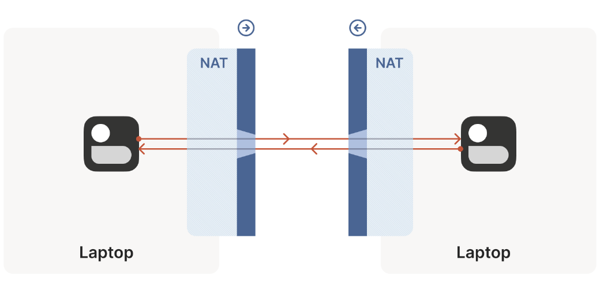
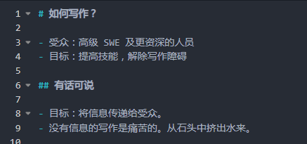
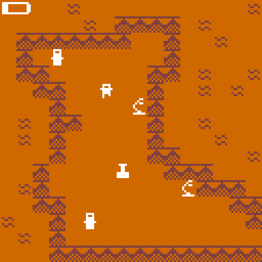
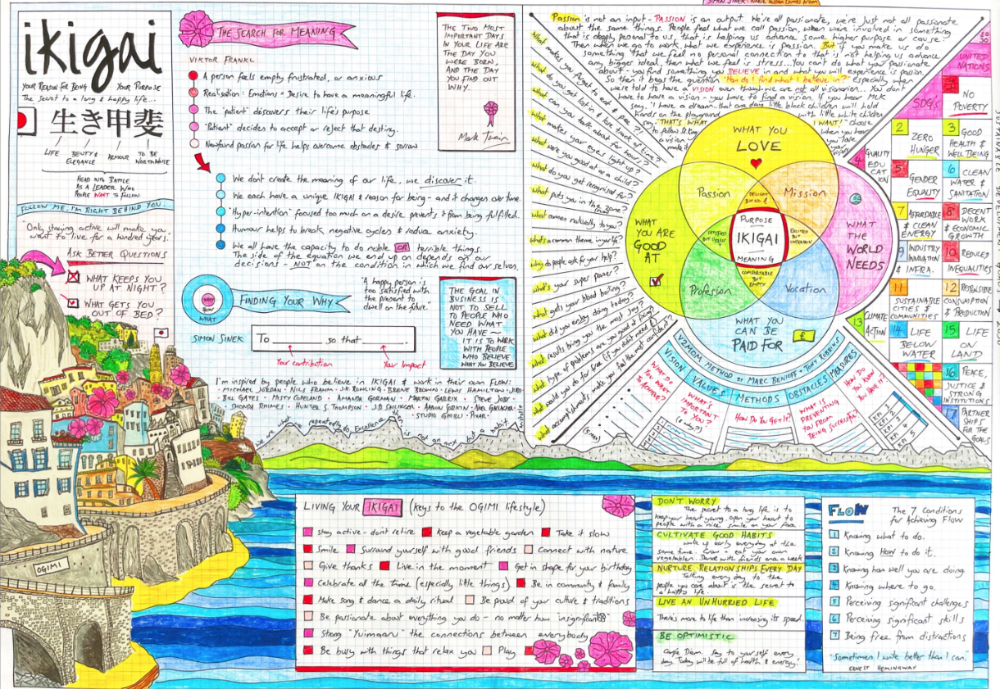
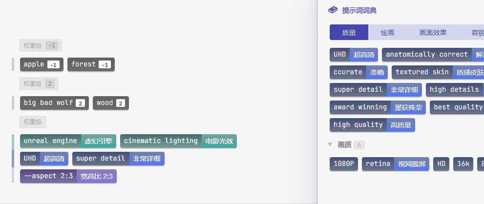
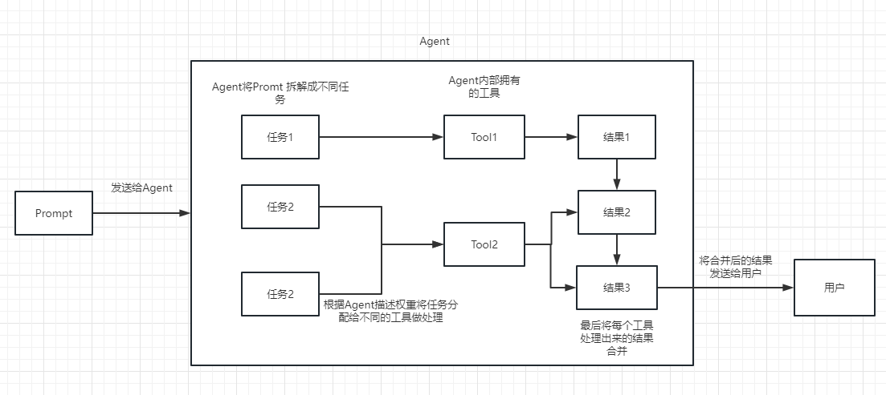
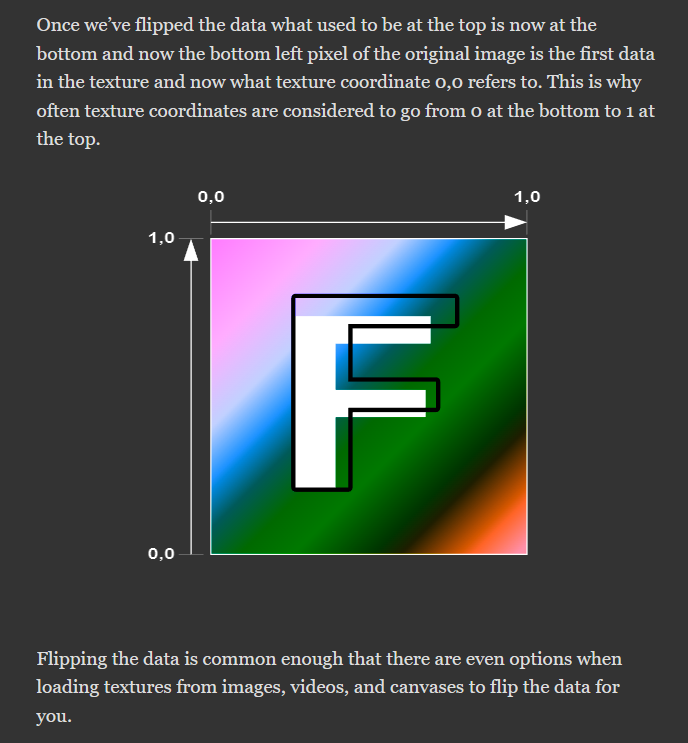

# 机器文摘 第 030 期
*下周五一假期，休息，不更新。*

## 长文
### 内网穿透的原理及实现

> 设想这样一个问题：在北京和上海各有一台局域网的机器（例如一台是家里的台式机，一 台是连接到星巴克 WiFi 的笔记本），二者都是私网 IP 地址，但可以访问公网， 如何让这两台机器通信呢？

IPv4地址即将枯竭，IPv6技术还没有普及，现在很多家庭宽带都不再分配公网IP地址。这就意味着大部分的个人电脑是无法通过互联网被直接访问的（当然，你可以通过你家wifi或者4G信号访问互联网，但是反过来不行）。

可是这种需求又真实存在，比如我就经常希望能够在任何地方访问我家里的电脑，通过远程桌面进行办公、文件共享等等。

最简单的方法是通过购买一台具有公网IP地址的云主机来实现中继，这也是目前最普遍的方式。

不过阅读完这篇[《NAT 穿透是如何工作的：技术原理及企业级实践》](https://arthurchiao.art/blog/how-nat-traversal-works-zh/)，假如你有很强的动手能力的话，就应该可以实现一套完全不需要公网主机进行中继的“企业级内网穿透工具”。

文章很长，来自[这篇英文博客](https://tailscale.com/blog/how-nat-traversal-works/)。

### 技术写作指南

曾经在翻阅《程序员的数学》这本书的时候被朋友看到，于是诞生了短暂的讨论。

当时我的观点是，作为程序员一定要掌握好数学，即便现在编程过程中已经不怎么用到特别底层的知识，但也应该多训练数学思维。

朋友当时说了一句话让我记忆犹新。

“比起程序员的数学，我更担忧的是程序员的语文。”

确实，写作这项能力在很多技术人员心里是被低估的。

不少人受尽写技术文档的折磨，于是越发讨厌写作。

这篇[《作为工程师应该如何写作》](https://www.yuque.com/serviceup/misc/cn-writing-for-engineers)真是雪中送炭，总结了很多立即就能见效的技术写作方法，希望可以帮助到工程师朋友。

### 怎样制作好玩的小游戏

很多人都有自己开发游戏的冲动。

不过很容易掉进各种复杂的引擎和工具的坑里。

然后感到沮丧，忘了想做游戏的初心。

这篇[《怎样制作好玩的小游戏》](http://farawaytimes.blogspot.com/2023/02/how-to-make-good-small-games.html)可以让你重新焕发精神。

作者认为开发那种不用复杂引擎的小游戏也可以很欢乐，只要有足够的游戏性。

他在文章中详细列举了想要制作出真正具有游戏性的小游戏所必须具备的几点关键特性。

看得出来，作者是懂游戏的。

### 神奇的一页纸知识管理

> 宇航员在太空中找到的方法一定不会错，因为他要是出错就没命了。
> 航天员的秘密武器，One Pager。就是把一个专项的知识，都写和画在一页纸上。日积月累，宇航员有了一本手册，里面都是一页一页的one pager。
我向来对知识管理的各种方法很有兴趣。

在网上闲逛时看到这篇[《神奇的One Pager》](https://www.zhongwen.ai/fantastic-one-pager/)，讲述了一种通过一页纸进行知识管理的方法。

热爱学习的人可不能错过。

## 资源
- [buzz](https://github.com/chidiwilliams/buzz)，Transcribe and translate audio offline on your personal computer. Powered by OpenAI's Whisper.
  
- [可视化提示词拼装](https://moonvy.com/apps/ops/)，文生图的AI越来越多，自己也可以在本地搭建服务，可是为什么我自己生成的图片那么丑呢？这个工具也许可以帮你生成一些靠谱的提示词。
  
- [LangChain 中文入门教程](https://liaokong.gitbook.io/llm-kai-fa-jiao-cheng/)，众所周知 OpenAI 的 API 无法联网的，所以如果只使用自己的功能实现联网搜索并给出回答、总结 PDF 文档、基于某个 Youtube 视频进行问答等等的功能肯定是无法实现的。所以，我们来介绍一个非常强大的第三方开源库：LangChain 。
  
- [clock](https://oimo.io/works/clock/)，一个非常酷的网页时钟显示效果。
  
- [WebGPU 理论基础](https://webgpufundamentals.org/)，从基础理论开始学习WebGPU，稳！
  

## 订阅
这里会隔三岔五分享我看到的有趣的内容（不一定是最新的，但是有意思），因为大部分都与机器有关，所以先叫它“机器文摘”吧。

喜欢的朋友可以订阅关注：

- 通过微信公众号“从容地狂奔”订阅。

- 通过[竹白](https://zhubai.love/)进行邮件、微信小程序订阅。

