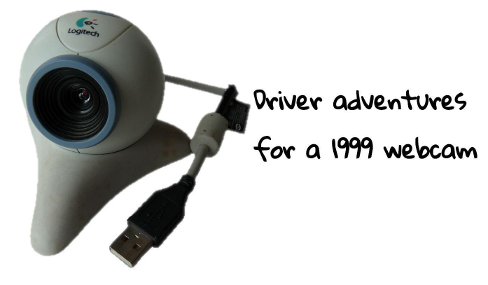
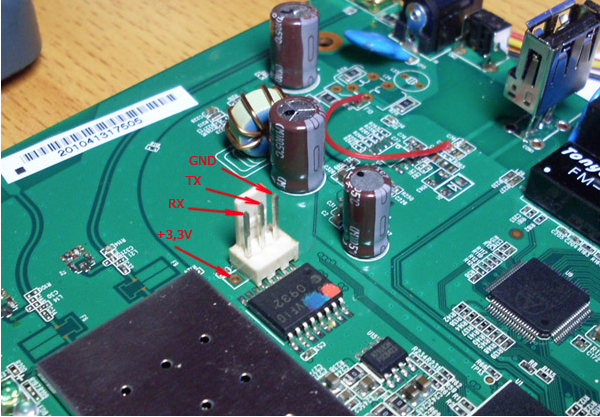
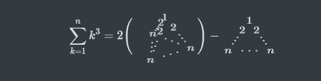
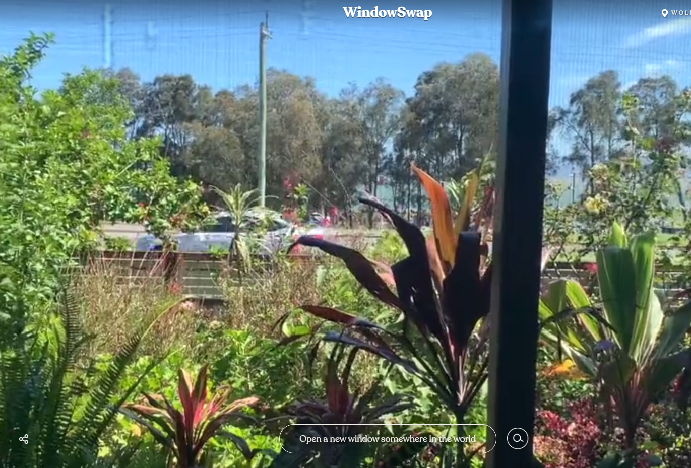
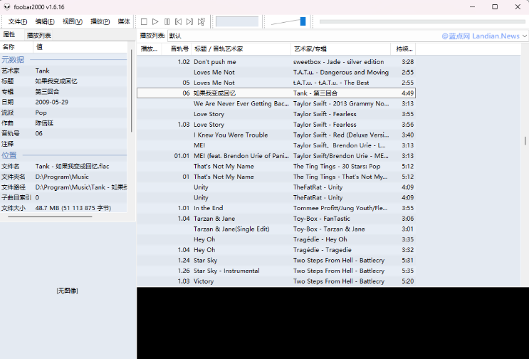
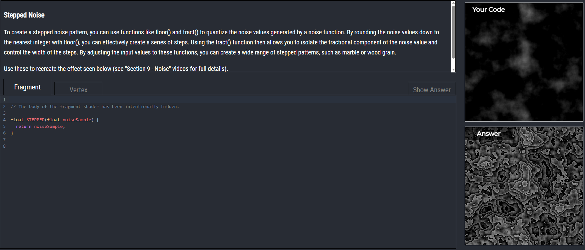
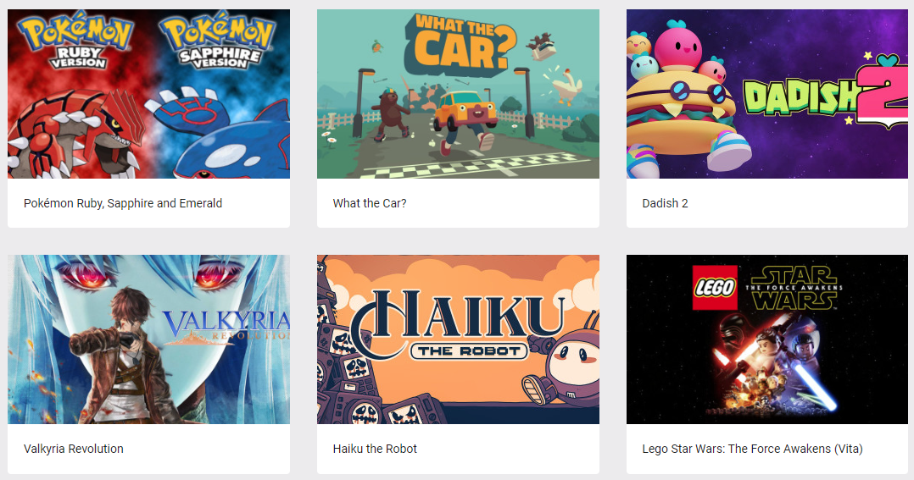

# 机器文摘 第 031 期

## 长文
### 怎样驱动上个世纪的网络摄像头

国外有个老哥，在帮朋友收拾废品的时候，获得了一个老旧的摄像头。

于是他按耐不住想感受一下，这个来自上个世纪的“古董”，还能打吗？

由于年代比较久远，厂家也不再提供驱动程序的更新。

哥们不得不在虚拟机里全新安装一个windows xp，成功启动摄像头，并获得“清晰图像”。

安装xp时有个插曲：安装界面里的进度条仅用时几十秒就走完了原本几十分钟的倒计时（所以说微软的进度条是如何推断剩余时间的永远是个迷）。

在经过一番体验之后，又跃跃欲试准备自己给它手搓一个在现代操作系统下的驱动程序。

整个过程记录在[《一个1999年的摄像头复活的故事》](https://blog.benjojo.co.uk/post/quickcam-usb-userspace-driver)。

整个故事都充满了一种“我不知道这么做有什么意义，但是我就是可以”的极客风格（也是我收录它的主要原因）。

### webGPU 科普

最近谷歌浏览器率先宣布全面支持 webGPU ，预计到今年年底各大浏览器也都会跟进并提供支持。

webGPU 从名字上看跟显卡和浏览器有关，可是之前已经有webgl了，这次又有什么变化？

通过多方面信息的搜索，我得到的结论是：webGPU 更充分地暴露了显卡的计算能力，GPU不再只是做图形渲染相关的事情，而是根据webGPU提供的相关专业接口，可以执行深度学习之类的更通用的计算工作。

如果想了解的更全面一些，这篇[《谈谈 webGPU》](https://cohost.org/mcc/post/1406157-i-want-to-talk-about-webgpu)文章十分值得一读。

作者对 webGPU 这一技术介绍的比较详尽，从各个图形接口的发展历史一直到对未来如何应用的展望，都包括了。

### 如何翻译一本书

[《从不自量力到 AI 助力，我如何翻译完一整本英文书》](https://sspai.com/post/79534)
这是一个关于执行力的故事。

主题是：如何借助AI和现代信息工具，实现看似不可能完成的任务。

在这个时代，个体的力量很渺小，因为个人几乎无法独立完成任何事情。

但同时，借助科技工具和基础设施的力量，1 个人甚至可以完成之前需要一个上百人公司才能做到的事情，这让个体变得非常强大。

### 如何刷路由器

[V站](https://www.v2ex.com/)上说，中年技术男有三大爱好：钓鱼、NAS、软路由。

~~我一样也没沾边儿~~，但还是克制不住关注相关技术。

之前多次想拿自己家的路由器开刀，刷一个openwrt系统，然后就可以各种折腾（科学上网、内网穿透等等）了。

但是一直没有动手，今天看到这篇[自己动手定制你的路由器](https://a-wing.top/linux/2023/05/01/start-openwrt)写的如此详细，还是心动了一下。

先收藏吧。

### 仅用CSS+HTML实现三维动画

CSS 的 `translate3d`用到的不多。

如果使用巧妙的话，可以帮你实现很出彩的 3D 动画效果，国外有高手在给自己的文章配数学公式的时候，利用CSS制作了一些可以动态显示的公式图表。这篇[CSS 3D图表](https://x.st/spinning-diagrams-with-css/)记录了它们的实现细节和技术原理。

## 资源
- [window-swap](https://www.window-swap.com/Window)，随机看别人家的窗外景色。这个网站每次刷新都随机显示一个网友共享的摄像头视角，一般是自家的窗外。可以随时体验全球各地的邻家风景。
  
- [foobar2000](https://www.landiannews.com/archives/98512.html)，经典的音乐播放器终于更新了。2002年发布的foobar2000播放器曾经是很多发烧友的最爱，如今过了20多年，居然更新了2.0稳定版，值得收藏；
  
- [lost-at-sql](https://lost-at-sql.therobinlord.com/)，一个在线学习 sql 的交互游戏，通过游戏闯关的方式练习 sql 技能；
  
- [glsl-exercises](https://glsl-exercises.simondev.io/lesson/1/1#welcome)，在线学习glsl的交互课程，通过交互式页面练习 glsl 编写；
  
- [gameuidatabase](https://www.gameuidatabase.com/)，一个游戏界面资源网站，各种游戏的界面截图，可以用来“借鉴”？；
  

## 订阅
这里会隔三岔五分享我看到的有趣的内容（不一定是最新的，但是有意思），因为大部分都与机器有关，所以先叫它“机器文摘”吧。

喜欢的朋友可以订阅关注：

- 通过微信公众号“从容地狂奔”订阅。

- 通过[竹白](https://zhubai.love/)进行邮件、微信小程序订阅。

