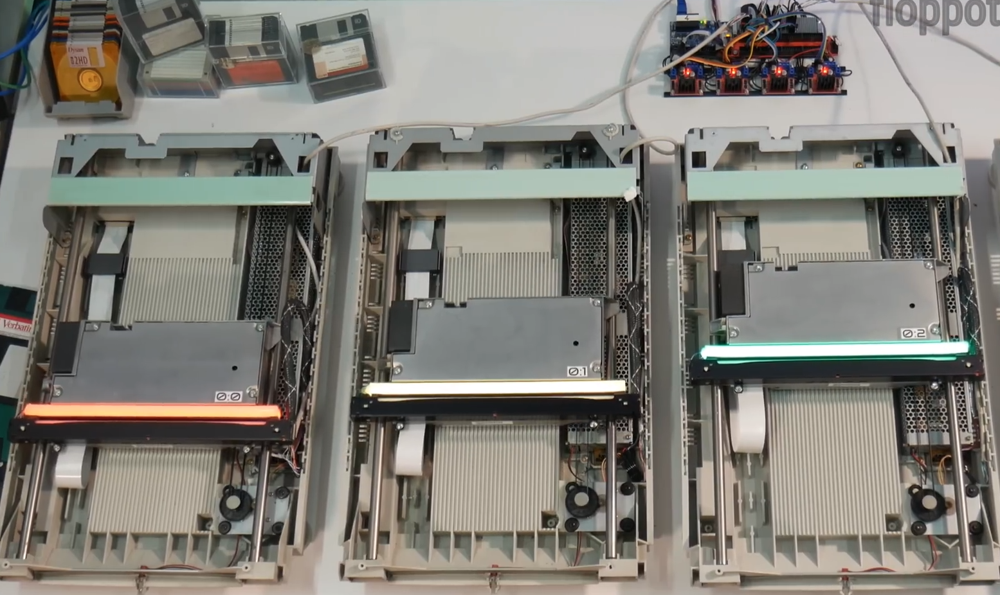

# 机器文摘 第 036 期

## 研究
- [软驱阵列演奏音乐](https://video.weibo.com/show?fid=1034:4911535232057363)，国外大神用512个软驱、16个硬盘、4个扫描仪，组装成阵列，通过编程的方式控制电机震动发出声音，组成各声部。这么多软驱，让我想到了退休老干部合唱团。
  
- [大脑能像身体那样锻炼吗？](https://video.weibo.com/show?fid=1034:4564677670141974)，如何训练大脑？提高记忆力、注意力和智力！这个视频进行了讲解，总之就是，用进废退，改变日常默认行动，让大脑动起来。
  
- [用纯汇编写一个GUI](https://gaultier.github.io/blog/x11_x64.html)，跟随这篇教学文章，通过编写图形界面的方式来学习汇编语言吧。顺便，作者想挑战一下，最小的GUI程序其可执行二进制文件能有多小。（现在的可执行文件动不动就好几十上百MB）​。
  
- [让 ChatGPT 帮我们总结 Hacker News](https://blog.betacat.io/post/2023/06/summarize-hacker-news-by-chatgpt)，让AI每天帮我总结新闻摘要，这个想法我已经考虑很久了，现在已经有人做了实现。这篇文章介绍了一个开源静态网站的实现，它利用 ChatGPT 的总结能力，直接将每条Hackernews的新闻用一两句话总结出来，然后发布到GithubPages 可以节约我们每天看新闻的时间。
  
- [马斯克专访：推特的混乱过去了，现在的目标是最大化用户无悔时间！](https://www.web3brand.io/p/maximize-unregretted-user-time)，我不喜欢看八卦，但是科技的除外。马斯克收购 Twitter 几个月过去了，大家还在等着看笑话，但是为什么没等到，以及开掉一半人之后效率却提升那么多？
  

## 资源
- [FinGPT](https://github.com/AI4Finance-Foundation/FinGPT)，一个面向金融领域的开源语言模型，采用以数据为中心的方法，为研究人员和实践者提供易于使用的资源，致力于做金融领域的chatGPT。
  
- [Audiocraft](https://github.com/facebookresearch/audiocraft)，facebook发布的一个PyTorch库，用于音频生成的深度学习研究。目前，它提供了用于从文本生成音乐的MusicGen代码和模型。模型使用2万小时正版授权音乐训练。
  
- [Mercury](https://github.com/mljar/mercury)，在 Jupyter Notebook 中构建 Web 应用程序，允许您在Python笔记本中添加交互式小部件，然后将笔记本发布为带交互界面的Web应用程序。我的感受是，Mercury就是 notebook版的[gradio](https://github.com/gradio-app/gradio) ​​​。
  
- [ReactPy](https://github.com/reactive-python/reactpy)，React是最流行的用于构建UI的前端框架，现在所有Python开发人员都可以使用它。比起gradio，这个reactpy的抽象层级更低一些，自由度更高了，我猜测目标用户应该是不喜欢写前端代码但是又希望掌控页面细节的python程序员。
  
- [GGML](http://ggml.ai/)，一个用于机器学习的张量库，采用纯C++实现，无其他依赖项。旨在在普通硬件上实现大型模型和高性能。它同时也是 llama.cpp 和 whisper.cpp 的底层库。
  
- [Scrcpy](https://github.com/Genymobile/scrcpy)，一个让人相见恨晚的app，可以通过USB或TCP/IP连接镜像Android设备的视频和音频，并允许使用计算机的键盘和鼠标来控制设备。它不需要任何root权限，并且兼容Linux、Windows和macOS操作系统。
  
- [Tafi](https://maketafi.com/ai)，通过自然语言生成3D模型，质量号称接近AAA级游戏，可以导出创建的角色到Blender、Unreal 或 Unity中。 ​​​
  
- [canvas-editor](https://github.com/Hufe921/canvas-editor)，一个基于 canvas/svg 实现的富文本编辑器，在市面上，使用 Canvas 实现整个编辑器的开源项目并不常见，大多数情况下仍然使用 DOM 来实现。使用 Canvas 的最显著特点是其出色的性能，但实现起来的成本也更高。
  
- [markmap.js](https://markmap.js.org​​)，一个用markdown文本制作思维导图的工具，提供了vscode的插件可直接在编辑器预览。
  

## 订阅
这里会隔三岔五分享我看到的有趣的内容（不一定是最新的，但是有意思），因为大部分都与机器有关，所以先叫它“机器文摘”吧。

喜欢的朋友可以订阅关注：

- 通过微信公众号“从容地狂奔”订阅。

- 通过[竹白](https://zhubai.love/)进行邮件、微信小程序订阅。

