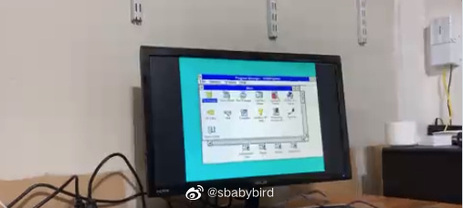
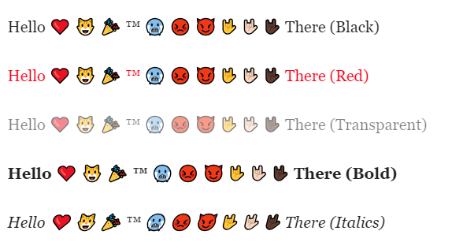
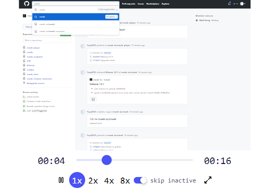
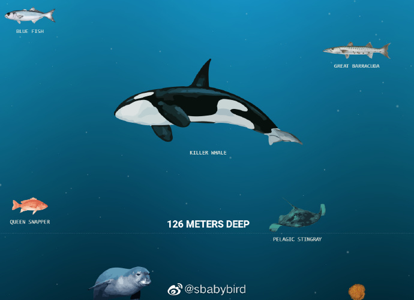
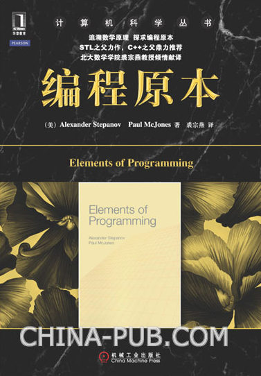
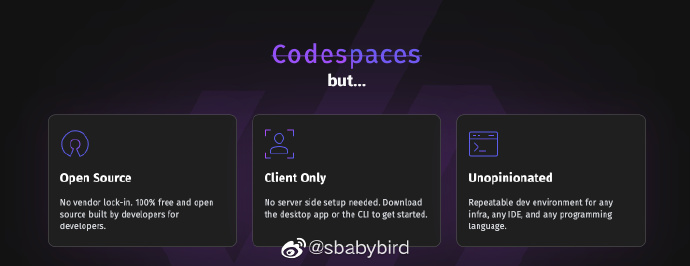
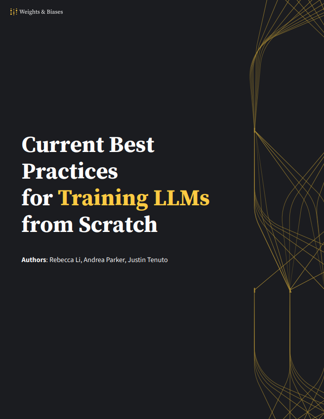
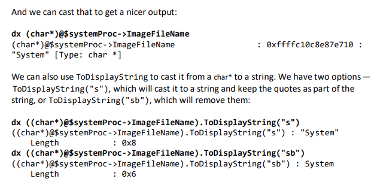

# 机器文摘 第 039 期

## 长文
- [关于写作的通用问题](https://www.cs.columbia.edu/~hgs/etc/writing-bugs.html)，“元技能”一般指比普通技能更高阶的技能，我理解为可产生技能的技能，此类技能并不会随着外部环境的高速发展而被淘汰。比如写作就算是一种元技能，当不知道该训练和提升什么技能的时候，将时间花在“元技能”的提升上准没有错。这篇文章主要讲解英文写作的常见问题，但是有些我觉得对于中文也适用。比如文章开头提到的两个基本原则：“在写之前就弄清楚自己想表达什么”、“即便是你已经写完了一整篇，如果没能表达你的意思那也是废纸”。
  

- [新电脑快还是老电脑快？](https://jmmv.dev/2023/06/fast-machines-slow-machines.html)，上周有博主在twitter发布了一个视频吐槽了一个我也困惑很久的事情。作者展示了他在一台古董电脑上运行Windows NT 3.5 的情况，视频中的电脑基本可以做到秒开程序，然后又展示了一台配备了Windows 11的Surface平板电脑，操作起来界面响应有明显延迟。后者cpu频率为前者的4倍，内存容量为前者的6倍。
  

现在的硬件性能动辄就比之前的老硬件几十甚至上百倍的提升，但是我们的交互体验呢？能够秒开的程序甚至还不如二十年前的老爷机。
后来这事儿在twitter引发了一些争议，有人认为现在的软件确实吃掉了硬件提升的性能，对体验来说提升不足。也有人说现在的体验与以往不可同日而语，这样的对比不公平也没有意义。

博主不得不专门写了一篇文章来回应，详细记录了作者认为更加合理的对比过程。

我个人认为首要原因就是随着硬件性能的提升，软件开发者的精力已经逐渐从性能向开发效率倾斜了。由于现在硬件成本确实低廉，软件迭代周期变得越来越短，软件开发者也越来越没有动力做出极致挖掘硬件性能的软件。

不信你看，现在越来越多的应用程序不再使用原生开发，而是采用了可以“跨平台”的web技术。

这样使得软件界面的响应直接下降了一个数量级。（我在使用vscode的时候甚至还会遇到打字卡顿慢慢弹出字符的情况。）

另外，复杂的设计模式和软件架构，也吃掉了不少硬件性能，因为每增加一层抽象，都会消耗资源，而现在各种复杂的架构就是拼命地增加抽象层。

希望以后市场能够鼓励开发者多做挖掘硬件性能的事情吧。
- [文字渲染比你想象的要复杂](https://faultlore.com/blah/text-hates-you/)，这篇文章的作者曾负责火狐浏览器的文字渲染引擎，他写这篇文字的目的是科普一下关于文字渲染的一些基本技术和困难。在阅读之前，我也简单的以为，文字渲染就是把对应的字符字形从字体库中取出来然后绘制到相应的位置即可，但实际情况确实比这要复杂得多。比如，文中提到的关于“连字符”的处理、“抗锯齿”、“书写方向”等问题，每一个都是开发者的头发杀手。
  

## 资源
- [rrweb](https://github.com/rrweb-io/rrweb)，可在网页上记录用户行为并导出视频文件。可用于：排查用户错误、保险业务签署、内部风控、用户交互分析等。rrweb采用虚拟化转换DOM、记录变更和操作过程，并通过链表回放数据。存储最小化、回放可快进且跳过无效行为。
  
- [DragGAN-Windows-GUI](https://github.com/zhaoyun0071/DragGAN-Windows-GUI)，DragGAN（上周介绍过的开源模型，可以针对图片进行交互式拖动修改）的懒人包，解压直接用，内置17个模型。 ​​​
  
- [deep-sea](https://neal.fun/deep-sea/)，这个网页可以让你查看海洋各个深度都是有哪些生物，果然是越往下越看不清，所以大家就随便长长了，不讲究好看不好看了。 
  
- [电子书《Elements of Programming》](http://elementsofprogramming.com/)，这本老书在出版十年后推出了免费pdf版。中文译作《编程原本》，旨在介绍通用的程序设计原理和技巧，重点关注程序设计的基本元素和抽象概念。这本书的核心思想是将程序设计看作是一种构建和操作抽象概念的过程。它强调程序设计应该建立在数学原理和精确性基础上，通过抽象和泛化来创建可重用、可扩展和可维护的软件。
  
- [devpod](https://github.com/loft-sh/devpod)，Github 的 Codespaces 和微软的 VSCode DevContainers 给开发者提供了即开即用的云端开发环境。现在，他们的开源平替来了，devpod 是一个开源的开发环境容器，可以方便地在任意客户端（Mac、Win、Linux）或云端主机创建体验一致的开发环境，并且可以与VSCode和Jetbrains等IDE直接集成。
  
- [从零开始训练大语言模型的最佳实践](https://uploads-ssl.webflow.com/5ac6b7f2924c656f2b13a88c/6435aabdc0a041194b243eef_Current%20Best%20Practices%20for%20Training%20LLMs%20from%20Scratch%20-%20Final.pdf)，训练大语言模型的技术白皮书，从基本概念和技术讲起，教你训练大语言模型。
  
- [windbg](https://github.com/yardenshafir/WinDbg_Scripts/blob/master/windbg_the_fun_way.pdf)，一本电子书，讲了很多 windbg 调试器的高级用法，市面上很少见。
  

## 订阅
这里会隔三岔五分享我看到的有趣的内容（不一定是最新的，但是有意思），因为大部分都与机器有关，所以先叫它“机器文摘”吧。

喜欢的朋友可以订阅关注：

- 通过微信公众号“从容地狂奔”订阅。

- 通过[竹白](https://zhubai.love/)进行邮件、微信小程序订阅。

