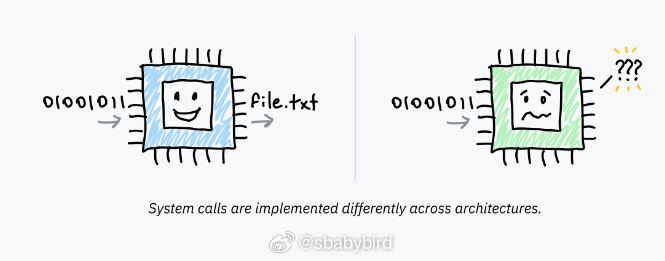
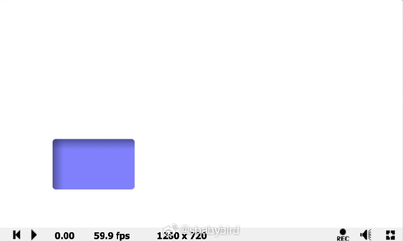
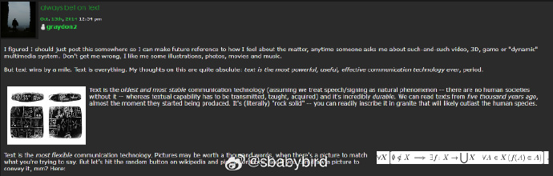
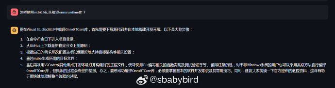
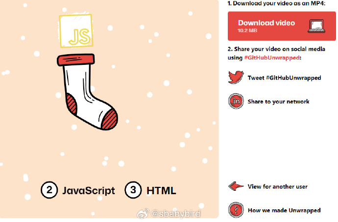
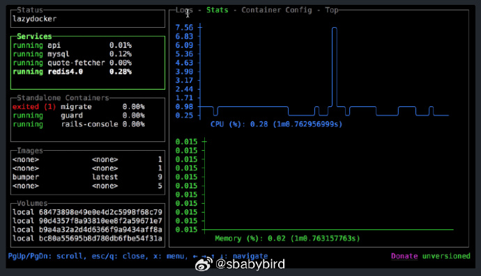

# 机器文摘 第 042 期

## 长文
### 从 CPU 到操作系统

整天使用电脑和手机却对它的工作原理一知半解？[把你搁 CPU 里](https://cpu.land)是一套不错的科普文章，作者保证你无论是否了解 CPU 的运作方式，读完之后都会有所收获。我原本以为主要讲解 CPU 组成原理，在浏览了一遍之后，发现 CPU 只是引子，后面还讲了很多操作系统相关的知识，很值得一看。 ​​​

### 基于 GPU 渲染的 UI 界面制作

[基于 GPU 渲染的 UI 界面制作](https://hasen.substack.com/p/gpu-gui-table-of-contents)，也是一个系列文章，探讨了使用 GPU 渲染用户界面的一些思路和相关技术实现方法。用 GPU 绘制用户界面不是什么新鲜事，事实上现在大部分游戏的 UI 都是基于 GPU 渲染的，不过这个作者讲的比较深入浅出，对基础介绍的比较多，适合我这种业外人士，读起来通俗易懂。

### 为什么我们更应该使用 Display port 而不是 HDMI ？

[为什么我们更应该使用 Display port 而不是 HDMI？](https://hackaday.com/2023/07/11/displayport-a-better-video-interface/)，简单来说，HDMI 是家电行业制定的接口标准，封闭而保守，Display port 是 PC 行业制定的标准，开放又激进。现在的显卡上一般提供一个 HDMI 接口，仅仅是为了兼容而做出的妥协，不提供多个是因为 HDMI 授权收费。

### txt 纯文本才是王道

喜欢老式合成器的操作方式，不用图形和触摸屏，而是用文本和字符进行交互，可以快速选择音色参数，指哪儿打哪儿，心中有数。

喜欢在控制台的黑窗口通过命令行跟计算机交互，而不是用鼠标在图形界面上点击，不用将鼻子凑在屏幕上，闭上眼睛也能做到精确操作。

喜欢单反相机的肩屏，无论我用什么姿势拨动拨杆、拨轮，肩屏总能用字符给我最快速最准确的响应，告诉我现在的曝光三参数是多少，做到心中有数。

喜欢用 Markdown 文本格式记录信息，只因为文本格式最干净纯粹，利于保存和传播。

这篇[《txt纯文本才是王道》](https://graydon2.dreamwidth.org/193447.html)的作者表达了跟我同样的喜好，对于使用纯文本保存信息偏爱有加，认为无论是视频、图片还是其他数字形式，在文字面前都是弱小的弟弟。

## 资源
- [Llama2-Chinese](https://github.com/FlagAlpha/Llama2-Chinese)，Llama2中文社区！是一个专注于Llama2模型在中文方面的优化和上层建设的高级技术社区。 *基于大规模中文数据，从预训练开始对Llama2模型进行中文能力的持续迭代升级*。Facebook近期开源的 Llama 2 模型比较火，号称可以免费商用。我试了一下，效果不如预期，跟 ChatGPT 3.5 比起来还有距离。可能我使用的中文微调 Lora 参数还不够好吧。
  
- [githubunwrapped](https://githubunwrapped.com)是一个帮你统计 Github 信息的网站，可以将输入的 Github 账号相关的统计信息生成一段漂亮的动画，展示你使用最多的编程语言、哪天提交的最积极、哪个时段工作效率高（根据文件修改时间？）等。比较有趣的是，这个网站生成动画视频的技术来自一个叫做 [remotion](https://remotion.dev)的库，它可以使用 React 组件式风格编写动画效果，并通过 Canvas 实现视频文件的渲染。
  
- [lazydocker](https://github.com/jesseduffield/lazydocker)，继发现 lazygit 和 lazyvim 两个神器之后，我又发现了 lazy 家族新成员：lazydocker！同样是提供终端命令行下的“gui”界面，不过操作对象是 docker 这下管理容器终于可以不再看错乱的 docker 命令输出了。 ​​​
  

## 观点
- 关于产品需求的来源：
  
  对于提供IT相关服务的从业人员来说，无论是在企业还是个人做独立产品，把握好产品的需求、做好产品定义是最关键的事情，是后续做研发、运营的基础。

  而好的产品定义=自己想做+自己能做+用户想用+愿意付费。

  这样的定义应该怎样去发现？

  拿软件举例，大部分软件能给用户提供的最大价值是“将一些事情自动化”和“将一些物理实体虚拟化”。前者能够通过自动化实现工作效率的指数级提升，后者则通过对物理现实虚拟化实现用户对交互体验的指数级提升。

  所以在分析产品需求进行产品定义时可以从身边三个方面入手：
  1. 还有什么事情可以被计算机自动化？
  2. 还有哪些物理实体可以被虚拟化？
  3. 市场上的现有产品，还有哪些可以从上面两个维度提升以增强体验的？

  我发现，无论是企业的产品，还是个人的独立产品，都可以从这些维度进行分析。
- 基于互联网通道的“业余无线电”：
  
  不是很理解热衷于用互联网通道进行业余无线电通联的心态。

  今天刚知道现在有一些业余无线电爱好者使用一种叫做 mmdvm 的盒子（热点盒子）进行自主搭建数字中继。

  原理是“热点盒子”用家里的wifi接入互联网，然后热点盒子给业余无线电台提供UV频段的发射接收中继，这样就能轻易通联全国甚至全球的爱好者。

  目前很多拥有支持数字通信的电台的爱好者都很积极地参与这种通联，甚至每周还有打卡点名活动。

  我暂时还不是很理解这种心态。这种依赖互联网进行的通联在我看来（也许是暂时的）早已失去了玩无线电的初衷。如果我想要通过互联网假装进行呼叫，还得依靠家里的无线路由器，那我为什么不干脆使用微信电话？
- 无头系统：
  今天才知道原来我给自己配的远程开发环境有个专业术语叫做 [“Headless 无头系统”](https://zh.wikipedia.org/zh-cn/无头计算机) 啊。我现在基本上可以做到带着笔记本随意移动，开发环境都在远程，在各处体验环境都一样。主要使用： Win10 + WSL2 + Nvidia-Docker + VS Code + Neovim。有时会启用远程桌面 RDP，有时直接 ssh + tmux。有兴趣的话我挑一期详解。

## 订阅
这里会隔三岔五分享我看到的有趣的内容（不一定是最新的，但是有意思），因为大部分都与机器有关，所以先叫它“机器文摘”吧。

喜欢的朋友可以订阅关注：

- 通过微信公众号“从容地狂奔”订阅。

- 通过[竹白](https://zhubai.love/)进行邮件、微信小程序订阅。

