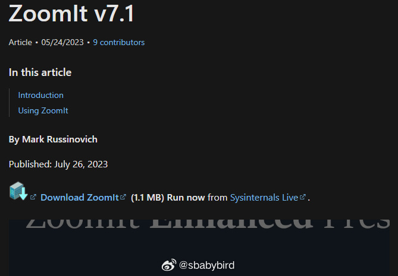
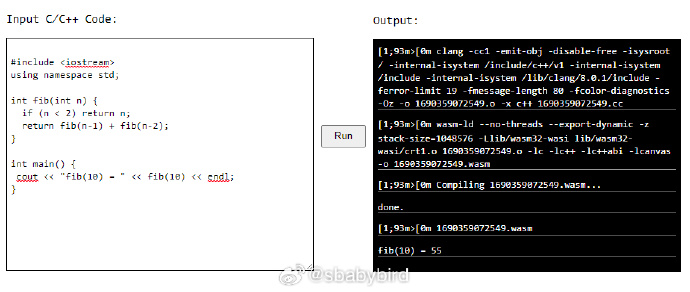
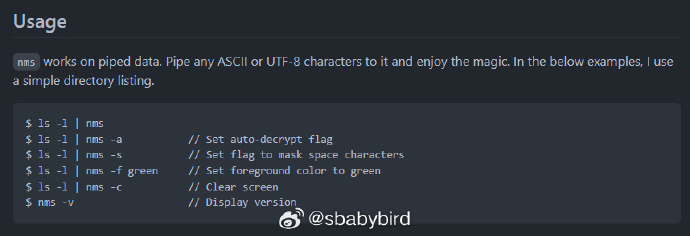
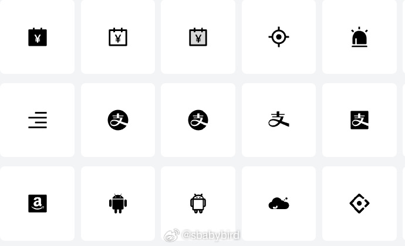
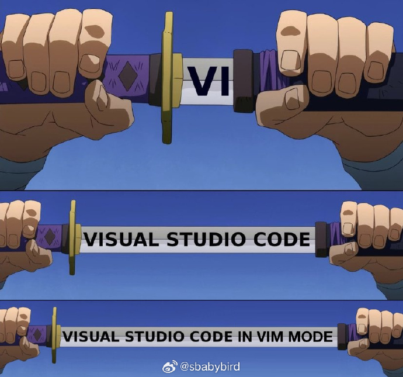

# 机器文摘 第 043 期

## 长文
### 先做框架再做功能

[Before you try to do something, make sure you can do nothing.](https://devblogs.microsoft.com/oldnewthing/20230725-00/?p=108482)

看到这句话第一反应是：这是什么 XX 逻辑？看完作者的文字之后，哦，这是一种软件构建的方法。

意思是说，先宏观再微观，先整体再局部，别一上来就陷入到细节代码的编写中去。

先把框架搭好，具体功能一个也别着急实现，留着占位，先搭一个“什么都不干”的架子，然后再逐渐补充功能。

但也不是真的什么都不干，而是理清了各个关键组件的调用关系以及与开发相关的辅助功能（如打印调试信息）。

这样做最大的好处是，随着功能开发的深入，代码不至于失控，而且具有良好的可调试性和组件问题隔离能力。

随之而来的就是轻松写代码，而不是眉毛胡子一把抓。

### 神经网络从开始到现在

[The Document is All You Need!](https://s3tlxskbq3.feishu.cn/docx/NyPqdCKraoXz9gxNVCfcIFdnnAc)

一篇 AI 科普好文章，用较为通俗的语言讲解了神经网络模型原理和发展历程（我感觉有些像生物的进化）。

从最初的由神经元组成的多层感知机开始，然后进化到卷积神经网络 CNN 降低网络复杂度，再进化， RNN 循环神经网络给模型增加记忆能力，记忆能力太强也不行，到了 LSTM 开始让它能够遗忘，再到后面的 注意力机制以及 LLM 语言模型。

比起同类文章，这一篇尽量避免了数学概念的推导和论证，尽量在不看公式的情况下解释基本思路，适合我等小白学习。

### 代码审查的一些建议
[5个关于代码审查的最佳实践](https://codelantis.com/blog/code-reviews-best-practices)，文章记录一些了对代码审查的实践建议，嫌长不看我总结如下:
  1. 一次只审查一个功能特性或者错误修复。
  2. 提前准备好背景交代（在审查之前写清楚这么做的原因和基本思路）。
  3. 利用自动化工具提前做好静态检查，提前统一风格、规范。
  4. 利用提问的方式提出改进建议而不是直接喷，如：“我们真的需要这个断言吗？”
  5. 仔细阅读代码，慢慢来，以充分理解。

## 资源
- 微软的 [ZoomIT](https://learn.microsoft.com/en-us/sysinternals/downloads/zoomit) 真是个经典工具，已经默默维护了好多年了，现在版本为7.0。体积小巧才1MB多点儿，绿色免安装，下载解压即用。非常适合进行共享屏幕培训讲解，或者录制教学视频。
  
  ZoomIT 快捷键如下：
  Ctrl+1：放大屏幕，屏幕静止，然后使用鼠标批注；
  Ctrl+2：使用鼠标随意绘制批注，支持 r、g、b、o 等快捷键切换颜色；
  Ctrl+3：显示 BreakTime 倒计时；
  Ctrl+4：放大屏幕，屏幕继续支持鼠标交互操作，用于放大操作过程；
  Ctrl+5：录制屏幕，可与前面几个功能结合使用；

- [driver.js](https://github.com/kamranahmedse/driver.js) 一个压缩后只有 5K 大小的前端库，可以让你的网站或者 Webapp 迅速集成交互式“使用指南”的能力。 ​​​
  
- [clangjs](https://clangjs.netlify.app) 一个在浏览器编译、链接、运行 C/C++ 代码的 JS 库。支持 C/C++ 标准库。完全在本地编译，无需网络即可工作。原理：
  首先把 Clang 和 LLD 编译为 WebAssembly 使其运行在浏览器中。然后使用 WebAssembly 版本 Clang 把 C/C++ 代码编译为 WebAssembly，最后通过浏览器 API 运行 WebAssembly。
  
  [附：clangjs源码](https://github.com/luoxuhai/clang.js)
- [nms](https://github.com/bartobri/no-more-secrets)，一个控制台程序，可以将任意命令的输出（ANSI TXT）文本转换成为乱码以达到防偷窥和加密的效果。通过命令管道使用：`ls -l | nms` ​​​
  
- [Icon Buddy](https://iconbuddy.app)，这个网站有超过 1 百万个免费 svg 图标，可在线自定义颜色。
  

## 观点
- 无法眼神交流不是导致远程办公沟通的最大障碍，语音延迟才是：
  - 我之前一直以为远程办公给沟通带来最大的最大障碍是无法眼神交流导致的信息失真，想象着可以通过升级摄像头（比如嵌入在屏幕中）来改善这一情况。
  - 但进行无数次网络会议之后，我体会到了最大的障碍还不是无法眼神交流，而是网络通信带来的（几乎是必然的）严重的语音延迟。
  - 人们对声音延迟的感知和容忍限度大约在10毫秒（现在的电脑声卡在使用 ASIO 驱动之后可以轻松做到本地延迟 8到6毫秒左右，所以可以用于实时录音），大于10毫秒的延迟会带来明显的迟钝感，时间再长一些就会对对话的节奏带来严重影响。（如果体会不到的话，可以回忆一下一些新闻直播中直播间主持人跟现场记者连线时那种说话总是对不上节奏的尴尬。）
  - 什么时候网络视频会议的延时能缩短到10毫秒以内（唱卡拉OK可以接受的最低延迟），远程办公才能迎来质的飞跃，否则网络视频会议对于工作讨论永远都是隔靴搔痒、效率低下。现在的解决方案普遍还在吹能做到一秒（1000毫秒）以内，任重而道远。 ​​​
- 现在真正的程序员用什么编辑器 ？
  

## 订阅
这里会隔三岔五分享我看到的有趣的内容（不一定是最新的，但是有意思），因为大部分都与机器有关，所以先叫它“机器文摘”吧。

喜欢的朋友可以订阅关注：

- 通过微信公众号“从容地狂奔”订阅。

- 通过[竹白](https://zhubai.love/)进行邮件、微信小程序订阅。

