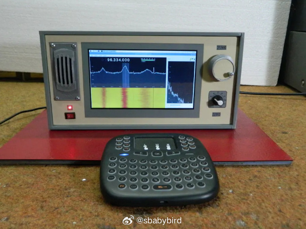
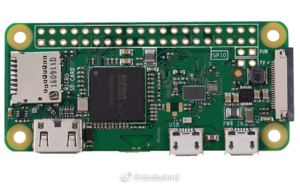
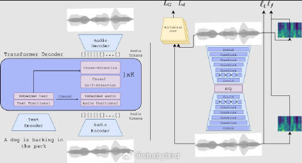
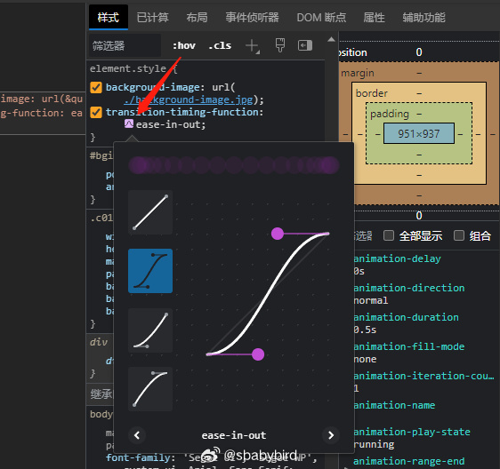
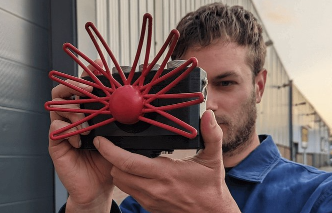

# 机器文摘 第 044 期

## 长文
### 导致 Python 多线程鸡肋的 GIL 是什么

近期在使用 Python 多线程的时候，遇到了 GIL 全局锁导致的性能问题。

具体来说就是性能提升没有达到预期，对于有些计算任务无法并行执行。

从多核 CPU 占用结果上来看，像极了网上那张经典的围观图，一核干活多核围观。

于是翻阅了相关资料研究一下，发现这是 Python 社区争论多年的问题，而且有很大的历史包袱。

严格来说，GIL 全局锁导致的性能问题与 Python 编程语言没有关系，导致这个问题的原因在于具体实现的 CPython 解释器。

当年解释器开发者为了简单实现对多线程的支持，搞了一个全局锁，以至于在多核时代无法充分发挥 CPU 性能。

而后续又有很多库延续了这项依赖，历史的包袱（屎山？）越来越重，很难下定决心将之移除（据说代价甚至比当年从 Python2.x 迁移到 Python3 还要大）。

如果不想深究具体技术细节只想了解基本的来龙去脉，这里有篇文章[为什么 GIL 让多线程变得如此鸡肋？](https://xie.infoq.cn/article/1e151c24367abe8cad18130f4)介绍了 Python PIL 的产生背景以及适用于 Python 多线程的业务场景，可以给你的技术决策提供参考。 

不过好消息是，就在刚刚（前几天），Python 官方终于宣布要动手取消掉 GIL 了，顿时网上一片沸腾（其实只有一部分人，大多数人都还不知道 PIL 是什么玩意儿）。而且，[Meta 也承诺，愿意出工出力（3人年）帮助 Python 社区做针对去除 GIL 的相关开发工作](https://news.ycombinator.com/item?id=36643670)。

### 用树莓派做一个属于自己的高级收音机

最近接触到 SDR （软件定义无线电）这个领域，感觉挺有意思的。

软件定义无线电是一种无线通信技术，它利用软件来实现无线电通信系统中的信号处理和调制解调功能，而不是传统的硬件电路。

通过软件定义无线电技术，可以实现灵活、可配置和可重用的无线通信系统，大大提高了无线通信的灵活性和性能。

传统的无线电通信系统通常使用硬件电路来执行信号处理、调制解调和频谱管理等功能。这些硬件电路通常是固定的，不能轻易更改，因此限制了通信系统的灵活性和可配置性。

而SDR技术通过将信号处理和调制解调等功能以软件方式实现，可以在通信系统中使用可编程的处理器和通用硬件，从而使得通信系统的功能可以在软件层面上重新配置和调整，而不需要更改硬件设计。

比起灵活性和可配置性来说，我觉得 SDR 最大的优势是成本大大降低。之前必须购买昂贵的硬件才能实现的效果，现在能够通过便宜的、少量的硬件加上软件模拟即可。

我近期就以很低廉的价格购买了一套 SDR 设备，通过 USB 接口连接计算机，可以实现 500KHz到1700MHz频率范围的接收。听 FM 和航空频段不在话下，SW 短波的话受天线影响，我暂时没有调试出好的效果。

跟 SDR 相比，我几千块买的旗舰手台显得既昂贵又功能弱。

[这里有篇文章](https://www.hackster.io/mircemk/diy-sdr-dsp-radio-with-raspberry-pi-and-rtlsdr-dongle-c38064)是作者自己动手用 SDR 设备结合树莓派制作了一个看起来还挺专业的宽频无线接收机。

其实这跟音乐制作领域内很多乐器、效果器逐渐被虚拟化的软件、插件代替是一样的。软件虚拟化拥有巨大的优势，随着通用计算硬件的成本越来越低廉，一切能被软件定义的最终都会被软件定义。

### 家用 WiFi 路由器需要选择哪个“信道”

近期验证了一个关于无线路由器的传说。

起因是我新买了一个树莓派 ZeroW 带无线版本，没想到板载的 WiFi 网卡天线太弱了。

离路由器稍微远一点，比如放到卧室，传输速率就会大幅下降，我又暂时没能找到合适的外接网卡，一度陷入绝望。

后来灵机一动，看看能不能从路由器那头想想办法，于是打开路由器配置页面，找到了 WiFi 的“信道”设置，将之从“自动”调到了最不常用的“13”。

这里补充一下，WiFi信道一般从1到13，由路由器自动选择，但现在无线环境十分混乱，尤其是 2.4G（树莓派 Zero W 只能连这个规格） 频段，干扰很严重。

但是 13 这个信道很少被路由器自动选用，原因是最初制定标准的时候，不是所有国家和地区都支持，也不是所有终端设备都支持，所以这个信道就成了最不常用的。

在我手动指定信道之后，惊喜地发现，树莓派放在同样的位置，传输速率得到了较大提升并且稳定。看来传说将路由器 2.4G 信道设为 13 可以防干扰是真实的。

[什么是路由器的信道？信道设置成什么最合理？](https://zhuanlan.zhihu.com/p/344389009)

## 资源
- [开发人员路线图](https://roadmap.sh)  是一个学习索引网站，旨在创建路线图、指南和其他教育内容，以帮助开发人员选择学习路径。在 Github 所有仓库中 Stars 排名第七。 ​​​
  
- [AudioGen](https://felixkreuk.github.io/audiogen/) facebook 开源的声音合成模型，可以根据文字描述生成对应的声音。效果已经很惊人了，这个页面展示了很多样例。我听了一下，觉得以后影视作品里的一部分声音特效应该可以通过 AI 进行生成了。至少像一些嘈杂的人群、婴儿哭声、鸟叫等各种背景音是可以合成的。
  
- 原来 Chrome 和 Edge 浏览器的 DevTools 里自带了 CSS 动画曲线编辑器啊！可以直接通过鼠标拖动进行调整和预览，十分便捷。 ​​​
  
- [Graphite](https://github.com/GraphiteEditor/Graphite)，一个开源的 2D 矢量图形编辑器，适用于照片编辑、图像处理、图形设计、插图、数据可视化、数字绘画等领域。可以实现项目图稿，数据可视化和自动化。
  

## 观点
### 获取高品质信息的需求仍然强烈，只是被淹没了

三十几年前，电视逐渐取代书籍、报纸等传统媒体的年代，尼尔波兹曼写下了《娱乐至死》。

作者认为：过度追求娱乐和娱乐化的信息传播方式可能导致公众思考能力的下降。

然而这么多年过去了，人们在降低信息质量这条路上越走越远。电视也早已沦为老年人卧床的伴侣，电视节目更是无法占据现代人的时间，取而代之的是手机短视频。

短视频已经成为大部分人闲暇消遣、信息获取的主要方式。这种媒体的变化将进一步降低理解和感受深度信息的能力，使人对深入学习和思考失去兴趣。

虽然获取的信息看似在增多，但现在高质量的信息却越来越少。

短视频等碎片化信息给我的感觉就像是无线电信号的背景噪音，现在的信息“电磁环境”早已被这种噪音充斥。因为“背景噪音”太大，就好像在高楼林立的城市里打开无线电，接收到的全是 LED 路灯和电动车充电器产生的噪波。

不过我还是相信会有包括我在内的相当一部分人，不愿放弃主动思考，不屑于接收低品质信息。

我正在努力做出一些尝试，以后逐渐记录下来：
1. 降低输入：减少刷碎片信息的时间；
2. 滤波：使用搜索引擎、RSS服务、newsletter邮件等工具进行整理；
3. 溯源：尽量选择信息源头获取一手信息，对于技术来说，直接阅读英文文档是一个办法；
4. 创造：自己制作高质量内容；

### 摄影师不会被 AI 取代，但是模特很可能会

即便以后 AI 绘画能够产出更加难以分辨真假的作品。

从目前能看到的各种生成作品来说，还是摄影师负责了主要的创作灵感。

真要说被取代的话，也许“被拍摄对象”经过虚拟化以后，很可能被取代。

以后不仅仅是举着相机的叫摄影师，说不定会诞生面向 AI 摄影这一职业。

到时候器材党玩的不再是镜头，改玩显卡了？

“嘿，你这 N 卡 比我这 A 卡有德味儿，毒！”

## 订阅
这里会隔三岔五分享我看到的有趣的内容（不一定是最新的，但是有意思），因为大部分都与机器有关，所以先叫它“机器文摘”吧。

喜欢的朋友可以订阅关注：

- 通过微信公众号“从容地狂奔”订阅。

- 通过[竹白](https://zhubai.love/)进行邮件、微信小程序订阅。

