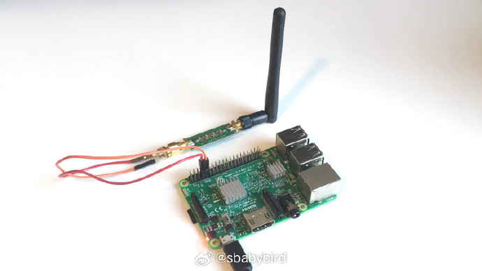

# 机器文摘 第 045 期

## 长文
### 基于浏览器 JavaScript 堆快照的网页爬虫

[基于 JavaScript 堆快照的网页爬虫](https://www.adriancooney.ie/blog/web-scraping-via-javascript-heap-snapshots)。

本文作者介绍了一个实现网络爬虫的新思路，据称已在生产上使用了一段时间，且效果不错。

比较典型的网络爬虫在爬取数据时，大都采用解析网页 DOM 的方式，或直接通过 HTTP 请求流直接解析，或使用无头浏览器进行解析。

但现在这项技术已经被很多网站、平台人为设置很多障碍，比如增加很多随机的嵌套等等。

作者某天福至心灵，想到一个点子。

利用浏览器提供的 JavaScript 内存堆快照功能，将内存里的全部信息扒下来，然后根据对应的 JavaScript 对象属性，按图索骥去找到真正需要的数据。

这种方法比较狠的地方在于，**直接从后台的数据结构下手，跳过了对页面 DOM 的分析和拆解**，而且据作者说，网站即便想通过混淆此类数据在内存中的属性名称来进行防御，其工作量还是相当大的。

所以，可能短期内无能为力。

作者说，也许全面转为 Web Assembly 才能彻底禁止他这种爬虫。

[项目源码在这里](https://github.com/adriancooney/puppeteer-heap-snapshot)

### Intel CPU 的“崩溃攻击”漏洞

[intel cpu 有一个崩溃攻击漏洞](https://downfall.page)，标识为 [CVE-2022-40982](https://cve.mitre.org/cgi-bin/cvename.cgi?name=CVE-2022-40982)，利用此漏洞可以在虚拟机里窃取共享同一个物理 CPU 的其他虚拟机的数据。

这个漏洞可以让恶意程序在本机运行后窃取如密码、加密密钥、以及个人电子邮件等私人数据。

恶意的云计算客户可以利用 Downfall 漏洞从与其共享同一台云计算机的其他客户那里窃取数据和凭据。

据文章作者（也即漏洞发现者）所说，该漏洞存在于 Intel Core 6 代到 11 代 CPU，并且研究人员发现存在通过 Web 网页浏览进行攻击的可能性。

[作者开放了一部分用于测试攻击的代码在此](https://github.com/flowyroll/downfall/tree/main/POC)

### 利用树莓派的 GPIO 发射无线信号

[原来树莓派的 GPIO 还能干这个](https://hackaday.com/2021/04/06/fan-tastic-misuse-of-raspberry-pi-gpio/)，这位老哥使用树莓派的 GPIO 接口直接进行无线电波发射（没错，就是随便扯出一根线就可以当作天线了）。实现了基于树莓派的微型电台。

这得益于 [rpitx](https://github.com/F5OEO/rpitx)这个开源项目，项目本来是为了研究和学习一些无线电原理，不过后来逐渐成为一些 SDR 爱好者必不可少的工具了。

[我上次看到一个小哥使用 RTL-SDR 录制汽车遥控器信号，然后使用树莓派重复发射出来，成功实现了自家汽车的解锁](https://www.youtube.com/watch?v=M2JY1_Xmokg&t=8s)。

## 资源
- [water](https://oimo.io/works/water/)，一个在网页里模拟流体动画的 Demo，使用 Haxe 语言编写。[源码在这里](https://github.com/saharan/works/tree/main/water)
  

  Haxe 是一种跨平台的开源编程语言，在其官方网站上称其为"universal language"。 

  它可以用于开发多种平台（如Web、移动、桌面等）的应用程序。

  Haxe 提供了强大的静态类型系统，并支持多种编译目标，包括但不限于 JavaScript、C++、Java、C#、Python 等。

  感兴趣的话，这里也有[一份 Haxe 的在线教程](https://daobook.github.io/haxe-book/docs/start/00_intro.html)

- [Fooocus](https://github.com/lllyasviel/Fooocus)，ControlNet 作者开源的一款新的 AI 画图工具 ，搭建起来比 Stable Diffusion webui 稍微方便了一点，相当于整合包。
  
  
- 原来 HTML5 有一个 `<progress></progress>` 标签，直接写这个标签，不加任何属性的话，就是一个加载动画，非常适合在页面里临时需要一个进度、状态展示的时候。
   

- [阮一峰老师的 Typescript 教程](https://wangdoc.com/typescript/)，发布了。
  

据老师自己说，刚开始也是抗拒的，觉得TypeScript 就是为 JS 语言添加静态类型系统。如果真需要静态类型，可以考虑使用其他更成熟的语言（比如 Rust 和 Java），再编译成 JS（wasm 模块），何必新学一门语言呢。

但是后来发现 TypeScript 越来越流行，成为前端开发的主流工具，各种项目纷纷移植过去。

我虽然对 TypeScript 仍然持保留态度，但是阮老师写的技术书籍读起来都很轻松易懂，所以觉得还是有必要收藏一下​​​。

- [stable-diffusion-webgpu](https://islamov.ai/stable-diffusion-webgpu/)，在网页里运行 AI 画图模型。
  

  基于 webgpu 技术，无需部署，直接在网页里运行。我试了一下，在我的 1080 8G 显存的显卡上 ，可以跑动，但是速度一般。

  上面的图是我只跑了 8 个 steps 的结果。。。 ​​​

## 观点
### AI 画图的品质

为了验证之前关于“模特很可能被AI取代”的想法，自己动手部署 [Stable Diffusion webui ](https://github.com/AUTOMATIC1111/stable-diffusion-webui) 测试了一些模型。根据网友分享的提示词尝试生成了一些图片。

感觉效果比我几个月之前体验时又有了不少提升，配合各种微调模型和 LoRA 模型可以生成照片质感和光影的图片。

虽然人物表情和姿态还有些僵硬，不过我相信这是我没有合理调整各个参数以及充分发挥插件性能导致。

多进行尝试和练习，应该能够生成更逼真、自然的照片。

### 信息的维度

最近看了一些线性代数相关的知识，在向量、矩阵的各种计算中逐渐有了一些感悟：

古代“老子”思想中的“道”很可能是无限维的，你的任何表达都是对它的一种投影，也就是降维了。所以才是“道可道，非常道”。

每个人都想用最简单的框架去理解世界，将多维的信息硬生生地将为一维。

这样的后果便是，盲人摸象、管中窥豹、一叶障目，不同的观点争得不可开交。

所以在接收时也应该尽量按自己掌握的其它维度进行升维还原，任何信息都不可孤立看待。

如果能从多维信息得视角去认知世界，也许会有转机，这多少就有点儿“阴阳互生、一分为三”的意思了。

## 订阅
这里会隔三岔五分享我看到的有趣的内容（不一定是最新的，但是有意思），因为大部分都与机器有关，所以先叫它“机器文摘”吧。

喜欢的朋友可以订阅关注：

- 通过微信公众号“从容地狂奔”订阅。

- 通过[竹白](https://zhubai.love/)进行邮件、微信小程序订阅。

