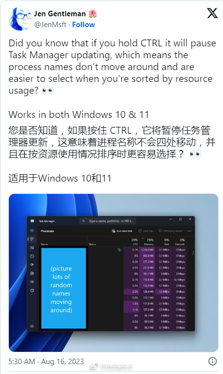
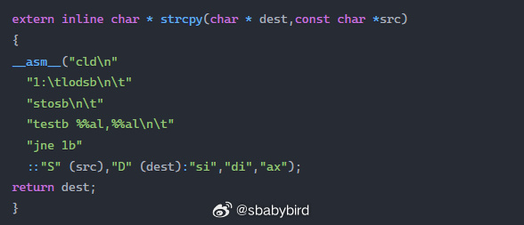
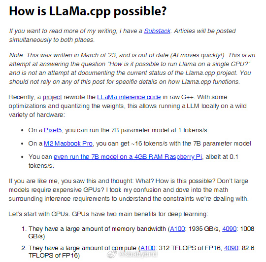
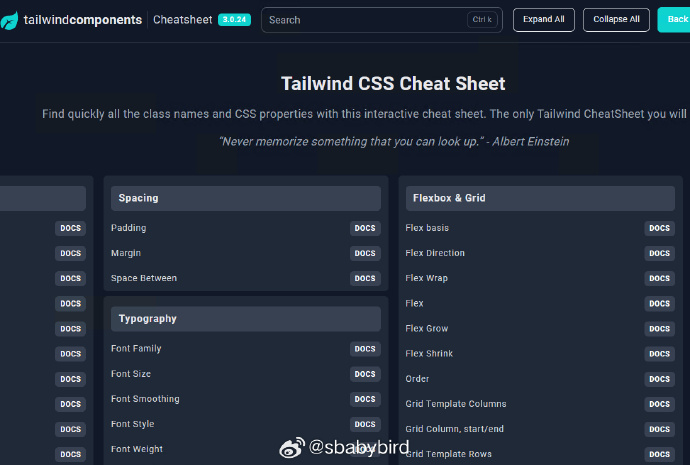
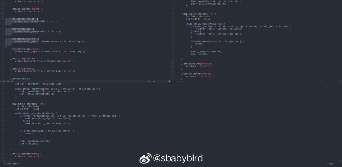
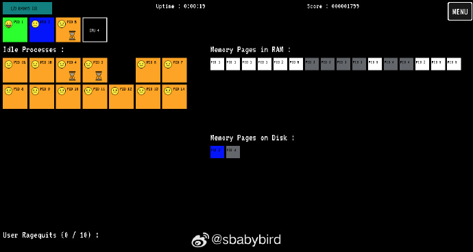

# 机器文摘 第 046 期

## 长文
### Windows 的任务管理器


如果你喜欢使用 Windows 任务管理器来查杀那些不安分的进程，并且跟我一样讨厌他们乱跳（尤其在按照资源占用排序时）。你可以按下 Ctrl 键，它就会神奇地停止更新直到你松开 Ctrl。

Windows 操作系统有一种魔力，就是哪怕你用了将近 20 年，还是会有你不知道的快捷键或者快捷操作。这些东西有时候能带来一些惊喜。

具体介绍可以看这里：[暂停 Windows 任务管理器](https://www.theverge.com/2023/8/16/23834125/microsoft-windows-task-manager-pause-shortcut)

### Linux 内核最初版的解析


最新版本的 Linux 内核，其源码规模已经飙升至 3600 万行，想要深入细节去了解它十分吃力。

而Linux 的第一个版本 v0.01 却非常小巧。

刨去注释和空行的话，也就 8 千来行代码。

这么小的代码结构，足够理解操作系统的精髓。

这篇[探索 Linux v0.01 d的内部结构](https://seiya.me/blog/reading-linux-v0.01)，可以带你像参观历史博物馆那样去见证曾经的 Linux。

我记录了一些有意思的地方：

1、v0.01 只有 66 个系统调用，用于支持文件管理和进程管理，分别是：
```sh
access acct alarm break brk chdir chmod
chown chroot close creat dup dup2 execve
exit fcntl fork fstat ftime getegid geteuid
getgid getpgrp setsid getpid getppid
getuid gtty ioctl kill link lock lseek
mkdir mknod mount mpx nice open pause
phys pipe prof ptrace read rename rmdir
setgid setpgid setuid setup signal stat
stime stty sync time times ulimit umask
umount uname unlink ustat utime waitpid write
```
其中 mount 调用啥也没干，直接返回了。

2、直接写死代码绑定 Intel 386 平台。至今对于 PS/2 接口的键盘、ATA硬盘、VGA显卡等标准硬件的驱动代码还是写死在内核里（而不是放在drivers文件夹）。

3、系统崩溃处理代码只有 5 行：只实现了打印一句“我不行了”，然后进入死循环`for(;;);`。

### LLaMa.cpp 是怎样做到的？


LLaMa.cpp 是一个令人惊叹的项目，在它之前没有人能够在低端消费设备上成功运行 Meta 开源的人工智能模型 LLaMa ，因为那需要太多的硬件资源。

但是 LLaMa.cpp 的横空出世使得在 M2 Macbook Pro、Android Pixel5 手机甚至树莓派上运行 LLaMa 的 7B 模型成为可能。

这是怎么做到的？

带着这个疑问，有网友深入研究了这个项目，并写下了这篇[How is LLaMa.cpp possible?](https://finbarr.ca/how-is-llama-cpp-possible/)以解释原因。

作者认为主要得益于对模型参数的量化，降低模型参数的精度，从 FLOAT16 减小到 INT4。使得 LLaMa.cpp 能够以较少的计算资源甚至只依赖 CPU 的情况下加载大模型。

### 逐渐觉得微软比谷歌良心


曾经微软是技术黑客的公敌，被不少人视为反对技术创新、技术开放的最大反派。

不过随着时间的推移，以及微软逐渐在开源社区所做出的努力。这一现象有所好转。

近期在 HN 上[有位网友很扭捏地承认：现在他对微软的感觉要比对谷歌好很多](https://old.reddit.com/r/degoogle/comments/15pd5si/today_i_realized_i_now_trust_microsoft_more_than/)。

他列举了一些关于两家公司的对比，包括发布的产品、主观的优劣评价等等。

为了抵制微软，他已经十多年没用 Windows 了，但貌似微软的其他产品“很香”（VS Code、Github、ChatGPT等）。

并表示最近正在寻摸租一个云存储，大概率也会用微软的 onedrive 而不是谷歌的 Google drivers。

对此我也有类似感觉，不过我对谷歌的不信任起始于十年前谷歌将 Google reader 停掉，而自从微软推出 WSL 后，我更是觉得微软在产品上越来越实在了。


## 资源
### tailwindcss 的小抄


tailwind 这个 css 框架之所以能够很快流行起来，主要原因就是它解决了一个之前很多人没有太注意的问题，即 CSS 的“正交性”。

之前 CSS 实现一个效果，可以有 N 种方法，外加各种奇技淫巧，但在使用 tailwind 之后，针对特定效果都有了最优实践路径，而且还可以很容易组合。

不过由于它的类分的太细太碎，导致刚开始的时候会有一些不容易记忆。

[这里有一份 tailwind 的小抄](https://tailwindcomponents.com/cheatsheet/)，适合初学者收藏，方便随时查阅。

### 在浏览器中运行的 vim


[vim.wasm](https://github.com/rhysd/vim.wasm)，在浏览器中运行的 Vim，不是插件。

使用 wasm 技术直接编译移植的 Vim Editor 源码，效果跟原生程序几乎一样。

使用 WebAssembly 给 Vim 提供一个新的 GUI 前端（类似 GVim）。

为了编译通过，作者在源码里禁用了很多 Wasm 不支持的特性，如：fork(2)、PTY 等。

可在这里体验：https://rhysd.github.io/vim.wasm/

### 无隐私问题的 pdf 工具网站


[这个pdf工具可以尝试一下](https://pdftool.org/zh)，跟其他pdf 工具网站不同，这个网站借用 WebAssembly 技术将很多工作放在浏览器客户端执行，用户无需上传自己的pdf到网站，即可执行处理工作，包括：加密、解密、拆分、合并等常用功能。 ​​​

### 深入理解操作系统的小游戏


[这个自称史上最极客的小游戏](https://plbrault.com/blog-posts/i-created-the-nerdierst-game-ever-en/)，是国外一位计算机科学教授给学生们写的一个小游戏，假设玩家是一个“操作系统”，在游戏里玩家需要不停地进程调度、内存页交换等操作，一旦调度不合理就会激怒用户导致“玩家”也就是操作系统被重启，游戏就 GAME OVER 了。

游戏使用 Python 编写，作者将其编译为 WebAssembly 以嵌入网页，这里可以直接在线体验: https://drfreckles42.itch.io/youre-the-os。

## 观点
### 学习技能最有效的练习手段是“复刻”
这是我前两天尝试用 CSS 临时写个页面效果想到的。

我虽然也了解了CSS 语言的一些基本知识，但是在具体实操的时候仍会感到无从下手。

与下棋类似，只知道“规则”但是没有“套路”。

后来干脆找了几个目标页面，按照自己的想法去还原，渐渐能够摸到一些“套路”的边缘，最终实现了自己想要的效果。

于是我想: **在学习一项技能的时候，“复刻”、“抄袭”、“借鉴”、“致敬”，都没有问题，应该把它作为最主要的练习手段。**

因为“抄”是最经济的学习方法了。

不仅仅是编程技能，艺术方面更是如此。

比如在编曲学习的时候有一种练习叫“扒带”，就是找一首歌，然后你通过你的工具和技巧制作一份完全一样的作品，尽量做到百分百还原。

很多“大师”都是在这个过程中，遇到问题解决问题，领悟到很多只能意会不能言传的技巧，而这些领悟是无论如何也无法仅仅通过“看”和“听”获得的。

另外，人们练字、绘画也是从临摹开始，一般在熟练之后才能突破，才又自成体系。

### 忍耐守恒
怕麻烦的人，主要是不能忍受一些事情。

然而正是因为这些不能忍受，所以注定要忍受一些其他的事情。

人生就是这样，比如无法忍受投资带来的风险，就得承受现金贬值；不能面对创业的压力，就得忍受按时上班的束缚。

对于这种现象，我将之称为“忍耐守恒”。 ​​​


## 订阅
这里会隔三岔五分享我看到的有趣的内容（不一定是最新的，但是有意思），因为大部分都与机器有关，所以先叫它“机器文摘”吧。

喜欢的朋友可以订阅关注：

- 通过微信公众号“从容地狂奔”订阅。


- 通过[竹白](https://zhubai.love/)进行邮件、微信小程序订阅。

