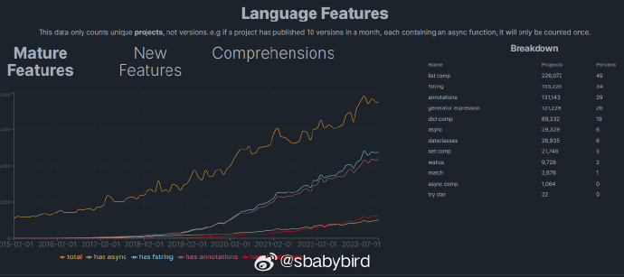
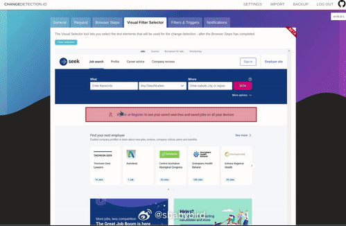
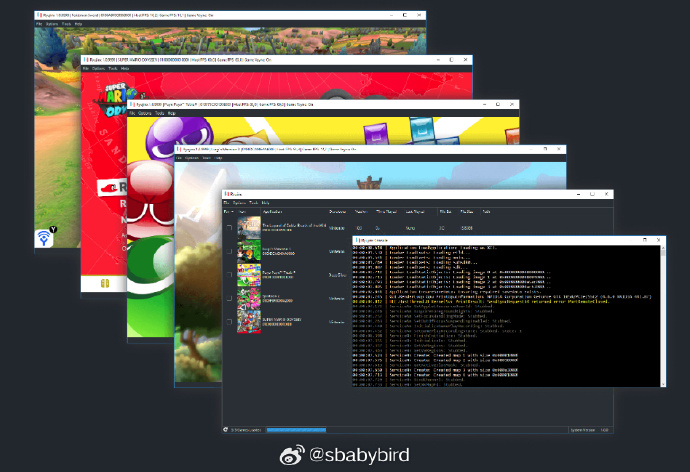
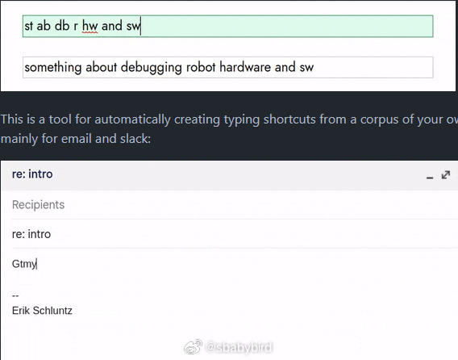
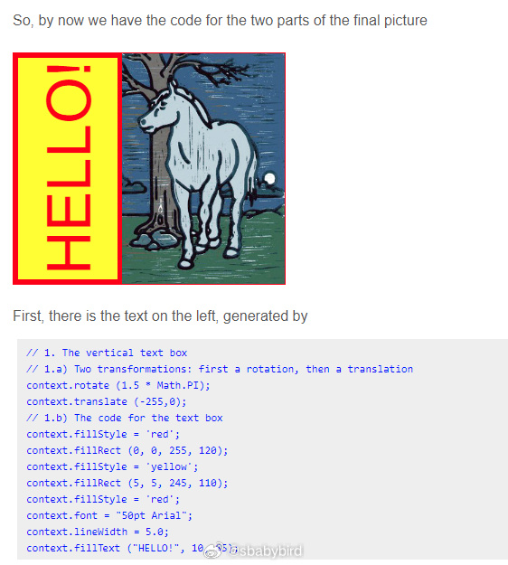

# 机器文摘 第 048 期

## 长文
### 关于 Python 语言的一些统计数字

[关于开源 Python 仓库的一些有趣统计](https://py-code.org/stats)，有人克隆了 PyPI 网站里所有 Python 包对应的 Github 仓库，并对这些仓库里的全部文件进行了分析和统计。

1、排名前三的语法特性分别是：列表推导、fstring字符串格式化、注解；

2、代码中大约包含有超过 2 万 5 千个密钥明文，泄露最多的是访问 Google API、OpenAI API和腾讯云 Secret ID；

3、截止到 2023 年 8 月，所有源码加起来已超过 60TB ，文件数量超过 10 亿。

### Wasm 技术让数据库执行 AI 模型

[使用 Extism 将 WebAssembly 引入 PostgreSQL](https://dylibso.com/blog/pg-extism/)。
 
这篇文章的作者介绍了一种方法，可以使用 Wasm 技术通过扩展插件的方式给 PostgreSQL 数据库增加 UDF （用户自定义函数），从而实现调用 AI 模型的能力。

### BitLocker 硬件加密能破解吗？

BitLocker 是 Windows 下的存储加密技术，用于保护硬盘中的数据安全。

未经解密的硬盘即使遗失或者被接入其他系统也无法进行读取。

这在极大程度上带来了数据安全（不过仍有不少用户在不知情的情况下开启了 BitLocker 且未保存密钥，在重做系统的时候发现硬盘无法解密，数据无法恢复。。欲哭无泪。。）。

然而这种加密方式也不是绝对安全，国外有技术爱好者对此进行了挑战，并使用一台逻辑分析仪成功绕过了加密。

[这篇文章进行了详细的记录](https://www.errno.fr/BypassingBitlocker.html)。

主要原理为：在系统开机启动过程中的某个时刻，加密芯片和 CPU 之间传输了未加密的信号。使用逻辑分析仪捕获该信号可以逆向出加密密钥。

## 资源
### 监控网页信息变化的工具

[changedetection](https://github.com/dgtlmoon/changedetection.io)，一个监控网站变化的工具。

帮助用户密切关注商品打折、股票行情、政策发布等信息变动。

支持通过网页可视化的方式指定监控页面区域。

通过邮件、即时聊天软件、API调用等多种方式推送信息。可使用 Docker 部署，或者本地 Python 环境部署。

### Switch 模拟器

[Ryujinx](https://github.com/Ryujinx/Ryujinx) 一个用c# 写的开源 switch 模拟器，该模拟器旨在提供卓越的准确性和性能、用户友好的界面以及稳定的版本构建。 ​​​

### 文字缩写快捷键工具

为了减少打字量，国外这哥们写了个脚本将日常用于全部缩写了，只需敲入缩写字母，脚本自动完成完整句子的键盘输入。

比如：
st => something
ab => about
hw => hardware
sti => sometime

据小哥自己统计，使用这个脚本以后他已经减少了一半的键盘敲击量。

[项目名叫 compress 目前已开源](https://github.com/eschluntz/compress)，如果你有兴趣，改成支持中文也不是不可以。

### Canvas 手册

Canvas 是网页中用于图形绘制的基本元素，结合 JavaScript 可以实现各种复杂的图形效果和交互动画。我之前都是每次用到了的时候现去翻文档，对它的每个 API 都是一知半解。这里有一个[Canvas 手册](https://bucephalus.org/text/CanvasHandbook/CanvasHandbook.html)，详细介绍了 Canvas 的各种调用接口。适合希望深度使用及系统学习 Canvas。

## 观点
### “不要重复造轮子”是人为设置的一种限制
遇到需求不能满足的情况，是去“寻找轮子”还是“动手创造轮子”，这是两种不同的思维习惯。

“寻找轮子”往往意味着寻找已有答案，将问题看为一种正常的状态，是“自古以来”、是“从来如此”。

思维定势一旦形成，就很难改变，让人成了那个在沙漠中让美女帮他牵住骆驼的矮子。

动手创造者往往是发现这种问题的人，他们不循规蹈矩，他们 Think different，是改变世界的人。

“不要重复发明轮子”，这个原则用于工作中确实比较安全，他保证了不会浪费资源，并且避免了一定的技术风险。
  
但也同时拒绝了伟大的创新。
  
所以不要被这句话束缚，尽管去做自己的轮子。

哪怕它一开始很丑。
  
你的轮子必将使你与众不同，使你拥有不一样的视角，成为那个动手创造的人。

## 订阅
这里会隔三岔五分享我看到的有趣的内容（不一定是最新的，但是有意思），因为大部分都与机器有关，所以先叫它“机器文摘”吧。

喜欢的朋友可以订阅关注：

- 通过微信公众号“从容地狂奔”订阅。

- 通过[竹白](https://zhubai.love/)进行邮件、微信小程序订阅。

